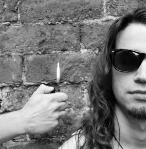

---

# CONFIGURATION
layout: 2012-autumnwinter
rootpath: "../../../"

# ABOUT THE SHOW - GENERIC
artist: "Ollie Smith" # the name of the artist or company
show: "27" # the name of the show

# ABOUT THE SHOW - LAYOUT
# artist_size: 1 # optional - size of artist name 1-5. Default is 1. Set longer names to lower values
# show_size: 2 # optional - size of show name 2-5. Default is 2. Set longer names to lower values
# header_image: "header.jpg" # optional custom background image, relative to current page

---
####In Brief    
Real rockstars die aged 27. Ollie Smith is 26. He is not a rockstar. Yet. Sitting somewhere between a grubby gig, a fanatic lecture and a Jonestown-esque cult meeting, *27* is a darkly humorous show that stirs up the myths surrounding the notorious 27 Club: a group of legendary musicians who all died at just 27 years of age.    

    

####More    
**Hendrix. Joplin. Morrison. Cobain. Winehouse. Smith?**             
*27* takes on hedonism and fading dreams, drugs and booze, suffocation and electrocution, murder and suicide.            

Tying fact together with fiction, speculation and conspiracy, the show fashions a tangled noose of self-destruction which chokes out the myths surrounding the notorious 27 Club: a group of legendary musicians who all died at 27 years of age.            

Through a precise meandering of pseudo-philosophy and numerology, risk assessments and fading dreams, Ollie speculates on his own untimely demise as he struggles to secure his own legend alongside such greats as Jimi Hendrix, Jim Morrison and Amy Winehouse.

 

####Who is he
Ollie Smith is a live artist, theatre maker and musician based in Nottingham, UK. He makes performance work as a solo artist and as a collaborator. He has been a rock junkie since he was a child and has an extensive vinyl library - but his turntable is broken.           

In addition to *27*, Ollie has recently begun working on *Cat in Hell*:          
"a kind of rock 'n' roll musical comedy in which a demon and a cat seem to be enduring (or inflicting on each-other) some implicitly eternal torment of frustration" (Wayne Burrows, writer).            

Other theatre work he is currently involved with includes *The End*, a collaboration with Nottingham-based artist and writer Michael Pinchbeck, which has been touring since 2010 - and a recently completed follow-up piece, *The Beginning*, in collaboration with Manchester-based artist Nicki Hobday.           

Ollie has toured nationally with various shows and has received commissions, platforms and development opportunities from Arts Council England, Theatre Writing Partnership (Nottingham), greenroom & hÅb (Manchester), Hatch (Nottingham), Emerge (Leeds) circuit (Leicester) and Compass (Leeds).          

Ollie trained as a performer at Bretton Hall and graduated in 2007 with first-class honours.

####Credits            
*27* is supported using public funding by Arts Council England, Emerge (Leeds) and circuit Live Art Festival (Leicester).

####Website    
[www.olliesmiths27.co.uk](http://www.olliesmiths27.co.uk)

####Venue & Booking Details
Date: Friday 2 November, 7.30pm (double bill with Richard DeDomenici)    
[Venue: Z-arts](http://www.z-arts.org/about-us/getting-here/), 335 Stretford Road, Manchester, M15 5ZA    
[Tickets: £8/5](http://www.z-arts.org/events/word-of-warning-02-nov/)    
Box Office Tel: 0161 232 6089     
