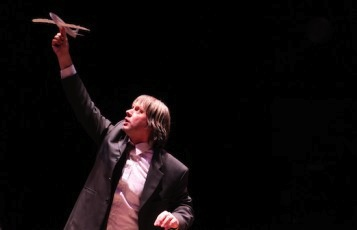

---

# CONFIGURATION
layout: 2012-springsummer
rootpath: "../../../"

# ABOUT THE SHOW - GENERIC
artist: "Third Angel"
show: "What I Heard About the World"

---

#### In Brief

 

There's a place where fake snow covers real mountains.  There's a place where you can rent strangers to cry at your funeral.  There's a place where, if the army send your Dad overseas, they give you a life-size cut-out version to keep you company.
The world seems to get bigger every day… how on earth can you know all the places you’ve been, let alone the places you haven’t?

An unfeasible attempt to describe the impossible… A theatre piece with 2 songs…

Watch video trailer [here](http://vimeo.com/36294994)

#### Who are they?

Alexander Kelly and Rachael Walton set up Third Angel in Sheffield in 1995 and have been making performance, theatre, live art, installation, film and just about everything else you can imagine ever since.  They have shown at festivals and venues throughout the UK and Europe - in theatres, galleries, cinemas, office blocks, car parks, swimming baths, on the internet and TV, in school halls, a damp cellar in Leicester and a public toilet in Bristol. 

Third Angel’s aim is to make entertaining and original contemporary performance that speaks directly, honestly and engagingly to its audience.
For *What I Heard About The World*, they join forces both with Portuguese company Mala Voadora and Mancunian writer/performer/musician Chris Thorpe (Unlimited Theatre, BBC Radio 4's *Friday Night Play*)

#### What people have said about them

>engaging, moving, provoking, thoughtful, funny, brutal and beautiful... brilliant theatre...  resonant and eloquent... beautiful, anxious, heartfelt story telling... brilliant, v thinky... top quality night out... awesome, very thought provoking... brilliant... *Twitter audience responses*   

>The great thing about Third Angel is you never know what you're going to get...heavenly work. *The Guardian*

#### More

There's a place where you confess your sins to voicemail.    
There's a place where you can buy a cure for loneliness on CD.    
There's a place where fake snow covers real mountains.    
There's a place where the dances only exist in the memory of three old women.    
There's a place where you can rent demonstrators to be angry on your behalf.   
There's a place where you can rent strangers to cry at your funeral.    
There's a place where they listen to a radio station that broadcasts silence.    
There's a place where there are only five official haircuts for men.       
There's a place where, if the army send your Dad overseas, they give you a life-size cut-out version to keep you company.

When you actually go there, you'll understand. The heat there. It's a different sort of heat. Or the cold. It makes you shiver in a completely new way. The light. They're always going on about the light.

A theatre piece with two songs: one original, one karaoke.

Produced in association with the geographers behind [Worldmapper.org](http://www.worldmapper.org), the show aims *“to help us to see foreigners as yourself in another place”* says Co-Director Alexander Kelly.
*“The project began as a search for the authentic, but we found more and more stories of the inauthentic, the fake, replicas. The stories connect to paint a sometimes bleak, sometimes hopeful, and darkly humorous view of the world, based on how people have told us they see it, and our own attempts to hold it all in our heads.”*

Third Angel has a history of making work based on the collection and exchange of stories.  People can catch up with what's gone into *What I Heard About The World* so far, and contribute stories of their own via:    
Twitter: #whatiheardabouttheworld    
Facebook: [What I Heard About The World](http://www.facebook.com/pages/What-I-Heard-About-The-World/143036205737691)

#### Websites

[thirdangel.co.uk](http://www.thirdangel.co.uk)      
[malavoadora.blogspot.com](http://www.malavoadora.blogspot.com)

#### Credits

A co-production with Sheffield Theatres and Teatro Maria Matos, Lisbon, in association with [worldmapper.org](http://www.worldmapper.org)
Supported by the National Lottery through Arts Council England. 
Co-produced with PAZZ Performing Arts Festival, Oldenburg, 

