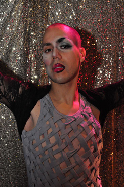
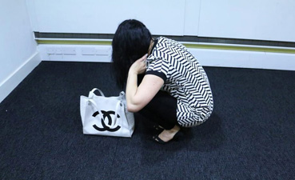
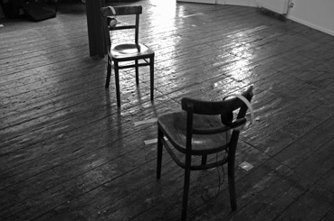

---
# CONFIGURATION
layout: 2015-emergency
rootpath: "../../../"

# ABOUT THE SHOW - GENERIC
artist: "Emergency 2015"
show: "AFTERNOON: 12noon-4pm"
artist_size: 1
show_size: 3
header_image:

# ABOUT THE SHOW - LAYOUT
# artist_size: 1 # optional - size of artist name 1-5. Default is 1. Set longer names to lower values
# show_size: 2 # optional - size of show name 2-5. Default is 2. Set longer names to lower values
# header_image: "header.jpg" # optional custom background image, relative to current page

---
*Presented by* Word of Warning, STUN *+* Z-arts *during* [Emergency 2015](/archive/2015-emergency)    
          
#### Artists in Alphabetical Order (*subject to change*)      
**Please note this is primarily an adult event, see Access Info below.**        
           
**Adam Lowe** | ***Encounters with Ecstasies***        
Presenting selections from his solo show *Ecstasies*, Adam Lowe as Beyonce Holes will lead you through a descent into the glittery history of Manchester's gay clubs. From intimate moments in a toilet cubicle to revelry on the dancefloor, club kid Beyonce reaches for the strobe-light stars across the ceiling and whispers profane incantations to the Lord of the Dance.        
        
Directed by Gerry Potter, music by Nikki Franklin, animation by Charlie Taylor.        
[Facebook](http://www.facebook.com/adambeyoncelowe) | [@adambeyoncelowe](http://twitter.com/adambeyoncelowe)     
       
         
**Adam York Gregory + Gillian Jane Lees** | ***Time/Distance***        
Gillian Jane Lees is a performer and director, Adam York Gregory is a scientist and visual artist — together they explore the equivalence and contradictions between their individual practices. *Time/Distance* is an attempt to place time under a microscope, enlarging it so that we can observe and study it better.        
[@Adam_Y](http://twitter.com/Adam_Y) + [@GillianLees](http://twitter.com/GillianLees)        
      
            
**Alicia Radage** | ***Illegitimi non carborundum (Grinding Down)***         
Radage's work explores the body and the relationship to gender within space. This piece looks at the concept and experience of aspects of masculinity alongside the visibility of the (female) body.          
[www.aliciaradage.com](http://www.aliciaradage.com)           
         
            
**Eleanor Fogg** | ***selves portrait***        
A darkened room. A lone figure sits in front of a mirror, their reflection glowing in the glass…        
*selves portrait* is a solo performance/installation exploring the multiplicity of identity. This short and intimate piece combines projection, lip-sync and a slow-motion pop soundtrack to create a hypnotic experience which 'feels like being inside a music video', placing the audience within the complex relationship between a person and their reflection.        
<http://cargocollective.com/eleanorfogg> | [@efoggy](http://twitter.com/efoggy)       
         
         
**Gwendolen Osmond** | ***The loss***         
An exploration of poetry, physical gesture and music around a female character's experience of loss…        
        
        
**Howl Yuan** | ***The Invisible Guest***        
He changed his English name several times…          
A new production about crossing culture, lost identity, nationalism and mobility. Through physical movement, language barriers and military figures, identity is questioned within cultures, nations and persons. We walk, run or march through moving images, memory and scenery like a changing mirror, which lights up our homecoming — an impossible homecoming.         
        
Thanks to Ben Francombe, Pete Phillips + Helena Hunter and all at University of Chichester without whose help, I couldn't have made this work.         
      
         
**Nicola Smith** | ***Drop Pick Up***        
*I use simple actions in my interventions, which have multiple meanings that can be understood by everyone. As a mother the action I repeat most is picking up objects off the floor in a never-ending continual cycle, which is reflected in my performance. My shallow retail self still wants to look good whilst tidying up and I have carefully styled my wardrobe accordingly: with the soles of my shoes painted red, a custom-made Chanel bag and sleek black hair hanging down over my face.*        
<http://nicolasmith.prosite.com> | [@nsartist34](http://twitter.com/nsartist34)      
      
          
**Paul Hughes + Andy Edwards** | ***the ground, the highest point.***        
A new interdisciplinary performance project intimately exploring the possibilities of duets and performance (im)balance. Through dance and text improvisations, this collaboration considers the ways in which our bodies are shaped by and can shape the spaces around us.        
        
Paul Hughes is a performance artist & theatre-maker who has made work with Forest Fringe, Artsadmin, Battersea Arts Centre, The Yard Theatre, SPILL festival and is currently a member of performance ensemble Ponyboy Curtis. Andy Edwards is a dramaturg, writer & performer who has performed with Scrapyard Theatre, Bedlam Theatre and a smattering of scratch nights across Scotland; he is currently studying for an MLitt at the University of Glasgow in Playwriting & Dramaturgy.        
<http://paulpaschal.tumblr.com> | [@paul_paschal](http://twitter.com/paul_paschal) + <http://andynedwards.tumblr.com> | [@AndyNedwards](http://twitter.com/AndyNedwards)         
        
**Rachel Gomme** | ***Mouth to Mouth***        
*Share a breath with me. Receive a gift from an unknown other.*        
A one-to-one interaction that celebrates breath as mutual interdependence and cycle of gift exchange.        
         
         
**Simon Farid** | ***The Gallery Watches You Back***        
*Supported by public funds means a lot of things. It means you've paid for this. Through lottery funding it means poorer people have paid more. It means those responsible for the event have filled in a lot of forms. It means others have checked those forms. It means your role as a visitor will be heavily monitored. Are you satisfied?*        
        
Learning from his invigilation day-job, Simon Farid will be making more visible one of the monitoring criteria — the visitor count. You can't miss him. And he won't miss you either.        
[www.simonfarid.com](http://www.simonfarid.com) | [@simoncfarid](http://twitter.com/simoncfarid)        
          

**Simon Gerrard** | ***9"***        
Simon works with various media and form to explore human experience and perception. He produces environments that are inhabited and activated by the participant aiming to provoke a heightened awareness of self and the interplay between subject and object. His practice explores the state between the reflective and pre-reflective, knowing and non-knowing, and questions an individual's perception and awareness of self in relation to their surroundings and social identity. Simon attempts to locate and sustain this pre-reflective state by capturing and interpreting the sliding exchange between reflection and present awareness and by drawing attention to the lived body, creating situations that enable the participant to perceive themselves through others. The work aims to re-appraise faith placed in pre-conceived concepts and uncover an intuitive unboundedness.        
[simongerrard.com](http://www.simongerrard.com)        
     
        
**Sturgeon's Law** | ***Portal 2 by 2***        
Odysseas loves video games. His mother makes theatre, rehearsing while he's on the computer.        
They are losing touch with each other's worlds. This performance brings them together.        
[@amaenad](http://twitter.com/amaenad)        
        
        
**Terri Donovan** | ***Finding Elsie***        
*Switch on the stereo, listen. In all that sound, can you hear her speaking out?*        
*Finding Elsie* explores the pain and the everyday conversations between Grandmother, Father and Girl. And asks you the question: *can we really find, or even understand the people we love, or do you prefer a remembered dream of them?* But what happens when these dreams are lost, then what?        
        
Born and bred in Manchester, Terri Donovan is a current member of Contact's Young Company but also enjoys cake and reading crime novels.        
[@TerriTezmabob](http://twitter.com/TerriTezmabob)        
        
***The Demolition Project***        
What would you like to demolish in your city? The house where your heart was broken? The school where you were bullied? A workplace, a hospital, the street where you were mugged? Or perhaps it's an ideological target (Old Trafford? Albert Square?), or a building that offends your sense of beauty, whether it's a shiny glass lego brick or a brutalist concrete wall.        
        
Whatever it is, we'll give you the tools to wipe it off the map – as long as you give us the reason for your demolition. With a little help from a street map, a scalpel and the Demolition Project team, let's reimagine Manchester!        
[Facebook](http://www.facebook.com/thedestructionists) | [@debriskent](http://twitter.com/debriskent)        
       
         
**Tim Anderson + Tessa Buddle** | ***How to resolve disputes over fossil fuels and fences***        
There is a hole in Tim’s garden fence. It was made in 1984 or 1985 (the dates change every time he tells the story), by members of the UDM who used Tim's back garden to get to Wollaston Pit without having to cross the picket line at the main entrance to the colliery.        
        
Tessa visited the hole and discovered that it's now a portal in time and space, leading to a utopian society formed in a mining colony on an asteroid. Tim and Tessa agreed that they should make a show about the hole. But they have very different ideas about what that show should be.        
[@tessabuddle](http://twitter.com/tessabuddle)        
        
        
**Trendscendence** | ***Prototype (Phase 1)***        
An interactive experience that envisions a post-human future in which the online and offline avatar morph indistinguishably and the border between reality and fantasy evaporates. Focusing on communication and connectivity, phase 1 probes simulated realities, virtual representations, and primal instincts through the medium of digital performance.        
[www.trendscendencelivehere.com](http://www.trendscendencelivehere.com) | [@trendscendence](http://twitter.com/trendscendence)        
           
        
#### Venue + Booking Details
Date: Saturday 3 October 2015, 12noon-4pm (full event runs to 10pm)    
[Venue: Z-arts](http://www.z-arts.org/about-us/getting-here), 335 Stretford Road, Manchester, M15 5ZA        
Tickets: FREE no booking required, come + go as you please.        
*N.B. Some limited capacity shows have sign-up sheets on the day, others operate on a first come, first served basis.*          
Venue Tel: 0161 232 6089             
          
#### Access Information       
Emergency 2015 is primarily an adult-focussed event, some works will not be suitable for younger viewers (i.e. under 18s). From 12noon experience durational and limited capacity work; from 4pm onwards see a short series of short performances. It takes place in a number of different spaces and formats — some seated, some standing, some spoken word, some visual, some limited capacity, some participatory. We apologise but some of the work is not wheelchair accessible. For specific age and access information please email <mailto:info@habarts.org> or call 0161 232 6086.     
            
#### Credits         
[Emergency](/hab/emergency) 2015 is produced by [hÅb](/hab); supported using public funding by Arts Council England, funded by Manchester City Council, supported by [STUN](http://stunlive.com) + [Z-arts](http://www.z-arts.org); a greenroom legacy project.        
        
#### Websites
<http://emergencymcr.org> | [Facebook event](http://www.facebook.com/events/1479136439056940) |[#EmergencyMcr](http://twitter.com/hashtag/EmergencyMcr)
