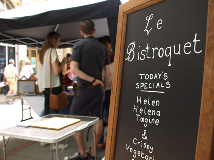
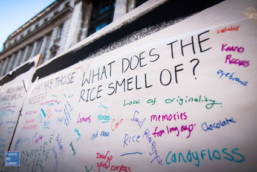

---
# CONFIGURATION
layout: 2015-haphazard
rootpath: "../../../"

# ABOUT THE SHOW - GENERIC
artist: "Haphazard 2015"
show: "Ongoing Activity from 12noon to 4pm"
artist_size: 1
show_size: 4

# ABOUT THE SHOW - LAYOUT
# artist_size: 1 # optional - size of artist name 1-5. Default is 1. Set longer names to lower values
# show_size: 2 # optional - size of show name 2-5. Default is 2. Set longer names to lower values
# header_image: "header.jpg" # optional custom background image, relative to current page

---
*A free event for the curious of all ages, presented by* Word of Warning *+* Z-arts* Turn up at Z-arts any time from 12noon to 4pm, come and go as you please…*		

####Venue + Booking Details, for Haphazard
Date: Saturday 28 February 2015, 12noon-4pm    
[Venue: Z-arts](http://www.z-arts.org/about-us/getting-here), 335 Stretford Road, Manchester, M15 5ZA        
Tickets: FREE no booking required († *limited capacity, sign-up on the day*)        
Venue Tel: 0161 232 6089

####Ongoing Activity (in no particular order)   
**Lani Irving** (The Busy Badger) **| *Livestock***        
Haphazard welcomes its very own bovine micro-herd… Last seen during [2013](/archive/2013-spring/haphazard), Lani returns with a friendly bunch of cows to herd you around the building — and if you **need any help** they might moo back!        
[The Busy Badger website](http://laniirving.wix.com/thebusybadgeruk) | [The Busy Badger facebook](http://www.facebook.com/thebusybadger) | [@thebusybadger](http://twitter.com/thebusybadger)          
      
            
**Anonymous | *Narcissus***       
*Everyone loves badges, don't they? What slogan will **you** choose and what does it say about **you**?*        
Ask a white-coated volunteer for your favourite badge and become part of this mobile and moving self-portrait of an unknown artist, painted in words on tin.        
      
                
**Leo Burtin | *Homemade: Le Bistroquet***      
You are invited to Leo's Bistro — join us in this pop-up café where the menu needs **you**! While you sip on a soupçon or taste a tit-bit, why not offer your own recipe for our chef to consider?             
[Seen at Hazard 2014](/archive/2014-hazard/ongoing) this is a pop-up intervention by Leo Burtin, produced by Talk with LEAP as part of the *Homemade series*. Leo is an artist + creative producer… He wouldn't normally let you know that he's French and used to work for Jamie Oliver! (**N.B.** Food + drink served may contain allergens.)        
[www.talkwithleap.com](http://www.talkwithleap.com) | [@olamerino](http://twitter.com/olamerino)        
    

**Peter Jacobs | *Gone Mad***    
Little by little, as the hours while away, curious creatures appear in the café. Shaping and growing, from little more than a roll of tape, these brightly coloured mummies emerge, stumbling and waddling in a slow-mo game of follow-my-leader.     
<http://peter-jacobs.weebly.com> | [Peter Jacobs facebook](http://www.facebook.com/mrpeterjacobs) | [@PeterTJacobs](http://twitter.com/PeterTJacobs)    
        
        
**Ultra Violets | *Labolis Goes Wild***        
Welcome to the jungle… Pick up a pirate map from Captain Jack and embark on a perilous quest for buried treasure. Fish in the lagoon and unravel the spider-web riddle as **you** search for the elusive clues.      
       
[In 2013](/archive/2013-spring/haphazard) the Ultra Violets brought mayhem in the Minotaur's maze. Now be enticed to explore, but remember — it's a jungle out there!      
[www.ultraviolets.org.uk](http://www.ultraviolets.org.uk) | [Ultra Violets facebook](http://www.facebook.com/pages/Ultra-Violet-Violence/182526948443905)		
	   
        
**Natasha Patel | *Shoes***   
*If **your** shoes could talk, what stories could they tell? What journeys have they been on and what has led you down the path you have walked?*       
A trail of shoes, big and small, plain and fancy, each with its own story…    
     

**Josh Coates | *The White Room***       
*Is there something you want to get off your chest? Has something been bugging you for a while? That song lyric, that memory, that conversation? Or is a little part of you just itching to make your mark?*      
Offering **you** the chance to do just that, *The White Room* is a store-room turned memory-book — walls, floors, chairs papered in an invitation to leave a message, a story or a picture for your fellow visitor. Artist Josh Coates will be there to help and inspire you (and maybe to discourage the less creative contribution!)      
[@J_JCoates](http://twitter.com/J_JCoates)       
    
        
**Julieann O'Malley | *HIVE* †**          
Welcome to the *HIVE* — or the plight of the bumble bee.        
Enter inside and meet Queen Bee, a friendly creature who needs your help — her workers are struggling and without them we'll lose our fruit and veg.        
Can **your** ideas help the Queen save her bees?     
† *Please sign-up on the day. Suitable for any age, this a 5 minute experience involving a one-to-one conversation with an adult — accompanying adults are more than welcome to join children if they would feel more comfortable, or to wait outside!*       
[@JulieannOMalley](http://twitter.com/JulieannOMalley)       
        
        
####There's also [Timed Activity between 12noon & 4pm](/current/2015-haphazard/timed):		
Rachel Ramchurn | Robert Foster | Levantes Dance Theatre | Liz Clarke
