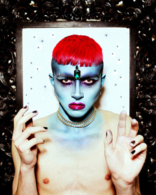
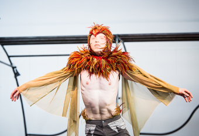

---

# CONFIGURATION
layout: 2015-turn
rootpath: "../../../"

# ABOUT THE SHOW - GENERIC
artist: "Turn 2015"
show: "First Night: Friday 27 March"
show_size: 4

# ABOUT THE SHOW - LAYOUT
header_image:

---
*A micro-festival of new dance, presented by* Word of Warning*,* Contact *+* Dance Manchester       
     
####Venue + Booking Details, for Turn        
Dates: Friday 27 + Saturday 28 March 2015, 7.30pm    
[Venue: Contact](http://contactmcr.com/visit/getting-here), Oxford Road, Manchester, M15 6JA    
[Tickets: £9/5 per night (two night pass £11/6)](http://contactmcr.com/whats-on/30697-turn-2015/booking)        
Special offer: buy nine tickets + get your tenth free    
Box Office Tel: 0161 274 0600    
        
####Order of Appearance (subject to change)      
**Rachel Sweeney | *Driftlines*** (video programme, ongoing from 7pm)        
This short dance film explores sense and synapses within a delicate ecology of rock, water, salt and skin. *Driftlines* follows a series of shifting perspectives held by both camera and dancer, captured along the Copper Coast shingle stretches of south east Ireland. Here, the camera follows a dancer's physical immersion and tactile exploration of those arterial spaces that are left in the wake of coastal erosion. The movement and environmental sounds fuse with internalized sensations to create a kinesthetic experience moving from water to land.         
[www.orrandsweeney.com](http://www.orrandsweeney.com)           
        
**Peter Grist + Company | *M.E.N.***        
Drawing upon an idea contained within the Greek myth *Pygmalion* — a tale about a sculptor who falls in love with a female statue of his own creation, an exploration of narcissism in relationships. The work revolves around a male duet performed in a marked-out space. So what are we to do? How do we protect ourselves from narcissists if they're so adept at slipping into our lives unnoticed?             
<http://petergristandcompany.wordpress.com> | [Peter Grist + Co. Facebook](http://www.facebook.com/petergristandcompany)        
        
**Joshua Hubbard | *Monochrome to colour***           
This solo is two ideas merged together, focusing on the idea of transformation through visually striking imagery and highly physical movement.
        
Dancer/choreographer: Joshua Hubbard | Starring drag queens: Grace (the face) Oni Smith + Liquorice Black | Make up artist: Louvaine C Lee | Filmed by: Andrew Greenland | On set assistant: Emma Speakman          
        
        
**Sophie Unwin | *The Chronicles Of Joy***         
*The Chronicles Of Joy* takes all the manuals, mantras and You Tube tutorials about happiness and throws them out of the
window. Because you are not alone, she is not happier than you are and you were better off without him anyway. Rule number 1, say yes.         
         
Music: *Gus on the bus* by The Travelling Salesman, *My Way* by Twinkle Twinkle Little Rockstar | Thanks: Yorkshire Dance, Peggy Olislaegers, Beth Cassani, Hollie Harkness-Gowers + Emanuele Pecorari         
[@SophieUnwin2](http://twitter.com/SophieUnwin2)          
           

**Rachel Sweeney | *Tradewinds/Taste of China***        
This solo is informed by the composite metamorphosis from rock to liquid mass, and employs a minimalist Butoh movement aesthetic. The title reflects the spatial arrangement for this work and is based upon the old mining process of changing composite granite into china clay.        
        
        
**Ebony-Rose + Lorienne Aimée | *More than high heels and lipstick***        
A performance based on the concept of how women are viewed in society; devised using autobiographical elements and dance.        
        
Created + performed by: Ebony-Rose Kirk + Lorienne Aimée Simpson         
      
**Adam Russell | *Out of the Chrysalis***        
Choreographer + Performer: Adam Russell | Costume Design: Casey Dixon | Music: *Escape Artist* by Zoe Keating, *This is my Shelter* by Olafur Arnalds, *Dawn* by Cinematic Orchestra, *Near Light* by Olafur Arnalds, *Shout* by Tears for Fears        
        
        
**Lo-Giudice Dance | *The Teeth Behind The Kisses***        
Inspired by time spent with artist Hector De Gregorio and his study on the theme of 'Ecstasy', two performers take to the stage to capture themes of the Divine and terrestrial, quiet and rapturous, extreme love and extreme pain. The work combines modern art and classical design to reveal religious overtones and eroticism.        
[www.logiudicedance.co.uk](http://www.logiudicedance.co.uk) | [Lo-Giudice Facebook](http://www.facebook.com/logiudice.dance) | [@LogiudiceDance](http://twitter.com/LogiudiceDance)           
         
         
**Maelstrom Theatre | *Oversight***        
Due to illness this piece will not be presented.        

####[Appearing on the Second Night: Saturday 28 March](/archive/2015-turn/sat)          
Dan Watson | EdgeFWD Dance Theatre | Joseph Mannion | Phoebe Ophelia Douthwaite | Rebekka Platt | Tangled Dance Company | ™ Dance Company | Victoria Sheldon — *plus a Mixed Movement Turn Special*
