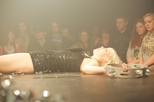
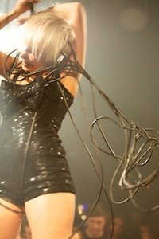

---

# CONFIGURATION
layout: 2012-autumnwinter
rootpath: "../../../"

# ABOUT THE SHOW - GENERIC
artist: "Action Hero vs. GO Project"
show: "Frontman"

# ABOUT THE SHOW - LAYOUT
# artist_size: 1 # optional - size of artist name 1-5. Default is 1. Set longer names to lower values
# show_size: 2 # optional - size of show name 2-5. Default is 2. Set longer names to lower values
# header_image: "header.jpg" # optional custom background image, relative to current page

---

####In Brief
Poised on the edge of catastrophe, *Frontman* is a furiously loud, raucous reproduction of the all the best gigs you never saw. With borrowed ramblings from iconic frontmen, the ghost of Elvis/Dolly/Kurt/Iggy is channeled by a girl in sequins, whilst a techie in rabbit ears refuses to watch the show. She turns up the volume and humps the speakers, and tells the crowd she loves them.     

Balanced between euphoria and a car crash, *Frontman* is part-gig, part-perfomance for an audience who like it loud.    

####More
*“I just wanna say that as of right now, this time tonight, you are my favourite fucking audience I’ve ever had!”*   

On a small raised stage surrounded by a tightly packed crowd on three sides cut through with haze and lights, a frontman lip-synchs, dances in spangled hotpants, sings her heart out and reminds us all how thankful she is that we’re all here.    

It feels like a music gig but we know its not.  The frontman knows this and we know this. Behind her a gangly techie wearing rabbit ears knows this too.  Weaving in and around *Frontman*, GO Project use guitar and electronics to underscore this game of hierarchical upstaging.  As the act turns more and more desperate, the tension between frontman, unsupportive techie and audience grows more and more intense until it explodes into a furious, chaotic and hilarious clash of personalities which unfolds and unfolds until both egos and crowd are subsumed and drowned out by violence, bright light, destruction and extreme noise.    

**Frontman is for an audience who like it loud (ear plugs provided....)**     

####Who are they       
**Action Hero** is the collaboration between artists Gemma Paintin and James Stenhouse. They’re based in Bristol and have been making performance together since 2005. This performance at GORILLA comes seven years to the weekend after their very first gig, at greenroom, as part of Emergency 2005!     

*Frontman* is the third piece in an unintentional trilogy of work about icons and the iconography of masculinity, following the highly successful *A Western* and *Watch Me Fall*.     

**GO Project** is Alex Bradley and Charles Poulet. Their last project, [*Whiteplane_2*](http://www.guardian.co.uk/music/2006/jun/11/jazz) received widespread critical acclaim.  Both veterans of greenrooom, Alex most notably, as his multiple entries on [greenroomutd.org]( http://greenroomutd.org/people/alex-bradley) will attest!      
   
*Like Throbbing Gristle meets Factory Floor meets Phil Niblock meets Zoviet France with a dose of live art thrown in for good measure!*    

####What people have said about them
>a beautiful, poignant and comic performance *Don’t Panic magazine*    
>a truly epic piece of theatre *The Guardian*         
>GO Project: ‘Achingly beautiful and fascinatingly different.’ *Glasgow Herald*     

####Credits      
Action Hero vs. GO Project was co-commissioned by In Between Time and hÅb. Frontman was co-commissioned by Fierce festival 2011 and IBT. Supported by Forest Fringe and Residence. National tour supported by ACE. Photos by Briony Campbell.     

####Websites:
[www.actionhero.org.uk](http://www.actionhero.org.uk)

Date:    Friday, 12 October, 7.30pm    
Venue:  GORILLA, 54-56 Whitworth Street West, M15 5WW    
Tickets: [£8/5](http://www.wegottickets.com/wordofwarning) also available from GORILLA in person at their bar      
Tel:       0161 832 1111 (ticketmaster)   

