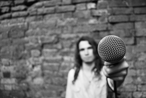

---

# CONFIGURATION
layout: 2012-autumnwinter
rootpath: "../../../"

# ABOUT THE SHOW - GENERIC
artist: "Ollie Smith" # the name of the artist or company
show: "27" # the name of the show

# ABOUT THE SHOW - LAYOUT
# artist_size: 1 # optional - size of artist name 1-5. Default is 1. Set longer names to lower values
# show_size: 2 # optional - size of show name 2-5. Default is 2. Set longer names to lower values
# header_image: "header.jpg" # optional custom background image, relative to current page

---
####In Brief    
Real rockstars die aged 27. Ollie Smith is 26. He is not a rockstar. Yet. Sitting somewhere between a grubby gig, a fanatic lecture and a Jonestown-esque cult meeting, *27* is a darkly humorous show that stirs up the myths surrounding the notorious 27 Club: a group of legendary musicians who all died at just 27 years of age.    

    

####More    
**Jones. Hendrix. Joplin. Morrison. Cobain. Winehouse. Smith?**  
*27 is drugs, booze, suffocation, electrocution, suicide and murder.    
It is hero-worshiping, celebrity-idolising, self-gratifying, growing-up-and-falling-down masturbation.    
27 is my current solo performance project.   
It's a show which explores the so-called 27 Club: an elite group of popular musicians who all died aged 27 whilst at the peak of their creative careers.    
The original ‘members’ were Brian Jones, Jimi Hendrix, Janis Joplin and Jim Morrison, but it wasn’t until Kurt Cobain died in 1994 that the concept of a ‘club’ was more widely popularised by the media.    
The show also speculates on my own potential death.  If I'm to become a legend of rock ‘n’ roll and subsequently a member of the 27 Club then I first have to establish myself as a rockstar.    
I’m now 26.    
So I have one year.*    

 

####Who is he
Ollie Smith is a live artist, theatre maker and musician based in Nottingham, UK.  He trained as a performer at Bretton Hall and graduated in 2007 with first-class honours.  He now makes his own performance work as a solo artist and as a collaborator.  He has been a rock junkie since he was a child and has an extensive vinyl library - but his turntable is broken.    

Other theatre work he is currently involved with includes *The End*, a collaboration with Nottingham-based artist and writer Michael Pinchbeck, which has been touring since 2010.  They’re currently making a follow-up piece, *The Beginning*, working with Manchester-based artist Nicki Hobday.  He's also currently working on a collaboration with London-based artist Phoebe Walsh called *Cat in Hell* which collides Andrew Lloyd Webber’s *Cats* with Goethe’s *Faust*.    

He has toured nationally with various shows and has received commissions, platforms and development opportunities from Theatre Writing Partnership (Nottingham), greenroom & hÅb (Manchester), Hatch (Nottingham) and Compass Live Art Festival (Leeds).  He is currently being mentored by New Perspectives (Nottingham).    

####Website    
[www.olliesmiths27.co.uk](http://www.olliesmiths27.co.uk)

####Venue & Booking Details
Date: Friday 2 November, 7.30pm (doublebill with Richard DeDomenici)    
Venue:	Z-arts, 335 Stretford Road, Manchester, M15 5ZA    
Tickets: £8/5    
Tel: 0161 232 6089     
