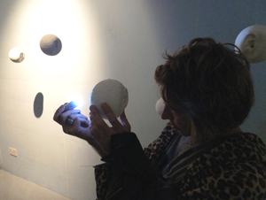

---

# CONFIGURATION
layout: 2012-emergency
rootpath: "../../../"

# ABOUT THE SHOW - GENERIC
artist: "BLANKSPACE" # the name of the artist or company
show: "12 til 5pm" # the name of the show

# ABOUT THE SHOW - LAYOUT
# artist_size: 1 # optional - size of artist name 1-5. Default is 1. Set longer names to lower values
# show_size: 2 # optional - size of show name 2-5. Default is 2. Set longer names to lower values
# header_image: "header.jpg" # optional custom background image, relative to current page

---

####Katie Taylor   *Let me wash your face*    
A shared ritual of cleansing exploring trust and vulnerability. How do we mark the moments of pain and pleasure which shape our lives?	A shared ritual of cleansing, exploring trust and vulnerability. How do we mark the moments of pain and pleasure which shape our lives?         
Katie is an emerging artist interested in performativity, ritual, gender and sexuality. She studies English and Drama at Salford University.    

####Kris Rowland/ How We Run	*Please don't touch*    
Homosapien,  from Nottingham, is looking for a mate or friend to join him in his new space. WLTM the same/similar species for a meetup very soon. If interested please inquire below...      	

Kris Rowland is an emerging live artist and film maker who works through queer and often autobiographical frames within intimate and interactive settings. He has previously worked with  Rachel Bernard, Chris Goode, Marc Hulson, Peter Mills and is a founding member of How We Run collective.  He has performed at Stoke Newington Airport, Embrace Arts Centre, De Montford University,  FIVE YEARS gallery, DEDA dance and Birmingham's Custard Factory    

####Jojo Townsend  *The wow project: Task Three*	    
*Go onto Google Maps and find a place where you feel like you lost something. Pinpoint the location and explain what you lost.*	    
With a laptop, a printer and Google maps you and Jojo Townsend navigate the world of lost items and people. You'll leave something behind of yourself but you'll take more with you: a fuller heart and a few biscuits in your belly.	    

Jojo Townsend is a performance artist and designer currently in her final year at Central St Martins. She makes heartfelt art pieces, installations and one-to-one performances. They are about people she has met, loved, lived with and lost.     

####aswespeakproject   *I know this, I do this all the time (I don't like it though)*    
An interactive performance installation performed by Julieta Kilgelmann    
 
*I do this again and again: I will close my eyes and keep still. You will draw. I will repeat your pattern until it becomes mine. Could you also tell me what to wear?*

This piece uses projection, direct audience participation and the performer's body to unearth the patterns that shape the space of the self, the messages, codes and images that invade, embed and collude on our encounter with the other. The aswespeakproject creates mixed media performance and installation work using the “stage space” as temporal and  spatial representation of the human brain. Xristina Penna is an independent designer and performance maker. Her practice is cross-disciplinary and consists of creating visual environments by blurring reality with dreamy states that relate to the uncanny. *I Know this...* originally commissioned by [Out of the Box Intermedia](http://www.outoftheboxintermedia.org)

[www.xristinapenna.com](http://www.xristinapenna.com)  [www.aswespeakproject.org](www.aswespeakproject.org)    
  

####Miyuki Kasahara   *His/her personal sky*    
Experience illuminated memories through a stranger's ear and even have your own ear cast. An installation and interactive performance.    

Miyuki invites you to have your ear cast; it takes 15-20 minutes. After casting, you can email her a personal memory as an image or text that she will place inside a cast ear sculpture. This will become part of a future his/her personal sky installation.    
    
These ear sphere sculptures are also a floating presence around the space you are encouraged to search for strangers' personal memories by looking into each ear hole. Shining a torch from behind creates a light-box effect, the inside illuminated as if another's secret memory just came to you.    

Miyuki Kasahara graduated with an MA from the Royal College of Art London. Her projects include 'Message to me 2012' (2008-12) commissioned by Shoreditch Trust, London, 'Trigger' a solo exhibition at Art Gallery X, Tokyo (2007).    
   
[www.miyukikasahara.com](http://www.miyukikasahara.com)    

    

####Yoko Ishiguro   *Flashes*    
An intimate and playful experience in the darkness 'taken' by you.	A photo documentation piece which only exists at the flashes of moments, occurring between you and the performer. Inspired by Vito Acconci's Blinks (1969).    

Yoko Ishiguro is a performance maker, performer and actress. Mostly, her works are site/time/situation-specific and performed in a toilet, a rice field etc. with some daily technologies to look at time, distance and communication.    

[ishiguro.info](http://ishiguroyoko.info/iroiro/)    

####Georgie Grace   *untitled (treat your mind like a screen)*    
Georgie Grace's films work to activate the sensory dimensions of language, using text to trigger tactile associations and imagined actions, allowing the viewer to become absorbed in an imagined present moment.  At the centre of her enquiry is the possibility of enjoyment in language and its capacity to create presence through the speed of its transmission.     

####Alice Malseed  *At the time, I had no idea...*    
I’m 24 and my world is really nice but there are lots of cracks. It’s like there’s been a tornado and loads of important bits have been blown away and broken. I remember being 4 and thinking everything was amazing, and I remember thinking that at 18 too. I’m afraid this piece is about being naive.    

Alice Malseed is from Northern Ireland and lives in London. She makes performance with, for and about communities. Her work is honest, sometimes brutally so. Alice is currently studying MA Applied Drama at Goldsmiths.     

####Burrow + Lee   *Wait A Minute*    
*Are you struggling to find time in this fast-moving world?  Learn to harness the power to become time rich.*	
Julie Burrow is Artistic Director of Dangerous Times theatre company, producing Montage Of Misery for the Not Part Of Festival 2011 (5 stars, Forever Manchester award) and Youpon Quality Time Experiences at this year's Hazard.  She has previously performed with Organised Chaos, Elysion Productions, Hens' Teeth Theatre and Larkin' About.  She is an actor, writer, director and storyteller.    

Jessica Lee's piece Stalking My Neighbour was in emergency accommodation 2012.  Her site specific piece the Swayze Stall was part of the Mayhem In The Market event by Question Your Teaspoons at Goole Market.  She was a documenter at Michael Mayhew's In Remembrance.  She worked with Julie at Hazard 2012 and at Contact Theatre's 24 Arty People.    
