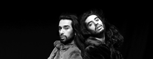
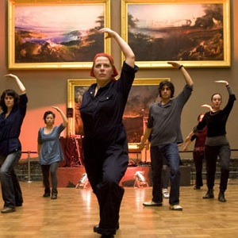
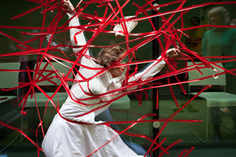
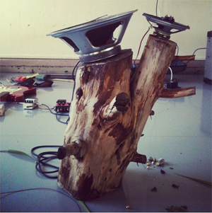

---

# CONFIGURATION
layout: 2012-emergency
rootpath: "../../../"

# ABOUT THE SHOW - GENERIC
artist: "Castlefield Gallery" # the name of the artist or company
show: "12 til 5pm" # the name of the show

# ABOUT THE SHOW - LAYOUT
# artist_size: 1 # optional - size of artist name 1-5. Default is 1. Set longer names to lower values
# show_size: 2 # optional - size of show name 2-5. Default is 2. Set longer names to lower values
# header_image: "header.jpg" # optional custom background image, relative to current page

---

####Stephanie Douet   *Real/No-Real*    
Follow the artist on screen and in person along mirrored pathways that suddenly turn upside down, through impossible forests of black paper, past looming geometric constructions. And just when you think you are getting your bearings, the artist remakes the landscape ahead of you.    

Stephanie Douet exhibits sculpture, performance and installation at various UK venues including the De La Warr Pavillion, V&A, Outpost Norwich, Kraak Manchester and home London. She is currently exhibiting in *Sinopticon* at National Trust's Saltram House and Plymouth Museum. Douet also co-curates the Queen of Hungary Project Space.    
[www.stephaniedouet.co.uk](http://www.stephaniedouet.co.uk)    


####Qasim Riza Shaheen   *Misplaced Memoirs*    
*Qasim Riza Shaheen invites you to step into his world and experience his declarations of love and desire.*    

An entire show experienced at Contact in February 2012 has been reworked and condensed into a few static moments, declarations and an unexpected intervention. Qasim Riza Shaheen's *Misplaced Memoirs* features Zaf Shabir and Stanislas Hagen. Limites one-on-one encounters.          

Qasim Riza Shaheen is a British artist based in Manchester with an international repertoire. His work has been presented at prominent venues and festivals throughout the United Kingdom, including at the Victoria and Albert Museum, London; the National Review of Live Art, Glasgow; the Liverpool Biennial; and British Dance Edition. Internationally, Shaheen's work has been programmed as part of several film festivals; British Council's showcases of live art in Denmark, Spain and Belgium; and at numerous art museums and galleries in Pakistan, India and in the USA. His art works have been acquired by museums and collectors internationally.

photo by Karin Albinsson    

[www.qasimrizashaheen.com](http://www.qasimrizashaheen.com)    


####PK Fiskulturnik   *Yugo yoga: the long march*     
*Increase personal flexibility, reduce social tension and gain moral strength by joining PK Fiskulturnik in the long march to socialist self- realisation through Yugo yoga.*

*Yugo yoga : the long march* is a durational performance piece inspired by physical yoga and poses from redundant revolutionary sculptures, created and performed by Lara Ritosa Roberts aka PK Fiskulturnik. Coined from ‘Yugoslavia’ – the country of artist’s birth that no longer exists – and ‘yoga’, the union, this performance revisits European communist cultural heritage whilst drawing a parallel between a real physical effort and determination of spirit.

Viewers are invited to join in at any point of performance and experience first-hand the act of live art embodiment.

Performed as both solo and a group piece in a variety of settings, *Yugo yoga...* has featured at many art events in the UK and abroad most notably at Tate Britain (2010), Museum of Yugoslav History, Belgrade, Serbia (2011) and Whitstable Biennale (2012). 

Lara Ritosa Roberts is a Croatian born, UK based visual and performance artist. She obtained an MA in Fine Art from Central Saint Martins College of Art & Design in 2007, and has also trained as a sculptor and as a physical theatre performer. In 2007, Lara founded Performance Klub Fiskulturnik, an international collaborative live art project.    

            

####Clarissa Sacchelli   *Untitled*    
*Untitled* is a performance about a desire for stillness. It is about what moves to immobilise, and what is in stillness to move, about an impossible possibility that can just exist in inter-relations.    
    
concept and performance | Clarissa Sacchelli    

            

####Platt, Birchall + Hussain   *The Dreaming*    
*Myth of creation and how it all began.*                  
By Rebekka Platt in collaboration with David Birchall + Aliyah Hussain.    

Rebekka Platt graduated from Salford University in 2010 and has worked with a range of artists from different disciplines: choreographer Saju Hari, musician and visual artist Goran Vejvoda, musician David Birchall, Volkov Commanders, Edwina Ashton and Genevieve Say.    

Aliyah Hussain graduated from Manchester Metropolitan University in 2009. She has a range of experience in performance and exhibitions such as *Triptych*, curated by Laura Mansfield, *11 rooms* with Marina Abramovic and Joan Jonas, and *Panoply* performance piece, Kraak Gallery and Sounds from the other city.     

David Birchall started playing the guitar in 1994 and has continued to ever since, gigging and touring extensively with a variety of groups in the UK, France, Holland, Germany, Spain, Portugal, Czech Republic, Austria, Switzerland, Italy, Palestine and Denmark. He consciously locate's improvisation at the core of his musical work.    

Supported using public funding by Arts Council England, and by Salford University, Dance Initiative Greater Manchester and Manchester Dance Consortium.    

