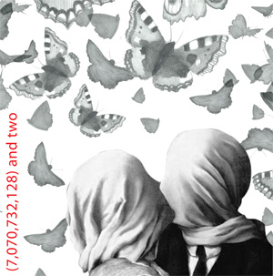

---

# CONFIGURATION
layout: 2012-emergency
rootpath: "../../../"

# ABOUT THE SHOW - GENERIC
artist: "Z-arts" # the name of the artist or company
show: "6 til 10pm" # the name of the show

# ABOUT THE SHOW - LAYOUT
# artist_size: 1 # optional - size of artist name 1-5. Default is 1. Set longer names to lower values
# show_size: 2 # optional - size of show name 2-5. Default is 2. Set longer names to lower values
# header_image: "header.jpg" # optional custom background image, relative to current page

---

####Angel Club (north)	*The Mirror Twins*    
The 'mirror twins' take the weight from your shoulders and transport you to exotic climes in this head to head encounter of canapé art.    

*I find it hard to believe you don't know the beauty you are....but if you don't, let me be your eyes...a hand to your darkness, so you won't be afraid.*  Velvet Underground - I'll Be Your Mirror lyrics
Phil Sykes and Chris Gilligan have been making performance for 10 years as Angel Club (north). Working in  theatre studios and public settings, recent works include 'Beyond the Sea' and 'Obstacles to Coming home' (2007-9). The company has presented at The NRLA (Glasgow) . They presented the final Emergency finale at greenroom in 2010.    

####Diego Bowie	*Double Up: Life Is Fantasy By Nature...*    
*…And We Must Create Our Own Reality , Before We Lose Our Identity Believing What We're Programmed To Believe.*    

A commentary on how we are tricked into thinking what society wants. A video Performance filmed by Georges Don.    

Diego Bowie is 20 years old, born and based in Panama City, Panama. The main motivation behind his work is social criticism and technology , which he takes as the starting point of all his creative adventures.    

####Wayne Steven Jackson	   *(7,070,732,128) and two*    
A live performance trying to be a film, piecing together fragments of narrative, telling the story of two people meant to be more than strangers. After the opening credits fade you will see the man and the woman walk towards each other, strangers, oblivious to their imminent collision.  And you will fall in love with these mediated, fictional characters behind the screen, will them to see each other, to see into each other; to have their happy ending.    

But this time will be different.  This time you won't play by the rules.  This time you will be with them in that moment.  And this time, this time this story will be about you.    

Wayne Steven Jackson creates *'poignant, beautiful and clever'* work.  Fusing video and liveness he confronts the fleeting moments of performance and explores ideas of memory and of being.  Image created by Alana Danielle Richards.     

He has worked for eight years creating 'funny, baffling, mystical, absurd and mind bending' work with Escape Theatre, creating seven pieces of live performance both with Escape and as a solo artist.  Wayne is currently exploring the relationship between live performance and memory, using video within his performances with intelligence and creativity as an aide to exploring his and his audience's position to his work.    

####Sedated By A Brick	*Sedated By A Brick present Serrated By A Knife present Sedated By A Brick*
A fevered dream, a paranoid trip or an inter-generational seance?  Whatever way you see it, they are a company possessed. 	Tonight Sedated By A Brick will summon up the spirits of their alter-ego theatre company, Serrated By A Knife.    

*Is there anybody out there?*    

Unexpectedly, three icons of the seventies will answer their call and assume the mantle of Serrated By A Knife, presenting their dramatic rendition of seminal book/film classic, *The Shining*.    

A fevered dream, a paranoid trip or an inter-generational seance?  Whatever way you see it, they are a company possessed.
A Bristol-based performance company, producing high quality 'quirk' since 2009. 
*''We want to see what kind of experiences we can create when we put our minds and bodies together. We combine strong imagery and a mordant strain of humour to explore interrelations between often impossible characters and situations."*    

####Allan Taylor	*Success and the City*    
Allan is just another strong, successful person in control of his single and fabulous life.

A take on the cult classic *Sex and the City*,  Allan explores the ideals of modern city living through a staged TV episode where his interior monologue and perception of the world in his own psycho drama soon goes awry after he comes to a realisation about the world he has constructed.    

Allan Taylor is a live artist, writer and theatre-maker whose work ranges from theatrical performance to durational installations and intimate performances. His work investigates the absurd in relation to the self and how external expectations affect our internal self-perception, often using character and façade to display the dichotomy between our ideals and reality.    

####Sh!t Theatre	*Sh!t Theatre's JSA (Job Seekers Anonymous)*    
A unique and humorous exploration of the (un)employment situation in the UK today. Expect song, satire and a sharing of stories. 	
>>>>>>> removed bad filename
*We all know someone who's on the dole. Your dad's on the dole. Your dog's on the dole. You're probably on the dole, aren't you? Or even worse, maybe you have a job....* 

See Sh!t Theatre before they hit the big time. Or have to go work at Poundland.    
*'Wonderfully politically incorrect and insightful...a cracking showcase for Mothersole and Biscuit's weighty talents'* WhatsOnStage.com    

Sh!t Theatre are: Louise Mothersole and Rebecca Biscuit. With backgrounds in performance art, music and long-form improv, they have been writing and performing together since summer 2010. This project is supported by Escalator East and the Arts Council for England.     

As performers they have collectively worked with: Duckie, The Barbican, Bobby Baker, Ron Athey, Marisa Carnesky, Split Britches' Lois Weaver and Peggy Shaw, Stacy Makishi, Helena Hunter, Julia Bardsley,  The RSC.   
[www.shittheatre.co.uk](http://www.shittheatre.co.uk)  
 

####Jenny Duffy and Massive Owl	*The MOBB Project*    
There's this man sat at a desk.    
There's this man and he's not sat at a desk...    
There are four men and one woman and they are all sat on chairs.    
Then there's You.    

The MOBB Project is a new collaboration between Bristol based theatre company Massive Owl and Newcastle-upon-tyne performance maker Jenny Duffy.    
Massive Owl are a Bristol based theatre company made up of three Artistic Leads: Adrian Spring, Danny Prosser and Sam Powell. They are Associate Artists of University College Falmouth. The MOBB Project has also been made in collaboration with Massive Owl Associate Artist: Jack Jago.    
  
Jenny is a performance maker and writer from Bristol, now based in Newcastle upon Tyne. Jenny is also the higher education 'GIFTed' co-ordinator for Gateshead International Festival of Theatre (GIFT).    
[www.massiveowltheatre.com](http://www.massiveowltheatre.com)    
[MOBB](MOBB2.jpg)    

####Lena Simic	   *1994*    

A homage to Kurt Cobain, forgotten soldiers and failed encounters from a life lived retrospectively.    
This solo performance is a story about 1994.    
A series of memory excerpts which intertwine the past with the present.    
An exploration of lost youth and ageing.    
A mix of historical, political and popular references (mention of the Balkan War and its atrocities, grunge and the suicide of Kurt Cobain) with personal autobiographical narratives (number of the boys I kissed, failed move to Seattle).    
A performative confession of a 37 year old woman who is remembering a 27 year old Kurt Cobain.    
This piece is about the troubling thrill of living life retrospectively.    

Lena Simic, performance practitioner and pedagogue, born in Dubrovnik, Croatia, living in Liverpool, UK. Co-organiser of The Institute for the Art and Practice of Dissent at Home, an art activist initiative run from her family home. Lena's autobiographical performance practice is informed by its relation to everyday lived experience, memory and fantasy.    
   

####70/30 Split	   *Content part 1:*     
Two women search for content. Meaning and substance is sourced through the philosophical medium of burlesque. Two women perform.    
70/30 Split is Sophie Unwin and Lydia Cottrell, two York based choreographers and performers. Together they present an accumulation of words, thoughts, characters, expectations, stories, experiences and alternatives.  Creating satirically energetic dance theatre work, the pair utilise movement, text, honesty and leotards, combining burlesque, bodies and the bizarre.  They have  performed to audiences both nationally and throughout the region including Leeds Light Night festival, Friday Firsts at Yorkshire Dance, Heads up north east at Edinburgh Fringe festival and Spring Loaded at The Place, London.    

####Robin Sidwell	*An Evening of Poetry*     
Chorlton based performance poet Robin Sidwell writes poems for the people and reads them to the people, his people, for he is the people's poet.      
Come and listen, he's not saying the work will change the world completely ...but it will a little bit!    
*"Oh that thing in the news? Yeah man,that was awful wasn't it!  Probably write a poem about it, that's just what I do!"* (Sidwell 20/08/12)    

Former greenroom associate artist with theatre company **Until Thursday** and Method Lab artist as Robin Sidwell.    

####Chris Fitzsimmons	   *It Goes Without Seeing*
*Small, thin, humpy, stumbly man seeks open-eared audience for simple show.*    

Imagine a small, thin person stood in front of some other people whose heights and widths are variable.    
Imagine then that the small thin person is male and is a bit humpier and more stumbly than the other people.    
Imagine then that the small, thin, male, humpy, stumbly person opens his mouth and begins to talk about being small, thin, humpy and stumbly and you are some way to describing what this show is.    
Some way, but not very close. :)    

Dedicated to all those people who have dared speak to me over the years...    

Chris Fitzsimmons graduated from UCLAN in 2007 and has since written and performed in countless solo projects. He has been a member of the NYT since 2004 and continues to make work both solo and in collaboration with other artists.    

####Josh Coates	*Stevie Wonder's Stern Warning*      
A rock-ukulele-pop concert performed by Josh Coates exploring how the only remaining member of the band 'Stevie Wonder's Stern Warning' copes with the loss of friendship, career and an audience. A solo performance for two.    

Josh Coates is a performance artist based in Lancaster and is the Creative Producer of LEAP, Lancaster Emerging Arts Platform. Special thanks to Ideas Tap, GETINTHEBACKOFTHEVAN, befur the bear and to anyone who has seen the piece in its infancy.    

 
