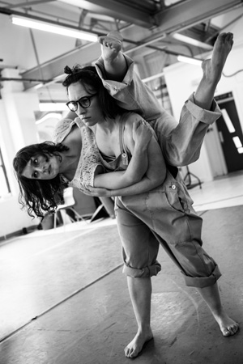

---
# CONFIGURATION
layout: 2013-autumnwinter
rootpath: "../../../"

# ABOUT THE SHOW - GENERIC
artist: "RashDash" # the name of the artist or company
show: "The Ugly Sisters" # the name of the show
artist_size: 1
show_size: 1
header_image: "header_rashdash.jpg"

# ABOUT THE SHOW - LAYOUT
# artist_size: 1 # optional - size of artist name 1-5. Default is 1. Set longer names to lower values
# show_size: 2 # optional - size of show name 2-5. Default is 2. Set longer names to lower values
# header_image: "header.jpg" # optional custom background image, relative to current page

---
*Presented by* Contact + Word of Warning 
   
####In Brief
Thumping drums, clanging keys and violent voices; a sinister and sensuous cabaret — a riotous funk-rock opera tells the real story of *Cinderella*.       
        
Watch trailer [here](http://youtu.be/i0rUjOh4yu8).    
     
####Venue + Booking Details
Date: Friday 11 + Saturday 12 October 2013, 8pm   
[Venue: Contact](http://contactmcr.com/visit/getting-here/), Oxford Road, Manchester, M15 6JA    
[Tickets: £11/6](http://contactmcr.com/whats-on/6232-rashdash-theatre-the-ugly-sisters/)   
Box Office Tel: 0161 274 0600    
    
####Q&A          
On Friday 11 October there will be a post-show talk.         
    
       
####More        
*Once upon a time there was us. Ruby and us. Ruby was our mum. She had to work a lot. We played in the burnt out car round the back. We could do anything... except play with the needles.*        
          
*Then everything changed, and there were bright lights and loud noises and flashing cameras. And there was her, and she was different. Everyone loved her.*       
        
*Whoever holds the pen writes the story.*        
               
Part-show, part-gig — a wild and unblinking look at media representations and public approval; a punk/pop reimagining of *Cinderella* told by two of the most infamous fairytale villains of all time, *The Ugly Sisters*.      
                          
####Who are they?        
Abbi Greenland and Helen Goalen formed RashDash in 2008 at The University of Hull; they are performers, devisers, choreographers and singers based at WYP in Leeds.        
         
They make theatre that is noisy, messy, fierce, funny, beautiful, unsettling, bold. So far all of their work has involved story, dance, live music and song  — but it might not always. They make shows about being young and being women. They make shows about what it feels like to be here, now. They make shows about the world we ALL know — can see, smell, touch — and the world that only THEY know; that exists in their cells and their bodies.        
        
Their process is evolving. It's never the same. Sometimes they sit and talk for days. Sometimes they play games. Sometimes they move together for hours without speaking. Sometimes they play with bubble wrap, or a bath, or a tower of mattresses, or...         
           
They are starting to play with how they can work with a writer, from the beginning, letting words affect movement and movement affect words. They are trying not to be scared of words and of asking someone else into the room to write them... they are doing well.        
         
They were Fringe First winners 2010 and 2011, have been nominated for a Total Theatre award for Innovation and Experimentation, and are an Associate Company of West Yorkshire Playhouse.        
          
####What people have said about them         
>*4\* Electrifying* The Daily Telegraph         
>                
>*4\* A riotous evening of performance* A Younger Theatre         
>        
>*Sensational* Total Theatre         
    
         
####Credits     
Featuring *Not Now Bernard*; direction by Kyle Davies; design by Alison McDowall.        
Supported using public funding by the National Lottery through Arts Council England.        
        
####Websites    
[www.rashdash.co.uk](http://www.rashdash.co.uk/) | [@rashdashtheatre](http://twitter.com/rashdashtheatre)   
