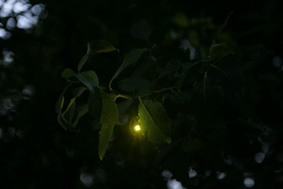

---
# CONFIGURATION
layout: 2013-domestic
rootpath: "../../../"

# ABOUT THE SHOW - GENERIC
artist: "Alex Bradley + Scott Smith"
show: "Field Test in Garageland"
artist_size: 1
show_size: 2
header_image: "header_alex.jpg"

# ABOUT THE SHOW - LAYOUT
# artist_size: 1 # optional - size of artist name 1-5. Default is 1. Set longer names to lower values
# show_size: 2 # optional - size of show name 2-5. Default is 2. Set longer names to lower values
# header_image: "header.jpg" # optional custom background image, relative to current page

---
*Presented by* Word of Warning, Guiness Northern Counties + Z-arts       
*during* [Domestic](/current/2013-domestic/index.html)        

####In Brief
A field test to pull your eyes to the periphery and the wilderness beyond.   
Durational, from sunset every night, this 'depth of field' illusion nestles amidst trees, forming a hidden landscape made immersive by sound — a moment of rural tranquility amidst urban chaos.    

Coming to life at dusk, *Field Test in Garageland* is experienced by looking out from within an empty garage, immersing its audience in a world far from its building-site surroundings.    
            
**Please note: this piece takes place in an unheated garage, wrap up warm!**    

####Venue + Booking Details             
Dates: Friday 8 + Saturday 9 + Thursday 14 — Sunday 17 November 2013 (5pm-10pm)         
[Venue: Cooper House](http://bit.ly/1anL5UN), off Boundary Lane, Manchester, M15 6DX — a 5 minute walk from Oxford Road (Aquatic Centre/RNCM), with a bus stop right outside for no's 53, 85, 86, 99, 101, 104, 105, 108, 109, 112, 250, 253, 263 & 291.             
BOOKING ESSENTIAL:             
Appointments can ONLY be reserved over the phone: 07581 299 439 (leave a message + we’ll get back to you).               
After your encounter, donations are invited.                  
             
####Access Information    
As a sited event, *Domestic* presents a number of access challenges.
*Field Test in Garageland* takes place in a basement level garage and wheelchair users should be advised there is a fairly steep slope to negotiate. Audio-visual installation, no spoken word.    
For specific age and access information please email <mailto:info@habarts.org> or call 0161 232 6086.        
      
              
####More      
Originally a work for a rural glade, here *Field Test* has been reimagined to offer respite in a more urban setting. The piece is composed of an array of over 500 solar-powered LEDs and a four speaker synchronised surround-sound.    

*"My family suffer from cataracts, a blurring of the vision. I haven’t personally suffered from this condition as yet, but I have taken the Humphries Field Test 6 times. This simple test examines your peripheral vision.”*    

*Field Test* is an explosion of this test; an artistic extension of the bio-medical examination, a way of recalibrating our viewpoint to the outskirts, or the edgelands, into the darkness and wilderness where glow worms insist we move on. *Field Test* uses remote speakers, LEDs, and nightfall to entice an audience into a collective 'test' of their senses, to take their senses literally to the edge and then beyond.    
                  
####Who are they?    
Alex Bradley (UK) is a Bristol-based sound and performance artist creating large-scale immersive sound works including *Whiteplane_2*, described as 'beautiful and disorientating' (The Observer). A former Cooper House resident and greenroom regular, last seen in Manchester as one half of the [GO Project](/archive/2012-autumnwinter/goproject/index.html), *Field Test in Garageland* marks his return to his home of more than a decade ago.   

Scott Smith (US) is a Kansas-born musician, a player of the steel guitar resonant with the feeling of belonging to absolute wilderness, of single railway tracks cast into the desert.   
                  
####What people have said about them       
>*Whiteplane_2 with Charles Poulet: 'Achingly beautiful and fascinatingly different.'*  Glasgow Herald         
                     
####Credits        
Alex Bradley is an Associate Artist with In Between Time, by whom *Field Test* was originally commissioned.         
Supported using public funding by the National Lottery through Arts Council England.         
Domestic is produced by hÅb; supported by Guinness Northern Counties, Z-arts + City Response Limited.           
     
            
####Website        
[@atasterisk](http://twitter.com/atasterisk)
