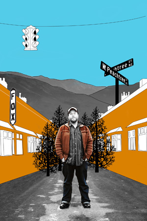

---
# CONFIGURATION
layout: 2013-domestic
rootpath: "../../../"

# ABOUT THE SHOW - GENERIC
artist: "J. Fergus Evans"
show: "my heart is hitchhiking down peachtree street"
artist_size: 1
show_size: 4
header_image: "header_mhih.jpg"

# ABOUT THE SHOW - LAYOUT
# artist_size: 1 # optional - size of artist name 1-5. Default is 1. Set longer names to lower values
# show_size: 2 # optional - size of show name 2-5. Default is 2. Set longer names to lower values
# header_image: "header.jpg" # optional custom background image, relative to current page

---
*Presented by* Word of Warning, Guiness Northern Counties + Z-arts       
*during* [Domestic](/current/2013-domestic/index.html)        

####In Brief
Stories of Southern Comfort, dancing drag queens and singing cicadas from the sticky heat of Atlanta, Georgia.        
                     
**Please note: this is a show for maximum 9 people, lasting approximately 60 minutes. Suitable for ages 12+.**        
         
####Venue + Booking Details             
Dates: Saturday 16 November 2013, [2pm](http://www.wegottickets.com/event/240524) (sold-out) + [5pm](http://www.wegottickets.com/event/240527) (sold-out) + [8pm](http://www.wegottickets.com/event/240529) + Sunday 17 November 2013, [2pm](http://www.wegottickets.com/event/240532) + [5pm](http://www.wegottickets.com/event/240534) + [8pm](http://www.wegottickets.com/event/240536)         
[Venue: Cooper House](http://bit.ly/1anL5UN), off Boundary Lane, Manchester, M15 6DX — a 5 minute walk from Oxford Road (Aquatic Centre/RNCM), with a bus stop right outside for no's 53, 85, 86, 99, 101, 104, 105, 108, 109, 112, 250, 253, 263 & 291.             
LIMITED CAPACITIES, BOOKING ESSENTIAL:          
Tickets: £6/4, can be [booked online; a fee applies](http://www.wegottickets.com/wordofwarning).                
Tickets: £6/4, can be reserved over the phone: 07581 299 439 (leave a message + we’ll get back to you).                
                      
####Access Information    
As a sited event, *Domestic* presents a number of access challenges.
The flat *My Heart Is...* takes place in is level access, but the room is small so we would appreciate it if you could let us know about any wheelchairs so we can adjust capacity.   Spoken word based.  
Age advisory: 12+   
For specific age and access information please email <mailto:info@habarts.org> or call 0161 232 6086.        

####More      
Fergus has lived in England for almost seven years. He hasn’t been back to his hometown in five.        
           
*my heart is hitchhiking down peachtree street* is a one-man show about living far away from home. It’s about the stories you tell people when they ask you where you’re from. It’s about learning that once you leave, you can’t go back.        
          
Using animation, storytelling, and spoken word, the show is about trying to make sense of where you come from when you’re very far from home.         
    

####Who is he?    
J. Fergus Evans is a yarn-spinnin', boy-kissin' spoken word + performance artist.           
        
His work focuses on restaging spoken word using video, soundscaping and sculpture. He deftly weaves poetry, theatre, and installation into tapestries saturated with lived experience and half-imagined fantastical landscapes.           
          
Previous work includes (among other things) a forest created from over a thousand donated sympathy cards; he has created work with a number of leading arts organisations including Contact, The Albany, and BAC; he is also a certified life coach and independent producer.      
              
####What people have said about him       
>*a refreshing reminder of just what can be achieved in Theatre* The Public Reviews       
>         
>*If you haven’t heard of Fergus Evans, you soon will* The Pink Paper       
>        
>*Gently perceptive... rich and unhurried...* Total Theatre       
>       
>*Heartwarming and intimate*  A Younger Theatre       
    
       
####Credits        
Written and performed by J. Fergus Evans.         
Co-produced by Contact with support from The Albany.        
Supported using public funding by the National Lottery through Arts Council England.             
Image by 'Off the Grid' and photography by Roshana Rubin-Mayhew.             
Domestic is produced by [hÅb](/hab); supported by [Guinness Northern Counties](http://www.guinnesspartnership.com/about-us/news/gnc/2013/October/manchester%20tower%20block%20plays%20host%20to%20performing%20arts%20festival.aspx), [Z-arts](http://www.z-arts.org) + [City Response Ltd](http://www.cityresponse.co.uk). With thanks to [Wesley Community Furniture](http://www.thewesley.org.uk/index.html).                  
         
####Websites        
[jfergusevans.com](http://jfergusevans.com) | [@Fergus_Evans](http://twitter.com/Fergus_Evans)
