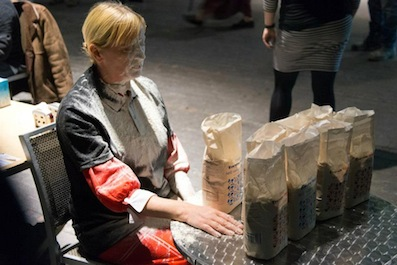
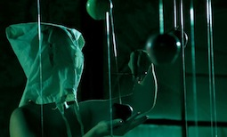
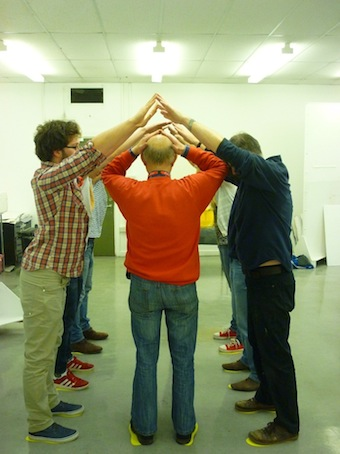
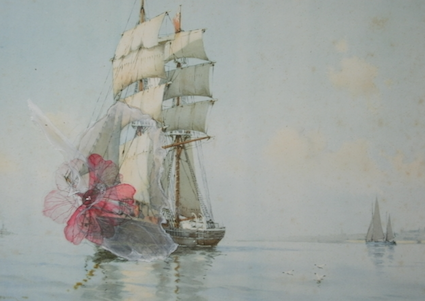
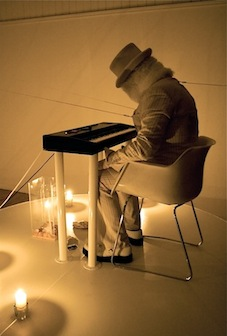
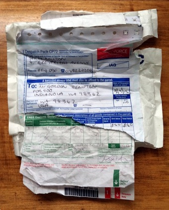
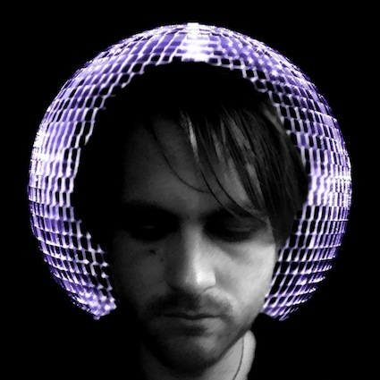

---
# CONFIGURATION
layout: 2013-emergency
rootpath: "../../../"

# ABOUT THE SHOW - GENERIC
artist: "Emergency 2013"
show: "BLANKSPACE: 12noon-4pm"
artist_size: 1
show_size: 3
header_image:

# ABOUT THE SHOW - LAYOUT
# artist_size: 1 # optional - size of artist name 1-5. Default is 1. Set longer names to lower values
# show_size: 2 # optional - size of show name 2-5. Default is 2. Set longer names to lower values
# header_image: "header.jpg" # optional custom background image, relative to current page

---
*Presented by* Word of Warning, Blank Media Collective + Z-arts *during* [Emergency 2013](/current/2013-emergency/index.html)        
          
####In Order (subject to change):              
**lili Spain | Break on Through (to the Other Side)**                
Pillaging elements of ancient ritual, anthropology, psychoanalysis and self-hypnosis, the work is an attempt to break through/back to an alternate state/time, and one of a series of performances marking the centenary of the publication of Sigmund Freud's controversial *Totem and Taboo* (2013).

lili Spain is an artist living and working in London. Starting from a sculptural sensibility her artwork encompasses a diverse range of media, including installation, film and performance. She uses found objects and shards of text to develop imagined, mythical histories that are obsessively reworked to form hybrid art pieces, often manifesting as performance relics or detrital remnants. The resulting works are often both unsettling and absurd. She draws reference from mythology, theology, personal history and psychoanalysis.            
               
lili has performed and exhibited at a variety of prestigious venues, including the Whitechapel Art Gallery, Milton Keynes Gallery and De La Warr Pavilion. She is currently working on a series of performances marking the centenary of the publication of Sigmund Freud's controversial *Totem and Taboo* (2013), in Egypt and the UK. She curated the hugely successful Totemic Festival of performance inspired by the text, which took place at the Freud Museum London 5-7 July 2013.              
[lilispain.net](http://lilispain.net/)              
              
              
**Maiada aBOUD | The Eucharist**             
*"Working in performance while reflecting on my personal background as an Arab Israeli Christian female artist was really appropriate for looking into the gaps, conflicts and limitations of the intercultural dialogue (especially after moving to the UK). Furthermore it helped me to explore the cultural differences, political commitment and political identity.*          
              
*"As a woman living in a patriarchal society and as an Arab citizen living in a Jewish country, I have used my body in performance art as an actual material to reflect the social and the emotional conflict, trying to break down barriers between art and life.*          
            
*"In my work I have always tried to employ forms of resistance to the sexual and social roles that I play as a woman; the role that I have had to follow throughout my life as a way of transcending the 'unkindness' of the real circumstances, finding my identity as an artist. In my society men are meant to control everyday life as part of the patriarchal society. These reasons and many more brought me to deal with the issues of identity, gender and sexuality so as to accomplish the things that are forbidden in my family, society, and religion."*          
[www.Maiada-Aboud.com](http://www.Maiada-Aboud.com)                 
                 
           
**Kerry Carroll | All imperfect things**               
Inspired by the 1993 film *The Piano*, this partly autobiographical work is about expression; using the body to speak, to portray your desires.            
                      
*"I will sometimes see an image or hear music, even read something that I find striking or inspiring, something that feeds my creativity; and then I take that and perform it, express it any way I can. I film these 'bursts' of performances and keep them. These small bursts might only be 20 seconds long, but over a period of time these bursts grow into a full-length piece.*                
               
*"With this particular piece I drew upon a film that I have always admired, for its simplicity and its dark romantic beauty. The imagery and the music gave me so much inspiration; I'd always wanted to test the waters and perform it on stage. I had a great amount of material from my 'bursts' that married with the material I had created from the film, so I chose to make it my first solo piece of work. It's something I have wanted to work on for a long while and it's an exciting feeling to perform something that is so different from anything I've done before."*                
              
                  
**Beth J Ross | Kleines Haus ii**                  
*Kleines Haus ii* is a quiet installation where the viewer becomes the participant, and the piece. It deals with personal spaces, intimacy, our relationship to others, and asks what 'home' is.                
                            
*"Interested in the ideas of family, memory, home and history; my work to date includes installation, photography, sculpture and drawing. Following a career as a teacher, the birth of my two children proved a catalyst to my work and I started studying fine art in 2011."*                    
[bethjross.wordpress.com](http://bethjross.wordpress.com)                  
                      
                 
**Rebecca Bowley | The Mistakes I've Made/Longing and Waiting | *Commissioned for Emergency***               
*The Mistakes I've Made/Longing and Waiting* is a boat, the sea, and a musical instrument.               
                    
It is an endurance piece set to a collection of writings accumulated through an informal call-out in which people were asked to describe their personal experiences of longing and waiting. It dreams of times, people and places that you want to go to but can not; it carries and transports us to those places through aloneness, distance, dream and physical endurance.                
                
The body becomes tired through rowing, rowing without physically being able to go anywhere; but rowing nonetheless, enduring the movement to enable the tired body to be transported as if by magic and child-like innocence to another shore where anything is possible and dreams have no limit.                

Rebecca Bowley is based at Bloc Studios (Sheffield), and a Freelance Co-director/Curator for Bloc Projects Contemporary Art Space; she is also an Associate Member of Compass Live Art and Point Blank Theatre, and a Visiting Lecturer at Sheffield Hallam University.                   
[www.beckybowleyworks.blogspot.co.uk](http://www.beckybowleyworks.blogspot.co.uk)              
           
                   
**Lotta SCAF | Bank of Change — Unconditional Real Trust**             
A live art act performed and developed by Sophie Frenzel; challenging the role of money in our society, this piece will give you deep insight about how an alternative economy could look.                
               
Sophie Charlotte Alexandra Frenzel, alas Lotta Vanina SCAF, is a conceptual artist and Social Entrepreneur. She strongly identifies with the practice of the FLUXUS movement, and with its representatives Valie Export and Joseph Beuys, she now is trying to find out what art can contribute to a socially, economically and ecologically balanced society; she has founded her own money Institute: *The Bank of Change — an Unconditional Real Trust*, that is in pursuit of an alternative economy for our future.                  
                  
Sophie is co-founder and manager of the award winning Social Enterprise OXFORD ART CIRCUS.             
                      
**Mike Chavez-Dawson | In Your Hands | *Commissioned for Emergency***             
*In Your Hands* sees critically acclaimed Manchester-based artist-curator Mike Chavez-Dawson perform as Mic Alche with a one-to-one palmistry service where he will scrutinise your artistic temperament & success from the creases of your hands and the veins in the whites of your eyes.             
               
Mic Alche’s regalia sees him don a René Magritte inspired overcoat & bowler and a gold painted face (*ref: Beuys, How to Explain Pictures to a Dead Hare*). In addition to his reading, each willing participant will receive a hand-map painting of her/his hands as a keepsake for taking part.               
                
Mike Chavez-Dawson is an artist-curator based at Rogue Artists' Studios, Manchester. He instigated and curated the critically acclaimed shows *Unrealised Potential* and David Shrigley's solo show entitled *HOW ARE YOU FEELING?* for Cornerhouse (2012–13). More recently his extraordinary proposal *Beyond the Medium, A Rake’s Dream…* made the 100 favorite proposals for Artangel *OPEN* 2013.               
                     
Chavez-Dawson tends to present 'propositional works' that retain a healthy skepticism for participation and interpretation; this is usually through multi-part works that sit between performance(-art) and curation, often revealing the myth of the artist's vision as against the audience's reading.             
[www.mikechavezdawson.com](http://www.mikechavezdawson.com)         
             
                    
**Sarah Boulton | Present**                   
A one-minute sound recording of the most silent place on Earth is offered to you to keep.                   
                     
*"I make situation-specific interventions in public spaces. A lot of them are carried out unannounced and unknown to the contemporary audience. The 'work' may then exist in various spaces both before or after its happening; its script may be told via word-of-mouth or printed onto business cards, it may sit in somebody's email inbox or be disseminated into the world at its own pace as the nail varnish that I wear chips away."*               
                  
Sarah Boulton currently studies on the MFA Fine Art Media programme at the Slade School of Art.                    
[www.sarah-boulton.co.uk ](http://www.sarah-boulton.co.uk)              

                  
**Collective Unconscious | 5am Saint**                
An an invitation for you to explore a different, more sensuous mode of being with a single performer. Leave your identity at the door and bring only your senses and your desires to a co-exploration of intimacy.             
                  
Collective Unconscious have shown work as part of  Franko B's Untouchable platform, Tempting Failure, and recently were co-collaborators on a major performance installation at this year's Roskilde Festival.              
                    
Dr Mark Ellis has been creating immersive, interactive performances with Collective Unconscious since 2010, he has performed at Tempting Failure (April 2013), The Franko B curated Untouchable (November 2012), Performing Porn (July 2013) and was one of two lead artists on a major interactive performance installation entitled The Velvet State manifested at this year's Roskilde Festival in Denmark. Mark lectures at the Universities of Worcester and Wolverhampton and has recently completed his PhD studying the relationship between reality and fiction in immersive theatre through practice.               
[http://collectiveunconscious.co.uk](http://collectiveunconscious.co.uk)              

                  
**Paul Hurley | If I Were You | *Outside on
Hulme Street***                 
Paul Hurley makes performances that are equally arduous and ridiculous. He is interested in exploring the relationships that bring us together and the actions that we use to make meaning in our lives.                   
                     
For this new piece of work, Paul wants to run. He wants to run for the things he cares about, for the things you care about. He wants to know what it is that keeps us going, what we're prepared to do for other people and what good that might even do anyway.                
                     
Paul Hurley is interested in ritual and connection, and in absurdity and humour. He has been making performance art in galleries, theatres and public spaces since 2002, and has more recently been interested in participatory and socially-engaged projects. He has shown work across the UK and in numerous international contexts, and has made collaborations with artists across a range of disciplines.             
[http://paulhurley.org](http://paulhurley.org)
                      
**Geranium Theatre Co | Loose Soul**
*Pinky has done something incredible: she has created the life she's always wanted; a life where she has a body of a supermodel and everyone adores her. There is just one catch: it only exists online. Welcome down the rabbit hole called cyberspace, where troubles melt like lemon drops and dreams really do come true.*                  
                    
*Loose Soul* is a solo performance that blends poetry, storytelling and improvisation which aims to question how we 'perform' our gender identities online; is the Internet a platform where we can transcend our physical limitations?                    
                      
The piece came third in the Soho Young Writer’s Award 2013 and is currently being developed for a full length stage production in 2014.                 
                    
Melody Parker, performer and writer, is currently studying theatre & performance at Goldsmiths and has previously performed at venues includng Dramaten, The Wharf Theatre, Latitude Festival and Camden Fringe festival in London.                  
                     
Sivert Lendorph, director, is also studying theatre & performance, and has previous experience from Copenhagen's fringe scene. He recently won the BFI Can Maker's Film Competition.                 
[http://geraniumtheatreco.tumblr.com](http://geraniumtheatreco.tumblr.com) | [melodyparker.tumblr.com](http://melodyparker.tumblr.com)
                       
####Venue + Booking Details          
Date: Saturday 5 October 2013, 12noon-4pm           
[Venue: BLANKSPACE](http://blankmediacollective.org/about-us), 43 Hulme Street, Manchester M15 6AW                
Tickets: FREE no booking required                
Venue Tel: 0161 222 6164         
          
####Credits           
Co-produced by [hÅb](/hab/index.html), [Blank Media Collective](http://www.blankmediacollective.org) + [Z-arts](http://www.z-arts.org); a greenroom legacy project.
