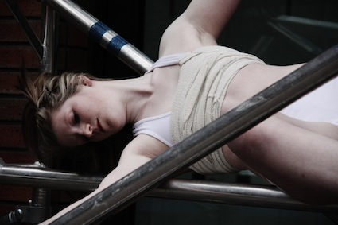
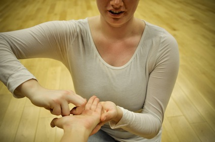
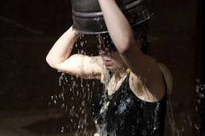
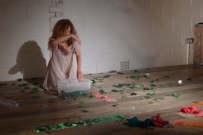
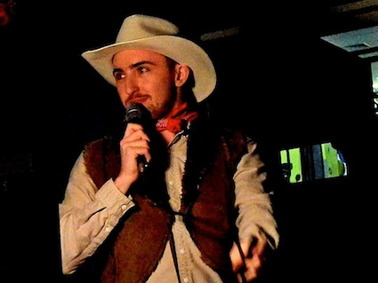
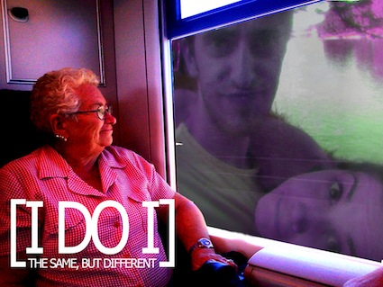
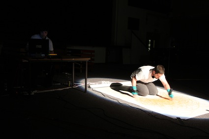
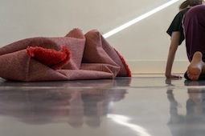
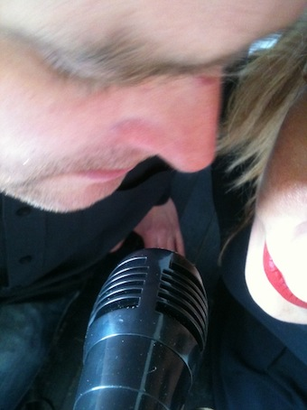

---
# CONFIGURATION
layout: 2013-emergency
rootpath: "../../../"

# ABOUT THE SHOW - GENERIC
artist: "Emergency 2013"
show: "Z-arts: 3pm-11pm"
artist_size: 1
show_size: 3
header_image:

# ABOUT THE SHOW - LAYOUT
# artist_size: 1 # optional - size of artist name 1-5. Default is 1. Set longer names to lower values
# show_size: 2 # optional - size of show name 2-5. Default is 2. Set longer names to lower values
# header_image: "header.jpg" # optional custom background image, relative to current page

---
*Presented by* Word of Warning, Blank Media Collective + Z-arts *during* [Emergency 2013](/current/2013-emergency/index.html)    
        
**Frances-Kay | Scaffold**    
Previously seen at this year's ['Poolside Emergency](/archive/2013-poolside/durationala) Frances-Kay's first installation, *Scaffold*, is inspired by her interest the impact of duration on the body and mind. It embodies her explorations of the body,
mind, and interests in religion and feminism; it represents her excitement of performing on high structures and the slight possibility of danger.    

Once again, a big thank you to CH + LJ, and this time FC + DW too.    
[www.vimeo.com/userfranceskay](http://www.vimeo.com/userfranceskay) |
www.twitter.com/@franceskay    
    

**Will Dickie | Long Distance Relationship**    
A one-to-one performance in a public space. A meditative exploration
of togetherness and separation. An appreciation of the other as a
figure in dialogue with the background that surrounds it.    
*Take a cassette, stand on this spot, look out at the landscape, and wait.*    
Will Dickie is a performance-maker based in the suburbs of London
whose practice is supported by a long-term commitment to training and
self development, which includes Martial Arts, Butoh Dance and the
Suzuki Actor Training Method. As a performer his work spans theatre,
dance, and interdisciplinary collaboration, including extensive work
with Tadashi Endo, Diego Ferrari, Jo Shapland and Zecora Ura.    

He made his first solo performance work, *Memories of Suburbia*, in
2012 with an awarded bursary from Chisenhale Dance Space. He is now
artist in residence at Battersea Arts Centre where he is developing
his second solo, *Man in Helmet in the Landscape*. Both pieces are
inspired by interviewing those close to him and dancing alone in
public space.    

    

**Zimmermann/Singh | Melancholy Machines**    
A live improvised dialogue between electronic sound and voice and the
projected image; an artistic collaboration between Jason Singh and
Maike Zimmermann.    

Based on a loose principal narrative, *Melancholy Machines* develops a
non-linear form from the live and improvised interaction between the
Sound Artist (Jason Singh) and the Filmmaker/Visual Artist (Maike
Zimmermann). The combination of sonic textures and poetic imagery
unfolds new arrangements, suggesting references to mythologies, social
norms, gender roles, the (post-)digital age and the complex
relationship between gender, self and power.    

At Emergency, *Melancholy Machines* is presented as a 3-channel video
installation; this unique approach is the result of the hybrid
character of the project's concept i.e. the inherent (non-linear)
narrativity residing in the material.    
 
Jason Singh is a Beatboxer, Vocal Sculptor and Sound Artist whose work
is rooted in inspiring people to engage in exciting creative
experiences through the breath, technology, performance and
participation. Using his breath, voice and a range of samplers and
loop pedals, he can vocally recreate sound and music compositions
mimicking a wide range of instruments, genres, atmospheres, wildlife,
and abstract experimental sonic textures. Jason composes music for
film, theatre, dance and facilitates sound and music workshops to
young people and adults. These include Beatboxing, Sound Design and
Music Production. He is an Associate Lecturer at the Manchester
Metropolitan University and has also recently completed a six-month
sound art residency at the V&A Museum.    

Maike Zimmermann's work is image-based (photo, video, 16mm, super8) —
creating experimental films and video, photographic or site-specific
installations. Amongst others she has also made sound recordings for
experimental radio shows. Her work has been shown internationally
including exhibitions in Barcelona, Berlin, London, San Francisco, St
Petersburg and Stockholm. She has been contributing images and videos
to publications and channels such as Creative Review, The
Guardian/Observer, Vogue online, DAZEDdigital, frieze magazine,
Islamic Art Magazine, BBC, ITV, ARTE (Tracks) and many more. In
2011/2012 she was artist in residence at no.w.here, an artist film
space in London, and has been employed at the V&A as a video content
producer, video editor and photographer. In January 2013 she began a
three-month residency program at Harvestworks (New Media Arts Centre)
in New York.    

    

**Chloë Smith | I’ve been dreaming of this since I was a boy**   
*You cannot evict an idea. Such is the message of defiance from Occupy. But it is not entirely true. For the whole point of Occupy is that it's not just an idea bouncing around the internet. Occupy is stubbornly about the physical reality of space.* — Giles Fraser, former Canon Chancellor of St Paul's Cathedral     

Recently graduated from Dartington College of Arts / Falmouth University, Chloë Smith is an artist interested in making work that is honest, intimate and socially relevant. Her recent projects have included a month-long residency in South London looking at home, and a site-specific work in a derelict house.    
[www.chloesmith.net](http://www.chloesmith.net)    

    
   
**Lucy Hutson | Britney Spears custody battle vs. Zeus in swan rape shocker**    
*I’ve been worrying about which way to go, what books to believe, and the cleanliness of my thoughts; I’ve been obsessing about getting it wrong and hoping that none of it matters. This is a show about fashion and God and hygiene and how much I love you.*    
  
Lucy Hutson is a London-based artist who has been making work since 2008. Her work engages with capitalism and gender. She works with found objects and unloved artefacts. Lucy Hutson has performed in the genres of intervention, installation, one-on-one and solo shows. These works have been seen as part of SPILL Festival of Performance, and Arches Live. Her collaborations include Kinetic Aesthetic and the
Monkey United Freedom Force.    

    

**PartSuspended | Clepsydra**    
*How is time experienced in a city's environment? Whilst everything moves constantly and rapidly around us, how scary is a moment of pause? What does it mean to measure time, to look at the past, to
search for the present moment, and to look towards the future? Time entails light, joy, creation, luck and wisdom, but also darkness, misfortune, destruction and death.*    

*Clepsydra* invites you to experience time as a collection of absurd, poetic, humorous and intense moments.    

PartSuspended is a multidisciplinary group that addresses issues emerging from the contemporary way of living through physical and visual devised theatre. PartSuspended has pursued innovative work through devising, which challenges the conventional performance narrative and looks for inspiration in everyday life. In PartSuspended
projects fragmentation, physicality, impulse and audience participation often appear leading to dynamic performances that ask both performers and audience to engage with imaginative approaches of creating and experiencing performance. They consider the devising process itself as a key part of the final performance piece because of its transformative effect on those involved.    
[www.partsuspended.com](http://www.partsuspended.com)    
    

**Paul O'Donnell | So Far West**    
*So Far West* is a show led by a cowboy, a real, REAL cowboy. Using everything he owns - his horse, his mystery, his gun, his fancy clothes, his secretive ways  - the man and the myth will stand in front of you, and will prove himself. This bar IS a saloon. You ARE Buffalo Bill/ the Sheriff/ the Bad Cowboy/the Town Whore. Join him to discover the truth about the rootin’ tootin’ cowboy deep down inside everyone.    

Paul O’Donnell is a recent graduate of Contemporary Theatre and Performance at Manchester Metropolitan University, this performance being one that originated from his final year of study. Since then, Paul has brought *So Far West* to a festival in Portugal, and will continue to tour with Sleepwalk Collective in November.    
    

**The Same, But Different | THE WEDDING [I DO I]**    
Meet Queeny and The Chancellor as they join their lives and love in Marriage.    

The Same, But Different use dance routines, direct address, absurdist sketches as well as presented failure to explore what marriage might mean in the modern age. Fast paced, desperate and irreverent you may be left thinking; 'What?'   

The Same, But Different is an Absurdist theatre group producing event-based performances that are both satirical and absurd. Using imagery, music, video and live performance they create an environment where all cultural reference points are made irrelevant. They are made up of performers and technicians based in Barcelona and London. Many of these performers are graduates of Rose Bruford's esteemed European
Theatre Arts course in London, alumni including companies such as Sleepwalk Collective and Zecora Ura Theatre Network.    

Lawrence Stanley (of Heywood, Greater Manchester) formed The Same, But Different in 2012 with the intention of creating new work that represents absurdist principles of performance. His particular theoretical interests regard the nature of failure in performance, the role of multi-media in performance and how chaos and juxtaposition
might be utilised in the performance space. He has directed all The Same, But Different's 'Events', as well as working with 50 Letter's Theatre Company, Els Pirates Teatre and Smoking Apples in performances throughout Europe. He is currently based in Barcelona Spain.   

Actor and Singer, Laura Pau studied at Institut del Teatre (Barcelona) and Rose Bruford College (London). Member of Els Pirates Teatre since she was 18, she's performed in festivals throughout Europe.    

Thanks to Sarah Readman for all her technical and administrative expertise.    
[www.samebutdifferenttheatre.com](http://www.samebutdifferenttheatre.com)    

    

**Manoli Moriaty | Symbiosis**    
The biological phenomenon of symbiosis refers to mutually beneficial relationships between organisms of different species. Unlikely pairings working towards a common goal is the core concept of this cross-art audiovisual performance, aligning two artists of different disciplines within a novel art form.    

A musician initiates an ambient soundscape alongside an artist drawing a painting inspired by the sonic environment, which in turn is affected by the artist’s gestures through wireless motion sensors. The outcome is a feedback loop between the contrasting artists, resulting in an obligate relationship where removing one party would render the other bland and inanimate.    

Manoli Moriaty is a Manchester based sound artist & composer of noise and electroacoustic music, performer/producer of techno & electronica, and researcher of collaborative performance. Born in Athens, he attended the University of Salford in 2005, where he completed BA Popular Music & Recording and MA Music Composition, after having also studied architecture at the University of Huddersfield. Up until his postgraduate studies, he was involved as performer and promoter in Manchester’s most popular club events, playing alongside and supporting world renowned DJs and EDM artists. After compiling a two-year portfolio of mostly conceptual minimal compositions, he is currently concentrating on researching interdisciplinary arts through collaborative performance and interactive sonic installations. Most recently, his work has been performed internationally, including the
EU funded Listening Cities collection of works in Salford and Corfu.    

[http://metanast.wordpress.com](http://metanast.wordpress.com)    

    

**Voris/Buchanan | clog clog**    
A performance between a woman, a red rug and a cascade of sound.    

The work develops a long-standing collaboration between composer James Buchanan and choreographer Amy Voris. Made with support from Clarence Mews (London), Coventry University and the University of Chichester.    

Amy Voris is a dance-artist recently relocated to Manchester. Her practice is process-oriented and collaborative. She works regularly with photographer Christian Kipp, composer James Buchanan, lighting designer Cath Cullinane and has ongoing creative relationships with dance artists Meghan Flanigan, Caroline Salem and Natalie Garrett. For her choreographic work she has received support from Chisenhale Dance Space, Falling Wide, Dance Northwest / Exploratorium, Decoda and Arts Council England.    

James Buchanan plays several instruments including piano, saxophone and guitar amongst others. His passion is music composition and he works in a number of genres, including folk, death metal, jazz and contemporary classical. He studied Music at Goldsmiths, University of London and is currently studying part-time to complete his doctoral thesis in computer - assisted composition at Middlesex University. He is a member of both CoMA London Ensemble and Graphite, a group of five composer-performers who perform their own music alongside works by other contemporary composers.     

[www.amyvoris.com](http://www.amyvoris.com)    

    

**Dirty Shade | HDPE (High-density polyethylene)**    
Fetish, provocation, petrochemical plasic container manufaction, sex, and the text. A seductive ritual of textual play, the fetishisation of sound, and the persuasive pleasures of plastic...    

Dirty Shade is a new performance collaboration between Selina Mosinski and Daniel Hunt. Recent performances have taken place at Edinburgh Fringe Festival’s PEEP / Anatomy, Upstairs at the Western, Leicester and The Chameleon Arts Café, Nottingham.    

Daniel Hunt is a Nottingham based artist / performer. He is a member of Third Space Studios and teaches on the Drama Programme at Lincoln University. His work centres around the possibilities that forms of collaboration offer the creative performance maker, focussing on techniques and processes of improvisation, and the unique contribution of the performer. Many works are concerned with the manipulation and
orchestration of diverse but simple materials, elements or components to create a complex whole. Recent gallery and out-door based work has been more conceptual in nature, exploring notions of ritual, communication and rule-based structures, as well as rural and traditional performative identities and customs. Recent performance
work has been presented at (amongst others) Hoopla! at Sugarhouse Studios, London, the Stockton International Riverside Festival, South Hill Park, Bracknell, LIFT Molten Festival, The Whitstable Biennale, and Watch This Space at the National Theatre.

Selina Mosinski is a Performer/Artist currently working with Stipe and Day, a performance collaboration that centres round surreal and fragmented views on contemporary culture, Wayward Company which is in the process of releasing a pilot of a satirical drama based around Nottingham life and Dirty Shade. Previous work has been showcased at Hatch, Reactor Halls and the recently released trailer for the Nottingham book Hello I’m Here. She has assisted at a number of Nottingham performance events including platform events at Backlit Gallery and Hatch Nottingham and is currently working with Nottingham Art Organisation.    

[www.dirtyshade.tumblr.com](http://www.dirtyshade.tumblr.com) |
[www.danielhunt.org](http://www.danielhunt.org)    

    

**Nathan Birkinshaw | That Night Recurring (A work in progress)**    
*There’s a man at the bar, he's asking for you again.*    

Nathan Birkinshaw is best known, if he's known at all, as one half of Matt & Nath, a performance duo who never quite made it. He considers himself a social commenter on subjects such as never quite realising your full potential and the lack of bins in train stations.    
    

**SheepKnuckle | Echo**    
*Do not answer back. Raise your right hand if you can hear me. Good.*    

*Echo* is a performance about the relevance of the live in a mediatised society and the impending connection between humans and their electronic shadow, their mobile devices.    

Sheep Knuckle is a collaborative effort by live artists Patrick Confrey and James Monaghan, interested in making contemporary performance / live art across the creative spectrum using interactive media and the 'self' to challenge and de-construct traditional dramaturgy.    

    

####Venue + Booking Details          
Date: Saturday 5 October 2013, 3pm-11pm               
[Venue: Z-arts](http://www.z-arts.org/about-us/getting-here/), 335 Stretford Road, Manchester, M15 5ZA           
Tickets: FREE no booking required               
Venue Tel: 0161 232 6089         
          
####Credits           
Co-produced by [hÅb](/hab/index.html), [Blank Media Collective](http://www.blankmediacollective.org) + [Z-arts](http://www.z-arts.org); a greenroom legacy project.
