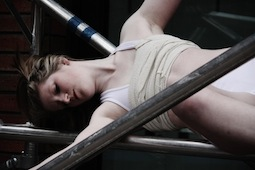
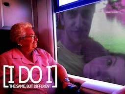
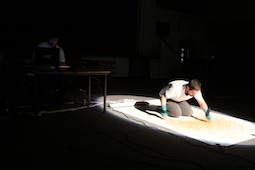

---
# CONFIGURATION
layout: 2013-emergency
rootpath: "../../../"

# ABOUT THE SHOW - GENERIC
artist: "Emergency 2013"
show: "Z-arts: 3pm-7pm"
artist_size: 1
show_size: 2
header_image:

# ABOUT THE SHOW - LAYOUT
# artist_size: 1 # optional - size of artist name 1-5. Default is 1. Set longer names to lower values
# show_size: 2 # optional - size of show name 2-5. Default is 2. Set longer names to lower values
# header_image: "header.jpg" # optional custom background image, relative to current page

---
*Presented by* Word of Warning, Blank Media Collective + Z-arts *during* [Emergency 2013](/current/2013-emergency/index.html)    
        
####Order of Appearance (subject to change):      
**Zimmermann/Singh | Melancholy Machines**    
A live, improvised dialogue between electronic sound, voice and the projected image; an artistic collaboration between Jason Singh & Maike Zimmermann.    
             
Based on a loose principal narrative, *Melancholy Machines* develops a non-linear form from the live and improvised interaction between the Sound Artist (Jason Singh) and the Filmmaker/Visual Artist (Maike Zimmermann). The combination of sonic textures and poetic imagery unfolds new arrangements, suggesting references to mythologies, social norms, gender roles, the (post-) digital age and the complex relationship between gender, self and power. Here, *Melancholy Machines* is presented as a 3-channel video installation; this unique approach is the result of the hybrid character of the project's concept i.e. the inherent (non-linear) narrativity residing in the material.    
            
Jason Singh is a Beatboxer, Vocal Sculptor and Sound Artist whose work is rooted in inspiring people to engage in exciting creative experiences through the breath, technology, performance and participation; using his breath, voice and a range of samplers and loop pedals, he can vocally recreate sound and music compositions mimicking a wide range of instruments, genres, atmospheres, wildlife, and abstract experimental sonic textures. Jason composes music for film, theatre, dance and facilitates sound and music workshops to young people and adults; he is an Associate Lecturer at MMU and has recently completed a 6-month sound art residency at the V&A.             
Maike Zimmermann's work is image-based (photo, video, 16mm, super8) — creating experimental films and video, photographic or site-specific installations; amongst others she has also made sound recordings for experimental radio shows. Her work has been shown internationally and she has contributed images and videos to publications/channels including Creative Review, The Guardian/Observer, Vogue online, DAZEDdigital, frieze magazine, Islamic Art Magazine, BBC, ITV, ARTE (Tracks). In 2011/12 she was artist in residence at no.w.here (London), and has been employed at the V&A as a video content producer, video editor and photographer; in January 2013 she began a 3-month residency program at Harvestworks (New York).    
    
          
**Frances-Kay | Scaffold**    
Previously seen at this year's ['Poolside Emergency](/archive/2013-poolside/durationala) Frances-Kay's first installation, *Scaffold*, is inspired by her interest of the impact of duration on the body and mind. It embodies her explorations of the body, mind, and interests in religion and feminism; it represents her excitement of performing on high structures and the slight possibility of danger.    
             
Once again, a big thank you to CH + LJ, and this time FC + DW too.       
[www.vimeo.com/userfranceskay](http://www.vimeo.com/userfranceskay)         
    
          
**Chloë Smith | I’ve been dreaming of this since I was a boy**   
*You cannot evict an idea. Such is the message of defiance from Occupy. But it is not entirely true. For the whole point of Occupy is that it's not just an idea bouncing around the internet. Occupy is stubbornly about the physical reality of space.* — Giles Fraser, former Canon Chancellor of St Paul's Cathedral     
              
Recently graduated from Dartington College of Arts / Falmouth University, Chloë Smith is an artist interested in making work that is honest, intimate and socially relevant. Her recent projects have included a month-long residency in South London looking at home, and a site-specific work in a derelict house.    
[www.chloesmith.net](http://www.chloesmith.net)    
     
      
**Lucy Hutson | Britney Spears custody battle vs. Zeus in swan rape shocker**    
I’ve been worrying about which way to go, what books to believe, and the cleanliness of my thoughts; I’ve been obsessing about getting it wrong and hoping that none of it matters. This is a show about fashion and God and hygiene and how much I love you.    
      
Lucy Hutson is a London-based artist; making work since 2008, her work engages with capitalism and gender. She works with found objects and unloved artefacts. Lucy has performed in the genres of intervention, installation, one-on-one and solo shows; these works have been seen as part of SPILL Festival of Performance and Arches Live. Her collaborations include Kinetic Aesthetic and the Monkey United Freedom Force.    
    
            
**PartSuspended | Clepsydra**    
How is time experienced in a city's environment? Whilst everything moves constantly and rapidly around us, how scary is a moment of pause? What does it mean to measure time, to look at the past, to search for the present moment, and to look towards the future? Time entails light, joy, creation, luck and wisdom, but also darkness, misfortune, destruction and death.    
                  
*Clepsydra* invites you to experience time as a collection of absurd, poetic, humorous and intense moments.    
             
PartSuspended is a multidisciplinary group addressing issues emerging from the contemporary way of living through physical and visual, devised theatre, which challenges the conventional performance narrative and looks for inspiration in everyday life. Fragmentation, physicality, impulse and audience participation often appear in their projects — leading to dynamic performances asking both performers and audience to engage with imaginative approaches of creating and experiencing performance. They consider the devising process itself as a key part of the final performance piece because of its transformative effect on those involved.    
[www.partsuspended.com](http://www.partsuspended.com)    
    
                
**Paul O'Donnell | So Far West**    
A show led by a cowboy, a real, REAL cowboy. Using everything he owns — his horse, his mystery, his gun, his fancy clothes, his secretive ways — the man and the myth will stand in front of you, and will prove himself; join him to discover the truth about the rootin' tootin' cowboy deep down inside everyone.     
              
*This bar IS a saloon. You ARE Buffalo Bill / the Sheriff / the Bad Cowboy / the Town Whore.*           
        
Paul O'Donnell is a recent graduate of Contemporary Theatre & Performance at MMU Cheshire — *So Far West* originated from his final year of study and has since been presented at a festival in Portugal; Paul will continue to tour with Sleepwalk Collective this November.    
    
                 
**The Same, But Different | THE WEDDING \[I DO I\]**    
Meet Queeny and The Chancellor as they join their lives and love in Marriage.    
        
The Same, But Different use dance routines, direct address, absurdist sketches and presented failure to explore what marriage might mean in the modern age. Fast paced, desperate and irreverent you may be left thinking 'What?'.   
                    
An Absurdist theatre group producing event-based performances that are both satirical and absurd, they use imagery, music, video and live performance to create an environment where all cultural reference points are made irrelevant.          
               
Lawrence Stanley formed The Same, But Different in 2012 with the intention of creating new work that represents absurdist principles of performance. His particular theoretical interests regard the nature of failure in performance, the role of multi-media in performance and how chaos and juxtaposition might be utilised in the performance space. Currently based in Barcelona, he also works with 50 Letter's Theatre Company, Els Pirates Teatre and Smoking Apples in performances throughout Europe.          
Laura Pau is a member of Els Pirates Teatre, studied at Institut del Teatre (Barcelona) and Rose Bruford College (London), and has performed in festivals throughout Europe.          
                  
Thanks to Sarah Readman for all her technical and administrative expertise.       
[www.samebutdifferenttheatre.com](http://www.samebutdifferenttheatre.com)    
    
                   
**Manoli Moriaty | Symbiosis**    
The biological phenomenon of *Symbiosis* refers to mutually beneficial relationships between organisms of different species; unlikely pairings working towards a common goal is the core concept of this cross-artform audiovisual performance, aligning two artists of different disciplines.      
                
A musician initiates an ambient soundscape alongside an artist drawing a painting inspired by the sonic environment, which in turn is affected by the artist’s gestures through wireless motion sensors. The outcome is a feedback loop between the contrasting performers, resulting in an obligate relationship where removing one party would render the other bland and inanimate.    
      
Manoli Moriaty is a Manchester-based sound artist & composer of noise and electroacoustic music; a performer/producer of techno & electronica; and researcher of collaborative performance. Born in Athens, he completed BA Popular Music & Recording and MA Music Composition at University of Salford, also studying architecture at University of Huddersfield. A former performer/promoter at club events across Manchester, he has compiled a two-year portfolio of mostly conceptual minimal compositions. Currently concentrating on researching interdisciplinary arts through collaborative performance and interactive sonic installations, his work has been performed internationally, including the EU-funded Listening Cities collection of works in Salford and Corfu.               
[http://metanast.wordpress.com](http://metanast.wordpress.com)    
    
                   
####Venue + Booking Details          
Date: Saturday 5 October 2013, 3pm-11pm               
[Venue: Z-arts](http://www.z-arts.org/about-us/getting-here/), 335 Stretford Road, Manchester, M15 5ZA           
Tickets: FREE no booking required               
Venue Tel: 0161 232 6089         
          
####Credits           
Co-produced by [hÅb](/hab/index.html), [Blank Media Collective](http://www.blankmediacollective.org) + [Z-arts](http://www.z-arts.org); a greenroom legacy project.
