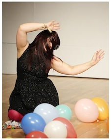

---
# CONFIGURATION
layout: 2013-emergency
rootpath: "../../../"

# ABOUT THE SHOW - GENERIC
artist: "Emergency 2013"
show: "Z-arts: 7pm-11pm"
artist_size: 1
show_size: 2
header_image:

# ABOUT THE SHOW - LAYOUT
# artist_size: 1 # optional - size of artist name 1-5. Default is 1. Set longer names to lower values
# show_size: 2 # optional - size of show name 2-5. Default is 2. Set longer names to lower values
# header_image: "header.jpg" # optional custom background image, relative to current page

---
*Presented by* Word of Warning, Blank Media Collective + Z-arts *during* [Emergency 2013](/current/2013-emergency/index.html)    
        
####Order of Appearance (subject to change)          
**Dirty Shade | HDPE (High-density polyethylene)**    
Fetish, provocation, petrochemical plasic container manufaction, sex, and the text. A seductive ritual of textual play, the fetishisation of sound, and the persuasive pleasures of plastic...    
       
A new performance collaboration between Selina Mosinski & Daniel Hunt, Dirty Shade have performed at Edinburgh Fringe Festival’s PEEP / Anatomy, Upstairs at the Western (Leicester) and The Chameleon Arts Café (Nottingham).    
       
Daniel Hunt is a Nottingham-based artist/performer, a member of Third Space Studios, and lecturer on the Drama Programme at Lincoln University. His work centres around the possibilities that forms of collaboration offer the creative performance-maker, focussing on techniques and processes of improvisation, and the unique contribution of the performer. Many works are concerned with the manipulation and orchestration of diverse but simple materials, elements or components to create a complex whole. He has shown performance work at *Hoopla!* (Sugarhouse Studios, London), Stockton International Riverside Festival, South Hill Park (Bracknell), LIFT Molten Festival, The Whitstable Biennale, and Watch This Space (National Theatre).     
Selina Mosinski is a performer/artist currently working with: Stipe and Day, a performance collaboration that centres round surreal and fragmented views on contemporary culture; Wayward Company, in the process of releasing a pilot of a satirical drama based around Nottingham life; and Dirty Shade. Previous work has been showcased at Hatch, Reactor Halls and the recently released trailer for the Nottingham book *Hello I’m Here*. She has assisted at a number of Nottingham performance events including platform events at Backlit Gallery and Hatch, and is currently working with Nottingham Art Organisation.    
[www.dirtyshade.tumblr.com](http://www.dirtyshade.tumblr.com) |[www.danielhunt.org](http://www.danielhunt.org)    
    
         
**Voris/Buchanan | clog clog**    
A performance between a woman, a red rug and a cascade of sound.      
             
*clog clog* develops a long-standing collaboration between composer James Buchanan and choreographer Amy Voris; made with support from Clarence Mews (London), Coventry University and the University of Chichester.    
            
Amy Voris is a dance-artist recently relocated to Manchester. Her practice is process-oriented and collaborative; she works regularly with photographer Christian Kipp, composer James Buchanan, lighting designer Cath Cullinane and has ongoing creative relationships with dance artists Meghan Flanigan, Caroline Salem and Natalie Garrett. For her choreographic work she has received support from Chisenhale Dance Space, Falling Wide, Dance Northwest / Exploratorium, Decoda and Arts Council England.       
James Buchanan plays several instruments including piano, saxophone and guitar amongst others. His passion is music composition and he works in a number of genres, including folk, death metal, jazz and contemporary classical. He studied Music at Goldsmiths, University of London and is currently studying part-time to complete his doctoral thesis in computer-assisted composition at Middlesex University. He is a member of both CoMA London Ensemble and Graphite, a group of five composer-performers who perform their own music alongside works by other contemporary composers.     
[www.amyvoris.com](http://www.amyvoris.com)    
    
         
**Nathan Birkinshaw | That Night Recurring (work-in-progress)**     
*There’s a man at the bar, he's asking for you again.*      
         
Nathan Birkinshaw is best known, if he's known at all, as one half of Matt & Nath, a performance duo who never quite made it. He considers himself a social commentator on subjects such as "never quite realising your full potential" and "the lack of bins in train stations".    
    
              
**Sheep Knuckle | Echo**    
*Do not answer back. Raise your right hand if you can hear me. Good.*    
                
*Echo* is a performance about the relevance of the live in a mediatised society and the impending connection between humans and their electronic shadow, their mobile devices.    
               
Sheep Knuckle is a collaborative effort by live artists Patrick Confrey and James Monaghan, interested in making contemporary performance / live art across the creative spectrum using interactive media and the 'self' to challenge and de-construct traditional dramaturgy.      
    
                
**Small Acts | Stitches in Time**    
In a sparse, object landscape, a woman tries to construct some meaning with her sewing machine.      
              
*What meaning do we make with the tools we have to hand?*    
[juliawilson.vpweb.co.uk](http://juliawilson.vpweb.co.uk)    
                  
**Lindsay Bennett | 6:41pm Mercury Complex**      
Lindsay Bennett recalls a moment aged 5 when she told her Mother: *When I grow up, I want to be Freddie Mercury*.    
                  
A hairbrush, an audience of porcelain dolls and a Hitachi 22inch television; an autobiographical solo performance that narrates a reminiscence of youthful aspirations lined with fragmented accounts of music and love. A retrospective personal story punctuated with nostalgia, sobriety and what could have been...   
               
Lindsay Bennett is a mature student undertaking her final year of Contemporary Theatre & Performance at UCLan, and has a varied spectrum of performance diversity with a history in black light puppetry, burlesque, screen acting and magic. Lindsay has been an active volunteer in previous hÅb/Word of Warning events; her most recent performance work was the durational live art installation *Inverted Gray*, during ['Poolside Emergency 2013](/archive/2013-poolside/durationala).    
            
Thanks to Dr Lena Simic and Krissi Musiol for their advice and guidance in the process of making this piece.    
    
               
**Drunken Chorus | Just Like Larry Walters**      
Sheena is blowing up balloons. She wants there to be a party. She wants everybody to dance.     
                   
Chris wants us to slow down. He wants us to take a balloon each, and float up high over the city, over deserts, over jungles, over mountains.    
              
Drunken Chorus is a contemporary performance company working across a variety of forms, including theatre, cabaret events and durational pieces; their work has been shown at earlier Emergency's, greenroom, Mayfest, Live at LICA, Chelsea Theatre, Leicester Square Theatre, Forest Fringe, Northern Ballet / Leeds Met Studio, the Bluecoat. and Warwick Arts Centre. Drunken Chorus also run DRUNKEN NIGHTS — a project supporting early career artists to create work for pubs and bars. The company has performed throughout the UK, as well as in Poland and Sweden.    

Performed by Chris Williams and Sheena Holliday.             
Chris Williams is the Artistic Director, and has also worked with Forced Entertainment and Kings of England.     
Sheena Holliday recently joined Drunken Chorus as Co-Director; she is also a filmmaker, writer and community artist.    
[www.drunkenchorus.co.uk](http://www.drunkenchorus.co.uk)    
    
                
####Venue + Booking Details          
Date: Saturday 5 October 2013, 3pm-11pm               
[Venue: Z-arts](http://www.z-arts.org/about-us/getting-here/), 335 Stretford Road, Manchester, M15 5ZA           
Tickets: FREE no booking required               
Venue Tel: 0161 232 6089         
          
####Credits           
Co-produced by [hÅb](/hab/index.html), [Blank Media Collective](http://www.blankmediacollective.org) + [Z-arts](http://www.z-arts.org); a greenroom legacy project.
