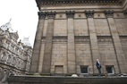
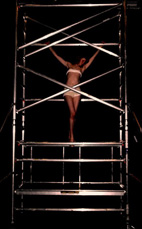
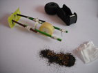

---

# CONFIGURATION
layout: 2013-poolside
rootpath: "../../../"

# ABOUT THE SHOW - GENERIC
artist: "''Poolside Emergency"
show: "Durational work 12-1400"

# ABOUT THE SHOW - LAYOUT
header_image: "header_pe_photo.jpg"

---

**Julieann O'Malley | Salty Milk: Violation of Expectation**   
It's human nature to try to make sense of what we do and the choices we make. Salty Milk: Violation of Expectation is an internal echo and exploration of personal and social constructs played out in a timeless space.    
     

**Sarah Spanton / Waymarking | City Scribe**   
The City Scribe measures, marks and reflects on the city, inviting local people to reflect on it too.  The City Scribe is observes and documents the citys architecture, atmosphere and its flows of people through movement.    
     
 
**Paper People Theatre | Here We Remain**    
There are three sorts of silence, three bodies waiting. Hers is a silent, active wait. She struggles to stay in motion, to continue waiting. His is a contemplative wait; it frames hers but remains his.  They both are destined to reach the third. Frozen. Her world is built of buttons and wool, meticulously sorted and separated by colour and size, filling her cushions, her shoes and her books. Reaching each corner, each nook, each crevice and pulling it in towards her.    
    

**Rosanne Robertson | Semi-automatic**     	
The connection between a subtle movement and an imposing sound.    By connecting body, object, action and sound via the amplified vibration of a surface this piece presents an uncomplicated arrangement exploring control. What we have here is a continuous moment of control charged with the impeding terror of possible loss of control.    
     
 
**Frances-Kay | Scaffold**   
Exploring the effects of duration on the mind, body and performance.    
    
 
**Martin Hamblen | Cutting Corners**    
I use installation, intervention, time-based media and performance. Inspired by Duchamp and Beuys my practise is democratic and egalitarian in delivery and execution, reacting to and embracing the laypersons common criticism of contemporary art "I could do that"    

**David Bethell | Constant Gardner**   
    

**Michelle Man & Lauren McGowan | i n l i g h t  l e  s  s**   
A durational, site-sensitive installation-dance piece created through a memory response to a passage way at The Bluecoat, Liverpool. Our proposal stems from a series of visits that have involved observing, sensing, documenting and touching on the space. The passageway is both an outside and inside space, between the private and the public, carving into the body of the building. The choreographic language has emerged from the visceral ability of light to identify directly with human sensation and emotion. 
i n l i g h t l e s s will exhibit a discreet trail of images, traces from our process, visions between the imagined and the real.     

**A Bottle Top Productions | SNAP!**    

**Xristina Penna and the aswespeakproject | Uncovered:	can clothes tell stories?**  
This piece uses multi-media, direct audience participation, sound and a sewing machine to uncover stories related to our clothes and build up a patchwork of memories, words and responses.     

**Jack Coverdale | Twice Nightly**     
A piece about the past, about a changing country and a change in culture. A piece about forgotten stars and fading sensibilities in the spit and sawdust theatres which used to dot the country.    
