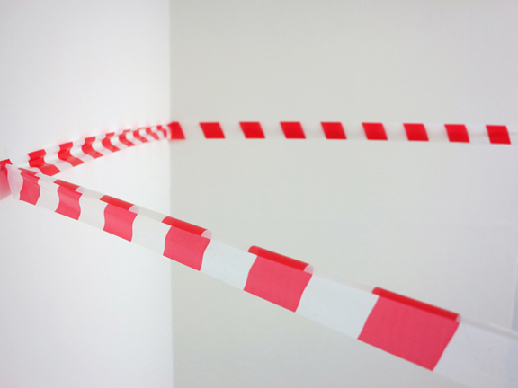
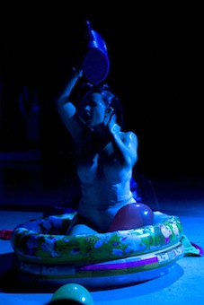
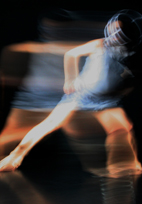

---

# CONFIGURATION
layout: 2013-poolside
rootpath: "../../../"

# ABOUT THE SHOW - GENERIC
artist: "'Poolside Emergency 2013"
show: "Durational Work: 2pm-5pm"
artist_size: 2
show_size: 3

# ABOUT THE SHOW - LAYOUT
header_image: "header_pool_photo.jpg"

---
*Part of* 'Poolside Emergency 2013 — [information](/current/2013-poolside/index.html)    
    
**Sam Treadaway |   «**    
« , or rewind,  is a live interventional work in which the artist will trace, edit and rupture the architectural space of the Bluecoat, deploying only barrier tape and map pins.    

The work is intended to address divisions and borders between  private and public territories. This includes the institutional control and sanction of a given place/space, be that within the 'non-spaces' of urban environments or, indeed, within the gallery setting and by extension the Art World.              [www.samtreadaway.com](http://www.samtreadaway.com)     
    

**Julieann O'Malley | Salty Milk: Violation of Expectation**   
It's human nature to try to make sense of what we do and the choices we make. *Salty Milk: Violation of Expectation* is an internal echo and exploration of personal and social constructs played out in a timeless space.        
                
    
**Louise Orwin | Humiliation Piece (for the duration)**    
Louise wants to be everything to you today – it's her last chance. Watch her squirm and struggle through a dastardly game of Truth and Dare controlled and judged by you: she's willing to go that extra mile to keep that smile on your face, but if she fails, she knows punishment lies in your hands.        
A one-woman crusade to the ultimate exhilarating performance, think Truth-or-Dare meets X-Factor-judgement-day meets Fun-House-gunge-tank: what does entertainment mean to you?    
    
        
**Rosanne Robertson | Semi-automatic**    
The connection between a subtle movement and an imposing sound. By connecting body, object, action and sound via the amplified vibration of a surface this piece presents an uncomplicated arrangement exploring control. A continuous moment of control charged with the impeding terror of possible loss of control.
        
**Frances-Kay | Scaffold**     
Exploring the effects of duration on the mind, body and performance.    

**Martin Hamblen | Cutting Corners**    
I use installation, intervention, time-based media and performance. Inspired by Duchamp and Beuys my practise is democratic and egalitarian in delivery and execution, reacting to and embracing the laypersons common criticism of contemporary art: "I could do that".    

**David Bethell | Constant Gardener**    
        
**Michelle Man & Lauren McGowan | i n l i g h t l e s s**    
A durational, site-sensitive installation-dance piece created through a memory response to a passageway at the Bluecoat, stemming from a series of visits involving observing, sensing, documenting and touching the space. The passageway is both an outside and inside space, between the private and the public, carving into the body of the building. The choreographic language has emerged from the visceral ability of light to identify directly with human sensation and emotion. *i n l i g h t l e s s*  will exhibit a discreet trail of images, traces from our process; visions between the imagined and the real.
    
        
**A Bottle Top Productions | SNAP!**   
    
CANCELLED: **Jack Coverdale | Twice Nightly**    
A piece about the past, about a changing country and a change in culture. A piece about forgotten stars and fading sensibilities in the spit and sawdust theatres which used to dot this country.
