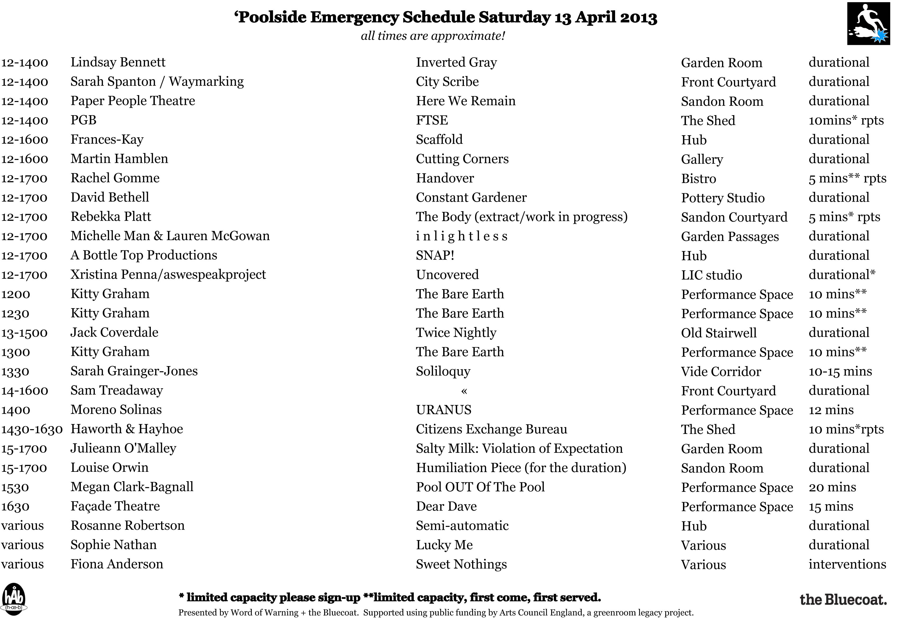

---

# CONFIGURATION
layout: 2013-poolside
rootpath: "../../"
is_index: true

# ABOUT THE SHOW - GENERIC
artist: "'Poolside Emergency 2013" # the name of the artist or company
show: "Mayhem on Merseyside." # the name of the show
artist_size: 2
show_size: 3

# ABOUT THE SHOW - LAYOUT
# artist_size: 1 # optional - size of artist name 1-5. Default is 1. Set longer names to lower values
# show_size: 2 # optional - size of show name 2-5. Default is 2. Set longer names to lower values
# header_image: "header.jpg" # optional custom background image, relative to current page

---
*Presented by* Word of Warning + the Bluecoat          
        
**Mayhem on Merseyside — a day-long splash of live art and performance in Liverpool.**
       
Returning for its third frenetic outing, this mini-marathon of the weird and the wonderful, the bizarre and the breathtaking takes over at the Bluecoat.

Previously at 'Poolside: a hunting party leading a charge and visceral experiments with butter and treacle; slow-dances in the lifts and singing in the toilets; mermaids in the cupboards and bucket-dancing in the stairwells.

Drop-in for ten minutes or stay for the full five hours — a free day-out for the curious with twenty-five new works, featuring (subject to change):    

**Saturday 13 April, from 12noon to 5pm**        
A Bottle Top Productions | Fiona Anderson | Lindsay Bennett | David Bethell | Megan Clark-Bagnall | Jack Coverdale | Façade Theatre | Frances-Kay | Rachel Gomme | Kitty Graham | Sarah Grainger-Jones | Martin Hamblen | Haworth & Hayhoe | Michelle Man & Lauren McGowan | Sophie Nathan | Julieann O'Malley | Louise Orwin | Paper People Theatre | Xristina Penna + aswespeakproject | PGB | Rebekka Platt | Rosanne Robertson | Moreno Solinas | Sarah Spanton / Waymarking    

####Venue + Booking Details
Date: Saturday 13 April 2013, 12noon-5pm    
[Venue: the Bluecoat](http://www.thebluecoat.org.uk/content/index/visitor-info), School Lane, Liverpool, L1 3BX    
Tickets: FREE no booking required   
Venue Tel: 0151 702 5324   

####Credits         
Co-produced by hÅb + the Bluecoat.

####Schedule    
All times are approximate and subject to change.
To download, right click and save image.    
    
