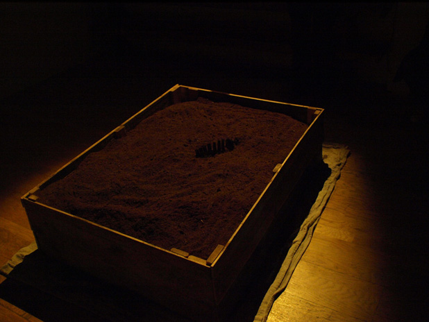
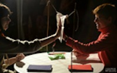
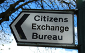

---

# CONFIGURATION
layout: 2013-poolside
rootpath: "../../../"

# ABOUT THE SHOW - GENERIC
artist: "'Poolside Emergency 2013"
show: "Limited Capacity + One-To-One"
artist_size: 2
show_size: 3

# ABOUT THE SHOW - LAYOUT
header_image: "header_pool_photo.jpg"

---
*Part of* 'Poolside Emergency 2013 — [information](/current/2013-poolside/index.html)        
          
**Kitty Graham | The Bare Earth**        
*You stand before a bed of earth. Perhaps it is empty, still, peaceful — perhaps it is not.*        
Using a bed of earth — the place of death and decay, as well as creation and growth, and continual transformer of one into the other — *The Bare Earth* explores what might emerge when unconscious contents are freed in liminal ritual, and how these contents may be transformed by contact with consciousness.        
    
        
**PGB | FTSE**    
*I have a secret. Do you have a secret?*        
We all have secrets. Some we will share and some we won't. What is your secret worth? I'll tell you mine if you tell me yours...    
        
**Rachel Gomme | Handover**    
*If I give you my hand, will you give me yours?*        
An invitation to a brief exchange of touch that leaves a lasting trace.     
    
     
**Rebekka Platt | The Body (extract/work-in-progress)**    
An intimate live & digital performance inspired by film noir, mystery & silent discos. Observe and engage with a body left on the fringe of the world.      
         
**Lara Haworth & Lucy Hayhoe | Citizens Exchange Bureau**    
Haworth & Hayhoe are live artists who create participatory installations that ask audiences to re-imagine or reinterpret their lived environments. Previous works include The Library Project and Cupid (collaborations); home sweet home (Hayhoe); Customs and Border Patrol (Haworth). *Citizens Exchange Bureau* premiered at Buzzcut Festival in Glasgow, March 2013.    
    
