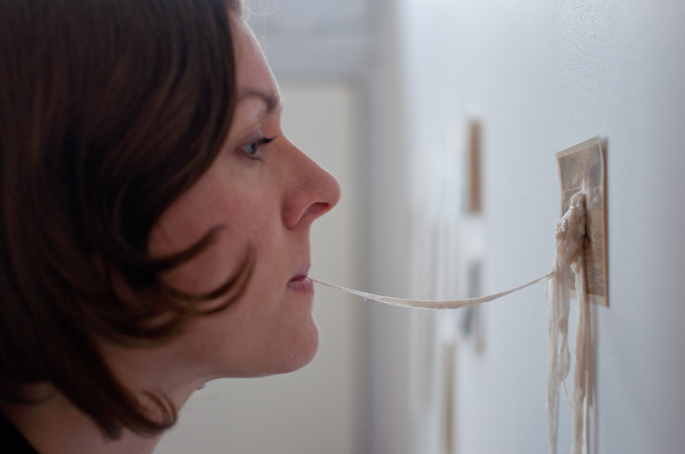
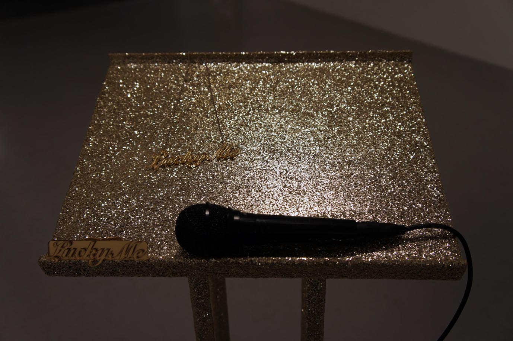
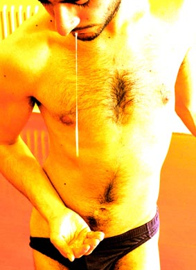
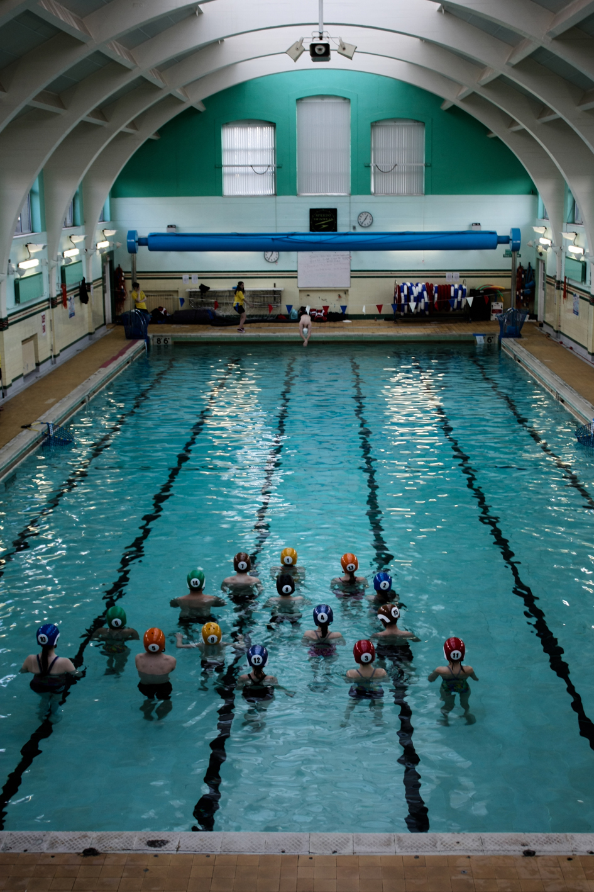

---

# CONFIGURATION
layout: 2013-poolside
rootpath: "../../../"

# ABOUT THE SHOW - GENERIC
artist: "'Poolside Emergency"
show: "Performances"

# ABOUT THE SHOW - LAYOUT
header_image: "header_pool_photo.jpg"

---

**Kitty Graham | The Bare Earth**    
Using a bed of earth “ this place of death and decay, as well as creation and growth, and continual transformer of one into the other “ the piece explores what might emerge when unconscious contents are freed in liminal ritual, and how these contents may be transformed by contact with consciousness.    

**Sarah Grainger-Jones | Soliloquy**    
A solo performance exploring the futility of language in the face of loss.  The piece references death, mediumship and the struggle to communicate silence    
    

**Sophie Nathan | 	Lucky Me**    
A site-specific performance piece, which explores success, status and commodification of identity. The performance operates by re-enacting œtrophy-momentsù we may aspire to, things we have always wanted to achieve.    
    

**Fiona Anderson | Sweet Nothings**    
Fiona Anderson is currently in her final year of study at Edinburgh College of Art, within the Intermedia department.  'Sweet Nothings', furthers these investigations into internalized social norms, focusing on views of how to be in love.    

**Moreno Solinas |	URANUS**    
A performance for body and voice. Love and sex, need and fear, spirit and fluid. Entertains the audience with song and performance, then sets them a challenge they werent expecting.   
 
 
**Megan Clark-Bagnall | Pool Out Of The Pool**    
Join Megan as she hosts the ultimate on land Pool Party! An interactive performance that invites the audience to take part in a new aquatic sport (on land). Looking at the history of swimming since the 1930's Pool OUT of The Pool will take the audience out of their seats and on a playful adventure. You will experience how the table top ball game relates to the on land swimming techniques of the early 1930's. Be prepared to stand up and have fun.    
    

**Facade Theatre |Dear Dave**    
Dear Dave is a over heard conversation , a conversation meant only
for the closest of friends. Three women take the time over a bottle
(or three) of wine to come up with the easiest, softest, kindest, most
humane way to break it off with their male friend. It is that point
in the dating game where you reach a fork in the road, you either take
the bull by the horns and become someone’s life long partner, for
better for worse, or you toss them out like a semi used condom. As the
women become more inebriated the ways in which they break It off with
Dave become, more outlandish, more cruel and oh so more personal until
the most self assured of them takes it upon herself to test run the
break up scenario on the closest male in site.    
    

    
   
