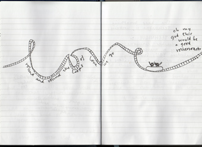
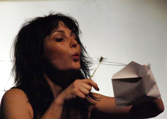

---

# CONFIGURATION
layout: 2013-spring
rootpath: "../../../"

# ABOUT THE SHOW - GENERIC
artist: "Lowri Evans" # the name of the artist or company
show: "The Secret Life of You and Me" # the name of the show
header_image: "header_lowri_photo.jpg"
show_size: 3

# ABOUT THE SHOW - LAYOUT
# artist_size: 1 # optional - size of artist name 1-5. Default is 1. Set longer names to lower values
# show_size: 2 # optional - size of show name 2-5. Default is 2. Set longer names to lower values
# header_image: "header.jpg" # optional custom background image, relative to current page

---
*Presented by* Word of Warning + The Lowry

#### In Brief
*A live scrap book. An unfinished love affair. A made up true story.*    

Lowri is in trouble. She leads a double life. By day she ponders the passing of time, sifting through the fractured memories of people left with snippets of who they were. By night she makes art in strange places: fleeting, filmic moments with unsuspecting mortals. All to draw meaning from our jumble-sale lives.    
  
But the telescope has turned on this meddling voyeur. You are invited to witness her attempt to piece together a sparkling constellation from stuff, love and darkness; to understand what we are, how we fit together and what we leave behind.

This is Lowri's first feature length solo show and will see her visual art and theatre practice blur together on the night of her thirtieth birthday.

####Venue + Booking Details
Date: (Thursday 31 January + Friday 1 February 2013, 8pm: SOLD-OUT)    
[Venue: The Lowry – Studio](http://www.thelowry.com/plan-your-visit/getting-here/), Pier 8, Salford Quays, M50 3AZ    
[Tickets: £10/8](http://www.thelowry.com/event/the-secret-life-of-you-and-me)    
Box Office Tel: 0843 208 6000    
    
####More
Lowri's website is beautiful – we couldn't sum it up any better than her pictures do – so have a look [here](http://www.thelowri.com/the-secret-life-of-you-and-me-2/).    

    
 
####Who is she?
Lowri is a Manchester based live artist whose work draws upon a background in visual art, experience in performance and commitment to social engagement. Over the last few years she has worked with National Theatre of Scotland, Tate Liverpool, Cornerhouse, Contact Theatre, Hatch, Islington Mill, hÅb, The Lowry, Quarantine, Eggs Collective, David Hoyle, Small Things, Weeding Cane, Salford University and Grupo XIX de Teatro. She is also in girl band Hotpants Romance, who have released two albums and toured the world.    
    
    
   
*"I am interested in human experience, the mundane and the miraculous. I try to strip information away to the barest truth, to the startling and underwhelming inside of things, often starting with the autobiographical. I am fascinated by the blurring of art and real life, and play as much as I can with that, subsequently my life appears in my work and I also take my work out to non-art spaces and connect with people from all walks of life."*   

####What people have said about her
>*Lowri is one of the most interesting emerging artists and performance makers in the North West* Richard Gregory, Quarantine   
>*Compelling* David Hoyle

####Credits       
Supported by hÅb and The Lowry.    
Developed with support from Works Ahead, Contact, The Future, University of Salford and public funding by the National Lottery through Arts Council England.    
Photography by Layla Sailor.   

####Websites
[www.thelowri.com](http://www.thelowri.com)    
[@lowrievans](www.twitter.com/lowrievans)
     

