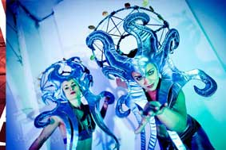
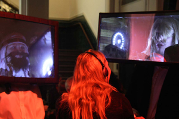
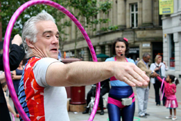
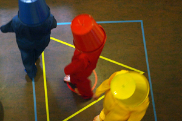
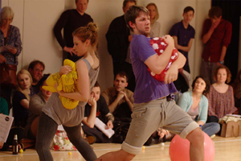

---

# CONFIGURATION
layout: 2013-springsummer
rootpath: "../../../"

# ABOUT THE SHOW - GENERIC
artist: "Haphazard" # the name of the artist or company
show: "A free day out for the curious of all ages." # the name of the show
header_image: "header_haphazard_photo.jpg" 
show_size: 3

# ABOUT THE SHOW - LAYOUT
# artist_size: 1 # optional - size of artist name 1-5. Default is 1. Set longer names to lower values
# show_size: 2 # optional - size of show name 2-5. Default is 2. Set longer names to lower values
# header_image: "header.jpg" # optional custom background image, relative to current page

---
*Presented by* Word of Warning + Z-arts
          
####In Brief
Intriguing images and offbeat oddities dotted around this historic building – take a wander and see what you stumble upon... living geometric shapes making moon music, a bonkers bucket dance, marathon hula-hooping and bouncy, squeaky, ping-pong performers...    

Playful, quirky, engaging and sometimes plain daft, this is a day for kids and their adults; adults and *their* adults – in short, anyone looking for a different day-out.    

Turn up at any time during the course of the day (12noon-4pm), come and go as you please – there will always be something to do or see and performances happen at least twice.        
**Schedule:**    
**Ongoing:**    
12-4pm	Car Conversations			Anna Macdonald	Atrium ramp    
1230-2pm + 2.30-4pm    
				Green, Gas, Grass			Rachael Nutter		Café    
				The Mirror Twins			Angel Club (north)	Café    
				Labolis :: Threads			Ultra Violets			meet in Café    
				The Game Show				Lydia Hirst				Café upstairs    
                     
**Performances:**
1200  		Synesthetic Moonscape  Volkov Commanders  Café    
1230  		Kitty has no pity             Katherina Radeva      Atrium     
1300  		Ping Pong Crash             whatsthebigmistry      Gallery    
1330  		Bucket Dance                 Robert Foster              Rear Atrium    
1400  		Synesthetic Moonscape  Volkov Commanders  Café    
1430  		Kitty has no pity             Katherina Radeva      Atrium     
1500  		Ping Pong Crash             whatsthebigmistry      Gallery    
1530  		Bucket Dance                 Robert Foster              Rear Atrium    
1600  		Haphazard discussion                                        Café    

In the **Café**, expect Volkov Commanders' geometric orchestra, Rachael Nutter's carbon dioxide garden, Angel Club (north's) mischievous *mirror twins* and, **Upstairs**, become contestants in Lydia Hirst's budget recreation of the iconic Crystal Maze *gameshow*... Or take a journey of discovery on Ultra Violets' exploration of the **hidden maze of Z-arts** in search of a Minotaur on the prowl.    

In the **Atrium** meet *Kitty*, a hula-hooping maestro, or listen-in on a miniature highway of talking *cars*... Join a bonkers *bucket dance* in the **Rear Atrium** or take a half-hour breather in the **Gallery** for whatsthebigmistry's *Ping Pong Crash...* Throughout you will be welcomed by friendly *wildlife* – if you **need some help** feel free to badger a badger, outfox fox a fox or just discover a duck.     
  
[**Have a look at our Haphazard image gallery**](/galleries/2013-haphazard/index.html)    

####Participating artists            
**Angel Club (north) | Robert Foster | Lydia Hirst** (Eggs Collective) **| Lani Irving | Anna Macdonald | Rachael Nutter | Katherina Radeva | Ultra Violets | Volkov Commanders | whatsthebigmistry**    

####More     
    
*LABOLIS :: Threads* – [**Ultra Violets**](http://www.ultraviolets.org.uk)    
Enter [*LABOLIS*](http://vimeo.com/33027206)... getting lost is just the beginning.   
            
A shape-shifting maze in an urban metropolis – immersing players of all ages in fantasy spaces, it seeks to test the wits and sharpen senses through fun and games. Come creep, sneak, frolic and guess your way through riddle-solving realms where live creatures roam; star’s will charm you with their stories and nothing is quite what it seems. This time, a Minotaur is on the prowl...    

    
*Synesthetic Moonscape* – [**Volkov Commanders**](http://www.volkovcommanders.co.uk): living geometric shapes make Moon music.            

    
*The Gameshow* – **Lydia Hirst**    
Set in the future on an abandoned space station, the Gamesmaster and his scientist have gone mad from watching too much bad TV. Two teams must do battle in a series of mental and physical challenges for the chance to return to Earth and play out more.    

Lydia is a founding member of Eggs Collective; her experiments in live art tend to be fun, trashy and high concept.    
           
            
*Green, Gas, Grass* – **Rachael Nutter**    
It's hard to be glum in a garden green    
With the squeakiest flowers you've ever seen     
Where the sun shines bright all day long    
And the grass grows round to the bird song    
If you're feeling deflated by the cold outside    
Pop along to the balloon filled patch where I reside.    
           
    
*The Mirror Twins* – **Angel Club (north)**           
Fresh from their winter sports and alpine escapades *The Mirror Twins* are back in Hulme – and now they smell the romantic whiff of spring; we're not sure its very proper, but Angel Club (north)'s errant twins are getting hitched!    
           
    
*Wildlife* – [**Lani Irving**](http://laniirving.wix.com/laniirving)    
It is little known that Manchester is home to some of the most remarkable wildlife in the world. In recent months there have been sightings of dandy wolves, busy badgers, socially awkward foxes and the odd commuting duck... If you’re lucky, maybe you'll catch a glimpse of some of these bizarre creatures going about their business, or even discover a previously unseen species!    
          
    
*Kitty Has No Pity* – [**Katherina Radeva**](http://www.katherinaradeva.co.uk)    
No kidding, this will be fun!   
          
Remember when you were young and carefree? This is a bit like that, but with a twist! A fun nostalgic look at those lost childhood and childish moments of playful learning, exercising and gaming. Throwing caution to the wind, all are urged to take up the hoop and join in the games.   
[See video](https://vimeo.com/38843313)    
        
    
*Bucket Dance* – [**Robert Foster** ](http://vimeo.com/25026289): a Bauhaus inspired parody.    
        
    
*Ping Pong Crash and Other Sounds* – [**whatsthebigmistry**](http://www.whatsthebigmistry.com)    
A small orchestra of bodies and objects, performing a score of action and tasks – a performance of falling, inflating and pushing. This performance is conducted as an experiment. All the actions have an arrangement but I can’t say where everything will land.    

Imagine a space going off with an assortment lilos, life jackets and beach balls bouncing off the walls, the sound of 500 ping pong balls falling or a crash box of crockery hitting the floor, a march punctuated by the squeak of pet shop toys...     
         
    
*Car Conversations* – [**Anna Macdonald**](http://www.forecastdance.org/car_conversations.html)    
There is something about being in a car that invites us to talk in ways that we wouldn’t in other places. *Car Conversations* is an installation that consists of thousands of toy cars forming tiny motorways that run along, over and under unusual spaces. Inside some of the cars are miniature speakers so, when you lean in closely, you can hear real recordings of people on car journeys as they sing, shout and ask ‘are we nearly there yet?’    

Anna Macdonald’s work spans dance, film and installations. For this work she collaborated with Manchester-based sound artist Sam Heitzman.     

####Plus: Haphazard discussion, 4pm
An informal chance to meet the artists and to discuss art that can bridge the generation gap. What different responses does the same work provoke and what can we, as adults, learn from how kids watch performance?    

####Venue + Booking Details
Date: Saturday 9 February 2013, 12noon-4pm    
[Venue: Z-arts](http://www.z-arts.org/about-us/getting-here/), 335 Stretford Road, Manchester, M15 5ZA    
Tickets: FREE    
Box Office Tel: 0161 232 6089