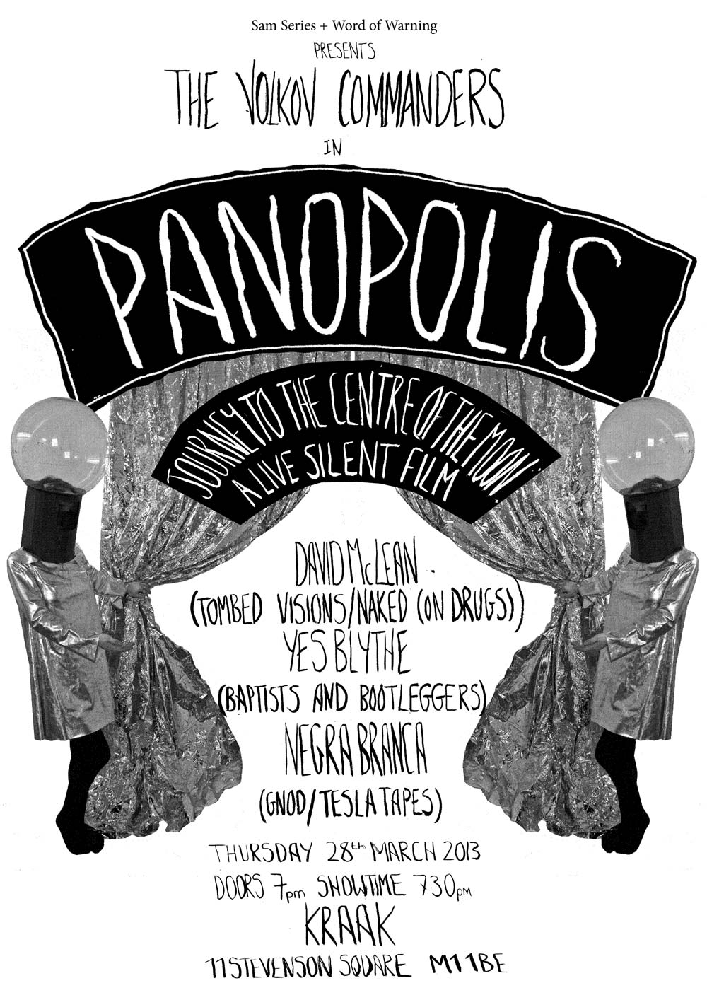

---

# CONFIGURATION
layout: 2013-springsummer
rootpath: "../../../"

# ABOUT THE SHOW - GENERIC
artist: "Volkov Commanders" # the name of the artist or company
show: "Panopolis" # the name of the show

# ABOUT THE SHOW - LAYOUT
# artist_size: 1 # optional - size of artist name 1-5. Default is 1. Set longer names to lower values
# show_size: 2 # optional - size of show name 2-5. Default is 2. Set longer names to lower values
# header_image: "header.jpg" # optional custom background image, relative to current page

---
*Presented by* Word of Warning + SAM at Kraak    

#### In Brief
*Panopolis, journey to the centre of the moon.*     
A live silent film.    

*Panopolis* is a live experiment in sound and story, all told in black and white on the silver screen. Inspired and influenced by the era of silent film, lo-fi cinematic special effects, mime, mirror-trickery and the film *Metropolis*, we will be collaborating with musicians David McLean (Tombed Visions/Naked(on Drugs), Yes Blythe (Baptists and Bootleggers), Negra Branca (Gnod/Tesla Tapes) and DJ’s Pumping Iron (TBC) to bring an evening you an immersive evening of wonder, dancing and entertainment.   

####Venue & Booking Details
Date: Friday 28 March, 7.30-11pm (doors 7pm)   
Venue: [Kraak](http://www.kraak.co/home/find-us/), 11, Stevenson Square, Manchester, M1 1DB    

####More    
*Panopolis* will be an immersive experience, a specially commissioned experiment in sound, storytelling, and audience interaction. The Volkov Commanders will be collaborating with three musicians on this combined gig, club night, and performance art event.    

The overarching theme and aesthetic of the event is inspired and influenced by the era of silent film, lofi cinematic special effects, mime, mirror-trickery and the film *Metropolis*.    

A series of three interlinked performances, with interludes between. As a performance is happening each musician will be composing the soundtrack in real time. All the musicians are prolific jack-of-all-traders, meshing digital and analog sounds into hypnotic soundscapes. Together they tally up a lengthy list of bands, collaborations, DIY record labels, and pet projects. They are Marlene Ribeiro of Gnod, Callum Higgins, founder of Baptists and Bootleggers, and Dave Mclean from Naked (on Drugs). Volkov Commanders feel a kinship with these three, and have chosen them as collaborators because of their like-minded approach to working and creating, continually experimenting with different combinations of processes, situations, and materials.    

####Who are they?   
ARTISTS:    
 **Volkov Commanders**    
 "A unified alter ego from a future of our own making who have travelled from the Moon on the Volkov, a large mechanical woolly Mammoth. We strive to continuously evolve and allow ourselves to indulge our imaginations and encourage the indulgence of others. We entertain and excite, making work centred on characters that celebrate movement, sound and costume. This takes form through enacting rituals, ceremony, séance and offerings.    
    
Some of our shows have included a future disco party from the moon, a Royal banquet with traditional Moon food and folk dancing and noisy interruptions at a music festival by a mobile orchestra made up of percussive costumed creatures."   
 
MUSICIANS:    
**Yes Blythe (Baptists and Bootleggers)**    
Yes Blythe uses cassette tapes and guitar pedals to create dark soundscapes; cavernous drone with underlying melodies. After more than two and a half years in the making, his debut album 'Keep The Faith' is due for release on Baptists & Bootleggers in the coming months.

**David McLean (Tombed Visions)**    
David is a prolific musician, artist, promoter and head of a record label, who is involved in many interesting projects across the city. Collaborating with other musicians, playing alongside band members Naked (on Drugs), putting on some of the cities most interesting gigs as a member of collective Fat Out Til You Pass Out,  as well as heading up record label Tombed Visions which is an umbrella for David’s many musical endeavors.    

**Negra Branca (Tesla Tapes / Gnod)**    
Long term member of Gnod, a band whose ever evolving psych-drone space-rockers has been transfixing audiences for years. This will be her first solo performance as Negra Branca, coinciding with her first release on Tesla Tapes.  Expect to hear everything from early Tricky style lurching, choral pop and favela stomp, all coated in a sticky glaze of sweet and sour chilli sauce.    

####Credits       
Supported using public funding from the National Lottery by Arts Council England.    

    

####Websites
[volkovcommanders.co.uk](http://www.volkovcommanders.co.uk)    
[yesblythe.blogspot.co.uk](http://yesblythe.blogspot.co.uk/)    
[facebook.com/baptists.bootleggers](https://www.facebook.com/baptists.bootleggers )    
[facebook.com/TombedVisions](https://www.facebook.com/TombedVisions )    
[tombed-visions.tumblr.com](http://tombed-visions.tumblr.com/)    
[teslatapes.bandcamp.com/album/negra-branca](http://teslatapes.bandcamp.com/album/negra-branca )     

