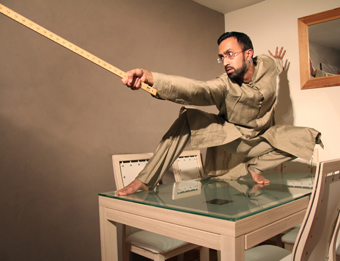

---

# CONFIGURATION
layout: 2013-springsummer
rootpath: "../../../"

# ABOUT THE SHOW - GENERIC
artist: "Hetain Patel" # the name of the artist or company
show: "Be Like Water" # the name of the show
header_image: "header_hetain_photo.jpg"

# ABOUT THE SHOW - LAYOUT
# artist_size: 1 # optional - size of artist name 1-5. Default is 1. Set longer names to lower values
# show_size: 2 # optional - size of show name 2-5. Default is 2. Set longer names to lower values
# header_image: "header.jpg" # optional custom background image, relative to current page

---

Contact + Word of Warning present:

#### In Brief
*"Have you ever wanted to be somebody else? I always wanted to be Bruce Lee.  And sometimes my dad.  What determines who we are anyway?"*    

Straight from the Royal Opera House, with dramaturgy by Michael Pinchbeck and Eva Martinez, award-winning Hetain Patel delivers a visually arresting and witty consideration of culture and identity.    
   
Video, live music and plenty of Northern factory talk courtesy of Hetain’s dad.    

>*clever and charming* The Guardian   
    
####Venue & Booking Details
Date: Thursday 14 + Friday 15 February, 7.30pm    
[Venue: Contact](http://contactmcr.com/visit/getting-here/), Oxford Road, Manchester, M15 6JA    
[Tickets: £8/5](http://contactmcr.com/whats-on/2013/02/14/)    
Box Office Tel: 0161 274 0600   

[Video clip](https://vimeo.com/37181870#) 

####More    
This piece began with Hetain wanting to recreate a scene from a kung fu movie that he loves. He knew it would be performative but without knowing whether it would become a video or live piece.    

It became both: a video installation, *The First Dance* and also a live work: *Be Like Water*.  The latter became a meeting place for Hetain’s live and video practice, which like *TEN,* his last live work, has been developed for the theatre.   

But after *TEN*, Hetain knew he didn’t want to speak on stage in his own voice. To repeat this would have felt too comfortable. Instead he would speak in Chinese or use subtitles.  

It started as a solo piece, but through a chance experiment with dancer Shelley Maxwell, things changed and Hetain became interested in asking a female performer to be his translator, avatar, or somewhere in between.    
  
    

####Who is he?   
*I am a UK-based artist. My work is about being.*

*Conceptually driven, my practice begins with ideas about identity formation through the use of language and physical movement. This started with photography and the ritualistic use of culturally marked materials. Currently my work inhabits different forms including, photography, video and live performance. Working simultaneously across different media allows me the space to explore the multiple dimensions of a single idea, whilst also challenging the form I use. I also find the different communicative possibilities of different media allow me to reach different audiences.*    

*Initially framing myself as the sole protagonist in what are often performative works, my practice is now increasingly populated by characters, both fictional and real, in relation to which I juxtapose myself in moments of elision and dissonance.*    

*My work is not consciously political. Any explorations of identity are not statements but rather a result of ideas allowed to develop from their residence in my body. I almost wish to deny the burden of representation in order to engage with subtler layers of placing oneself in the world, often using humour as a way into this. Most recently this has taken form through the lens of imitation: an activity I find myself drawn to because of the requirement to listen acutely to someone or something outside of myself. This listening, in every sense of the word, feels like the key to a connection or exchange with someone else. I imitate my father, or somebody I’ve met, or equally DVD footage of Bruce Lee.*    
      
####What people have said about him
>*It is Patel’s skilled precision in realising an almost seamless harmony of his culturally and historically divergent source material that gives his installations a distinctive resonance* The Guardian     
    
>*…seamlessly weaves storytelling and music to create a humorous, engaging and refreshingly unpretentious interrogation of cultural identity… an unusual, fresh and honest work of art.* Thea Warren, Three Weeks, (Five Star review TEN)    
    
>*Intelligent, thoughtful, humourous and hypnotic* Ian Palmer, The Dancing Times (TEN, 2011)    

  

####Credits       
Co-commissioned by Royal Opera House (ROH2), London, Dance4 and New Art Exchange, Nottingham. Development.
Supported by public funding by the National Lottery through Arts Council England and by Broadway Media Centre, Lakeside Arts Centre and Hatch, Nottingham, and South East Dance, Brighton. Hetain Patel is a Sadler’s Wells New Wave Associate Artist.    
      
####Websites
[www.hetainpatel.com](http://www.hetainpatel.com)     
[@HetainPatel1](http://twitter.com/hetainpatel1)    

    
