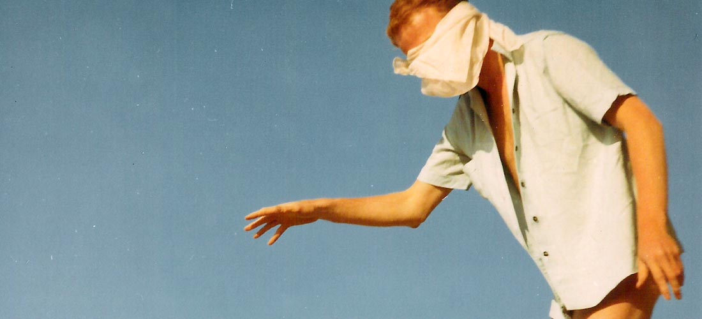
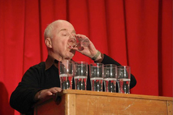

---

# CONFIGURATION
layout: 2013-springsummer
rootpath: "../../../"

# ABOUT THE SHOW - GENERIC
artist: "Michael Pinchbeck | Sheila Ghelani" # the name of the artist or company
show: "The Middle (preview) | Rat, Rose, Bird" # the name of the show
artist_size: 2
show_size: 3
header_image: "header_ghelani_photo.jpg"

# ABOUT THE SHOW - LAYOUT
# artist_size: 1 # optional - size of artist name 1-5. Default is 1. Set longer names to lower values
# show_size: 2 # optional - size of show name 2-5. Default is 2. Set longer names to lower values
# header_image: "header.jpg" # optional custom background image, relative to current page

---
*Presented by* Word of Warning + Z-arts      

####In Brief    
A foyer Hamlet in bubble wrap; and a meditation on leaving and staying-put.    

####Venue + Booking Details    
Date: Friday 31 May 2013, 7.30pm (Double Bill)   
[Venue: Z-arts](http://www.z-arts.org/about-us/getting-here/), 335 Stretford Road, Manchester, M15 5ZA    
Tickets: £8/5    
Box Office Tel: 0161 232 6089     

    

##Michael Pinchbeck    
####More    
Inspired by *Hamlet*, *The Middle* is a one-man show devised for a theatre foyer - a liminal space between outside and the inside, the real world and theatre. Hamlet is a character caught in a limbo between *To be or not to be* and by casting his father, Tony Pinchbeck, to play the title role, Michael hopes to explore time passing, aging and the relationship between father and son.    

####Who is he?    
Michael Pinchbeck is a writer, live artist and performance maker. He co-founded Metro-Boulot-Dodo in 1997 after studying Theatre and Creative Writing at Lancaster University. He left the company in 2004 to embark on a five-year live art project – *The Long and Winding Road*, performed at the ICA (London), Ikon Gallery (Birmingham) and The Bluecoat (Liverpool). Michael was commissioned by Nottingham Playhouse to write *The White Album* (2006) and *The Ashes* (2011) and was awarded a bursary by Theatre Writing Partnership to research a new play - *Bolero*.    

He is currently working on a trilogy of devised performances inspired by Shakespearean stage directions: *The Beginning*, *The Middle* and *The End*. In 2008, Michael was selected by Arts Council England to represent the UK at the Biennale for Young Artists in Italy. In 2012, he will be an ambassador for the World Event of Young Artists in Nottingham. His work has been selected twice for the British Council’s Edinburgh Showcase. He has a Masters in Performance and Live Art from Nottingham Trent University and is currently undertaking a PhD at Loughborough University exploring the role of the dramaturg in contemporary performance. Michael is a co-director of Hatch, a platform for performance in the East Midlands.    

    

####What people have said about him    
>*Pinchbeck is such an interesting theatre-maker* The Guardian    

>*An individual practice that is powerful and compelling* ArtArtArt magazine    

####Credits    
A hÅb micro-commission.    

####Website    
[www.michaelpinchbeck.co.uk](http://www.michaelpinchbeck.co.uk)     

    

##Sheila Ghelani    
####More    
*Rat, Rose, Bird* explores empire, colonialism, mortality and love. Subtly mashing up cultures, curios, objects and ideas, the piece is a poetic meditation on farewells, departures, long journeys and “the hunt” - for a better life, a better love, a place to drop anchor or a space to claim (“finally!”) as one's own.    
 
Inhabiting the work as a kind of hostess/magician, Sheila reveals, explodes and mixes together a range of ingredients including champagne, rats, roses and birds in order to re-enact a set of memories, remembrances, exits and endings - over and over again.    

Perhaps there's something to be learnt by invoking the past? Or perhaps it's nothing more than a series of repetitions?    

Sheila Ghelani makes visually rich performance work that engages with ideas surrounding hybridity, migration and love. Her work has been shown at venues and festivals across Europe including Belluard Bollwerk International in Switzerland and The Wellcome Collection in London.   
        
####Who is she?
Sheila originally trained in dance before moving over into the world of Live Art/Performance. As an artist she makes work that manifests in a range of media (video, object, participatory event, performance etc). She works both as a solo and collaborative artist.    

She has shown work at venues and festivals across Europe including Belluard Bollwerk International in Switzerland, Fierce Festival in Birmingham, NRLA in Glasgow, Trouble Festival in Brussels, EPAF in Poland and the Wellcome Collection in London. In 2010 she also produced a book/flower-press that was represented by KaleidEditions at UK art/book fairs.   

As a collaborative artist she is a long-standing Associate Artist of Blast Theory and has toured and performed nationally and internationally for them and many other companies.  She also teaches in Academic contexts and regularly mentors artists and students and gives public talks.    
 
Her work is informed by her own experience of being mixed heritage. She is interested in the relationship between art and science with particular focus on hybridity, crossings, blood, skins, skinning, carefully controlled experiments, colour, genetics and love.   

####Credits    
Credits: Originally a BAC Scratch Commission, supported by the National Lottery through Arts Council England    
Lighting Design: Martin Langthorne   
Original Sound: Bob Karper    
Sheila & Rose Image: Daniel Martin (2011)    
Rat Rose Bird set image: Briony Campbell (2011)    
           
####Website    
[www.sheilaghelani.co.uk](http://www.sheilaghelani.co.uk)    
