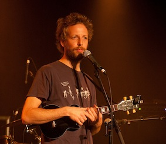

---

# CONFIGURATION
layout: 2013-springsummer
rootpath: "../../../"

# ABOUT THE SHOW - GENERIC
artist: "Stuart Silver | Tam Hinton" # the name of the artist or company
show: "You Look Like Ants | Delicious Monster" # the name of the show
artist_size: 2
show_size: 3
header_image: "header_silver_photo.jpg"

# ABOUT THE SHOW - LAYOUT
# artist_size: 1 # optional - size of artist name 1-5. Default is 1. Set longer names to lower values
# show_size: 2 # optional - size of show name 2-5. Default is 2. Set longer names to lower values
# header_image: "header.jpg" # optional custom background image, relative to current page

---
*Presented by* Word of Warning + Z-arts      

####In Brief
A 'Big Picture' monologue on gaining perspective meets mind-bending storytelling with claymation insanity.    
        
####Venue + Booking Details
Date: Friday 26 April 2013, 7.30pm (Double Bill)   
[Venue: Z-arts](http://www.z-arts.org/about-us/getting-here/), 335 Stretford Road, Manchester, M15 5ZA    
[Tickets: £8/5](http://www.z-arts.org/events/wow-april/)    
Box Office Tel: 0161 232 6089     
        
##Stuart Silver    
####More    
Stuart Silver presents his ‘Big Picture’ monologue on getting perspective. A philosophical almost-narrative of perilous received wisdoms and long-distance ambitions. With ukulele when you least expect it. And when you expect it.    
        
After a 10 year BAFTA-nominated + Perrier Award-winning collaboration with Kim Noble as (nobleandsilver), Stuart Silver continues that partnerships' tradition of crossing disciplines and entering new territories. After two highly successful runs at Soho Theatre, and shows at The Samuel Beckett Festival, The London Word Festival and Art Centres across the UK, this piece sees a technically stripped-back, musical, Stuart Silver.
       
*You Look Like Ants* is an intimate, humorous, tragi-ballad. A conversational and textually rich epic journey where Stuart seeks to get a hold on what life is all about, under the crush of great advice.    
        
   
       
####Who is he?    
Stuart Silver is a BAFTA-nominated, Perrier Award-winning writer / performer / director, working across theatre and gallery venues, television, radio, public spaces and experimental educational and mentoring contexts. He is co-founder of Multimedia double act (nobleandsilver) and more recently has performed solo at Soho Theatre, The London Word Festival, Pharos Arts Foundation — Cyprus, Tate Britain, How the Light Gets In music and philosophy festival at Hay, and Anti site-specific festival — Finland.    
     
He devised *What we should have said...* an original spoken word format for poets and musicians and is the Creative Mentor and film-maker for Phrased & Confused, working with spoken word artists and musicians to create new collaborative performances.    
     
Stuart co-wrote and co-directed *Cabaret Simon* at the Barbican, London with Lone Twin (Dec 2009) — a show for 4 to 10 year olds initially devised in collaboration with the children's group at Discover, London. Stuart also creates bespoke, sometimes large-scale multi-discipline arts projects.         
(nobleandsilver) garnered a cult following for their Channel 4 TV series *(nobleandsiver): GET OF ME* and for three major theatre shows (shown at Soho Theatre, Arts Theatre London, Edinburgh Festival, Her Majesty's Theatre) and numerous one off commissions (the British Library, BBC Electric Proms, Guerilla performance at Preston UCI cinema, month-long residency at Beaconsfield Gallery, Vauxhall); also for roles in *The Boosh*, Garth Marenghi’s *Darkplace* and for writing the featurette for Richard Ayoade’s *The Double.*    

####What people have said about him     
>*4\* It's lurches of logic keep your head buzzing long after it ends ... It's not like anything else.*  The Times    
      
>*... A surreptitiously seductive experience.* The Guardian    
      
>*Dreamlike and forensic ... He's like some pound-shop Laurie Anderson.* The Times    
       
>*A performance quietly brilliant at understating it's depth.* Culture Wars    
       
####Credits    
Written and performed by Stuart Silver    
Co-directed by Stuart Silver and Jason Phipps     
This work has been funded by Arts Council England.     
        
####Website    
[www.astuartsilver.com](http://www.astuartsilver.com)    
         
    
           
##Tam Hinton    
####More    
A one-man show for all the lost and angry children of the world. Using video, claymation, and swearing, Mister Hinton will present a vision of the human soul in torment. Hooray!    

In a housing estate in a parallel universe, three intertwining characters struggle with their personal demons. Or are are they all the same demon? Only one way to find out...    
  
In the latest show from the outsider artist's outsider artist, Hinton takes us on a trip into the diseased heart of modern England — via a rollercoaster ride along it’s furred up arteries on a collision course with it's wildly malfunctioning pacemaker.    
        
Expect laughter, tears, and a strange tingling sensation in your left earlobe.    
       
####Who is he?
Writer and performer Tam Hinton has spent years alienating and appalling people with his bitter, thwarted little stories. He writes plays and one-man shows, usually comical in nature but dealing with the evil sides of life.    

Hinton's first one-man show, *The Naked Soul of Kirk Godless* took the 'best comedy' award at the Buxton Festival in 2006. A mixture of live action storytelling and claymation, it examined ways in which the internet may be mutating human intelligence — and sexuality. It also contained plasticine pornography.     

Winner of the Manchester not-part-of festival-fringe 'best play' award.    
          
####What people have said about him     
>*extraordinary, exhilarating, mindbending*  City Life/MEN online)    
           
>*the brilliance is unmistakable* Fringe Guru    
           
####Credits    
Developed with funding from the National Lottery through Arts Council England, a hÅb micro-commission.    
          
####Website    
[tam-hinton.wix.com](http://tam-hinton.wix.com/tamsvan)    
[www.kirkgodless.com](http://www.kirkgodless.com/uglyface-interface.php)    

