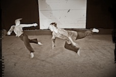
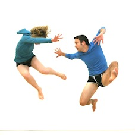

---

# CONFIGURATION
layout: 2013-turn
rootpath: "../../../"

# ABOUT THE SHOW - GENERIC
artist: "Turn 2013"
show: "First Night: Fri 19 Apr"

# ABOUT THE SHOW - LAYOUT
header_image: "header_turn_photo.jpg"

---
**Rebekka Platt | The Body (extract/work-in-progress)**    
A body has been found ... murdered.   

**hop.skip.jump dance collective | #haveyouseenmykeys?**    
A live sited performance piece, *#haveyouseenmykeys* highlights, distorts, and exaggerates the everyday moments and routines of modern society. The dancers explore the ridiculous nature of mundane daily ritual as their quest for lost car keys spirals out of control; they battle the weight of over-sized baggage, are lured astray by mischievous reflections and get sucked into the vortex of their own handbags!    
    
        
**Jo Ashbridge | S.O.S (working title)**   
In this case meaning sense of self, but usually a call for help, *S.O.S* explores the perception a person has of themselves and the impact the world around us has on this; who we believe ourselves to be, how we became to be that person and how we can be pushed and pulled in many directions by the numerous factors that shape us.    
    
        
**Oblique Strategists | In the Loop**    
Drawn from autobiographic material, which explores differences and similarities between the two performers. A mixture of photographic images, spoken word and movement allows for past reflections and truths to merge with those of the present day, especially as events unfold within the precise moment of live performance.    
    
      
**Jessica Butler | Your rights**   
A duet based on Terry Pratchett's documentary on Euthanasia, *Your rights* explores both the legal and personal rights through the exploration of movements and music.    

**Adam John Roberts | You Might Not See Me For Who I Am...**    
An autobiographical solo identifying the choreographer/soloist's identity, perhaps specifically Autistic Spectrum Disorder.        
        
**Ian and Jane | Everything Beautiful is Stolen**    
Sometime fragile, sometimes visceral, *Everything Beautiful is Stolen* sees dancers Ian and Jane face up to the task of living with their labels; trying to balance everything they tell people they are and whatever lies beneath.collection of labels we call '''identity" really our own? Or is it merely a reflection of self, a meaning garbled through an infinite series of social mirrors?  Our reflection becomes blurry, forever distorting until inevitably we do too. We throw ourselves once more into the endless cycle of search and discovery in an attempt to sharpen our own image, our own identity. Who the hell are we? Who the hell cares?    
    
        
**Daniela B Larsen & Robert Guy | This House Smells of Ghosts**    
*"I'm so scared I won't find what I'm looking for because I'm such a bad looker."*    

