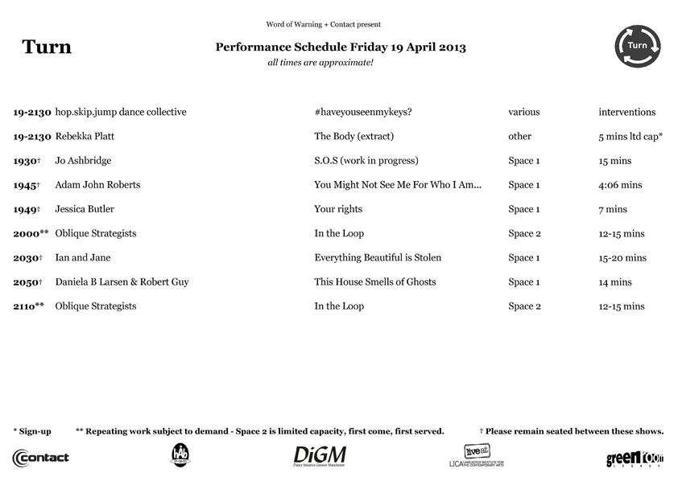

---

# CONFIGURATION
layout: 2013-turn
rootpath: "../../"
is_index: true

# ABOUT THE SHOW - GENERIC
artist: "Turn 2013" # the name of the artist or company
show: "Micro-festival of new north west dance." # the name of the show
show_size: 4

# ABOUT THE SHOW - LAYOUT
# artist_size: 1 # optional - size of artist name 1-5. Default is 1. Set longer names to lower values
# show_size: 2 # optional - size of show name 2-5. Default is 2. Set longer names to lower values
# header_image: "header.jpg" # optional custom background image, relative to current page

---
*Presented by* Word of Warning + Contact    
        
**Explosive, intimate, graceful and challenging — a two night micro-festival of emerging north west danceworks.**
        
**Plus**: SoundMoves Mixed Movement Jam, Saturday from 10pm.    

####Venue + Booking Details
Dates: Friday 19 + Saturday 20 April 2013, 7.30pm    
[Venue: Contact](http://contactmcr.com/visit/getting-here/), Oxford Road, Manchester, M15 6JA    
[Tickets: £8/5 (2 night pass £10/6)](http://contactmcr.com/whats-on/1201-turn-2013/)    
Box Office Tel: 0161 274 0600   

        
From intimate encounters in tiny cupboards to slow-dancing in the dark, mass ensemble precision to individual grace, *Turn 2012* filled Contact to the brim with energy and virtuosity.     
        
Turn returns in 2013 with fifteen new works, featuring (subject to change):    

**STOP PRESS: There will be pre-show events in the building from 7pm, including interactive and intimate performances.**         
 
**Friday 19 April, from 7.30pm**    
Rebekka Platt | hop.skip.jump dance collective | Jo Ashbridge | Oblique Strategists | Jessica Butler | Adam John Roberts | Ian and Jane | Daniela B Larsen & Robert Guy        

**Saturday 20 April, from 7.30pm**  
Rebekka Platt | The Mustdashios | Percussive Customer Projects | Joseph Lau, Shona Roberts & Joseph While | Tom Bowes Dance | Maelstrom Productions | Emma Lansley | Joshua Hubbard F\*\#\"\!D | **from 10pm** SoundMoves Mixed Movement Jam       

Have a look at our [gallery](/galleries/2012-turn/index.html) from Turn 2012.    

####Schedule    
To download, right click and save image.    
    
    
  
*All times are approximate and subject to change.*   
       
####Credits         
Co-produced by hÅb, Contact, Dance initiative Greater Manchester + Live at LICA.
