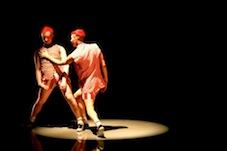

---

# CONFIGURATION
layout: 2013-turn
rootpath: "../../../"

# ABOUT THE SHOW - GENERIC
artist: "Turn 2013"
show: "Second Night: Sat 20 Apr"
show_size: 4

# ABOUT THE SHOW - LAYOUT
header_image: "header_turn_photo.jpg"

---
**Rebekka Platt| The Body (extract/work-in-progress)**    
A body has been found ... murdered.  
        
**The Mustdashios | Snap!Bar**    
Look out for these two around Contact spaces 1+2 and throughout your night as they surprise you with exciting moments of surreal performance in enjoyable pants. *Snap!Bar* is a series of short sketches full of E numbers, preservatives and artificial colouring, designed to entertain and delight.    
       
**Percussive Customer Projects | Northern Souls**   
Keep the faith...    
        
**Joseph Lau, Shona Roberts & Joseph While | Drawn Together, Drawn Apart**    
A relationship captured through dance, drawings & impressions.     
        
**Tom Bowes Dance | Brute**    
Following four peculiar characters who delve into the uncertainty of the unknown. They displace the ordinary and hoard past happenings. Ensnared by animal qualities and human desires, *Brute* makes inquiries into decision and discovery.                
    
        
**Maelstrom Productions | Preppers**    
A dark and hilariously disturbing world where four characters dive into action physically and metaphorically. They spin out of control and find each other, playing on their skills and 'preparation' to survive. Using confessional theatre, contemporary and urban dance styles the Maelstrom Performers weave humility and humanity through chaos, madness and humour.              
       
**Emma Lansley | Let's Talk to Mia & Butch**    
Lemon squeezing, patience pushing, game playing, hand holding, inflatable loving, failure facing, wine drinking reality.     
    
        
**Joshua Hubbard F\*#"!D | Cul-de-sac**    
An end to an end.    

