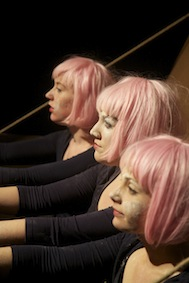

---

# CONFIGURATION
layout: 2013-woah
rootpath: "../../../"

# ABOUT THE SHOW - GENERIC
artist: "Façade Theatre"
show: "Celladour"

# ABOUT THE SHOW - LAYOUT
header_image: "header_facade_photo.jpg"

---
*Presented by* Word of Warning + Contact                
        
####In Brief
*If you wish to find out what ugly thing may escape from the box, I must tell you that it may be a whole family of earthly troubles: it could be greed, envy, lust, pride, sloth, gluttony or wrath; there could be more kinds of naughtiness than it would be any use for me to talk about, and so, I won’t talk about it.*    

####More    
Three caterpillars await inside a box, mischievous and brimming with anticipation. They are strange little creatures, inquisitive and naive, with one foot neatly bound to the box from whence they came. They are here to perform for you, entertain you, be beautiful for you. From their home they cannot stray too far away, allowing them only to peek inside a childlike fantasy world, teetering but not venturing into the nightmare that lies in wait.    
       
*If you wish to find out what ugly thing may escape from the box, I must tell you that it may be a whole family of earthly troubles: it could be greed, envy, lust, pride, sloth, gluttony or wrath; there could be more kinds of naughtiness than it would be any use for me to talk about, and so, I won’t talk about it.*    
        
Influenced by the work of James Jean, Butoh, and a sprinkle of Greek mythology, Façade present *Celladour*, a whimsical tale of just how ugly the process of beautification can be. More specifically in reference to the cultural cruelty of Chinese foot binding, administered to little girls for over 1000 years.    
       
A softly narrated, highly visual and physical performance told through the actions of three trainee Geishas, and their universal quest to become The Madame Butterfly, the ultimate beauty.      
         
*How were they ever going to grow if they did not become uglier first?*    
        
   
         
####Who are they?    
Façade Theatre is a Manchester-based collective founded at the University of Salford by Samantha Vickeridge, Natasha McNicholas and Kate Daley, later joined by Ben Thompson. Their work is rooted in human nature, exploring, researching and embracing different human experiences. They find inspiration from cultural differences and place them into a framework from which they add our own experiences, sense of humour and playful nostalgic style. Their work is eclectic in nature, defined by each individual project and using a variety of art forms, from performance based practice to photographic augmentation, installation, film and sound art.    
         
####Website    
[Facebook](http://www.facebook.com/pages/Facade-Theatre/)
