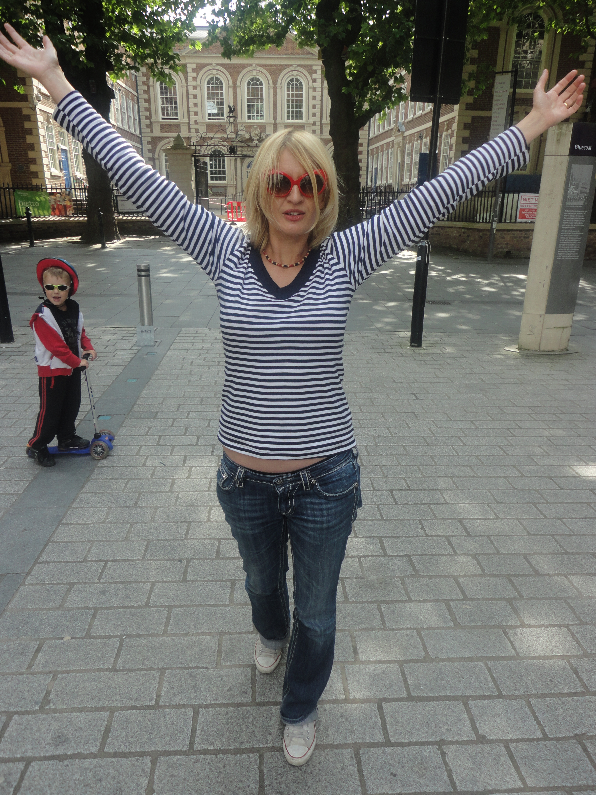

---

# CONFIGURATION
layout: 2013-woah
rootpath: "../../../"

# ABOUT THE SHOW - GENERIC
artist: "Lena Simic"
show: "1994"

# ABOUT THE SHOW - LAYOUT
header_image: "header_1994_photo.jpg"

---
####In Brief:
A homage to Kurt Cobain, lost youth, impossible and failed encounters from a life lived retrospectively.    

####More:    
This solo performance is a story about 1994.    

A series of memory excerpts. An exploration of lost youth and ageing. The rise and fall of Nirvana.    

A mix of historical, political and popular references. The Balkan War and its atrocities. Grunge and the suicide of Kurt Cobain. Inertia. Seduction. A number of the boys I kissed. My failed move to Seattle.    

This piece is about the troubling thrill of living life retrospectively.    

*I found myself thinking about Kurt Cobain during Live Art therapy workshop with Oriana Fox in Grizedale Forest in the Lake District. 'There she is with her hands, her arms in the air with the objects above her, her hair almost like Kurt Cobain’s, all that blond and kind of scruffy.*    

####Who is she?    
Lena Simic, performance practitioner and pedagogue, born in Dubrovnik, Croatia, living in Liverpool, UK. Co-organizer of The Institute for the Art and Practice of Dissent at Home, an art activist initiative run from her family home. Lena's autobiographical performance practice is informed by its relation to everyday lived experience, memory and fantasy.    

In 1994 I was 19. Kurt Cobain was 27 when he died. I kissed 12 boys in 1994. 

    

####What people have said about her?    
>*Lena is an extraordinary performer and writer with a captivating presence. As a maker her work is original, unique and extremely authentic. Her work is so refreshingly different - personal yet utterly accessible.*  Helen Paris and Leslie Hill – Curious    

>*Lena Simic is a dynamic performer of outstanding ability. The text resonates with humour and rage both engaging and challenging the audience from the moment she announces her arrival on stage.*  Louie Jenkins, Senior Lecturer in Performing Arts, University of Chichester    

>*I just wanted to let you know that I was incredibly moved by your performance. I couldn't quite understand the effect that it had on me but I was definitely moved to tears!* Email from a student    

####Website
[www.lenasimic.org](http://www.lenasimic.org)    

