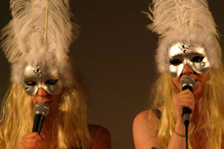

---

# CONFIGURATION
layout: 2013-woah
rootpath: "../../../"

# ABOUT THE SHOW - GENERIC
artist: "70/30 Split"
show: "Two Do: A Performance"

# ABOUT THE SHOW - LAYOUT
header_image: "header_7030_photo.jpg"

---
*Presented by* Word of Warning + Contact
        
####In Brief    
*We are two women, with two of everything; two people, two bodies, two voices, two minds, two ways, two paths, two loves, two gains, two unrelated stories, two alternatives, two gether.*       
        
A new satirical dance theatre work which investigates performance in differing contexts, the work sits peering over edges and meeting between the gaps of standard performance structures.    

    

####More    
70/30 Split strives to produce work which looks at and questions the female body in performance, forming a creative process which enquirers and seeks to question the gaze and autobiography within a live performance context.  Creating satirically energetic dance theatre work, as a pair we utilize movement, text, honesty and leotards, combining burlesque bodies and the bizarre.    

[See video here](https://vimeo.com/61264484)    
 
####Who are they?    
70/30 Split are Sophie Unwin and Lydia Cottrell, two York Based choreographers. After studying together at York St John University, we have found ourselves inspired and informed by each other’s artistic approach to performance making. We both were invited back to our university to create a new work for the Create 12 Festival. The result of this process was our current and ongoing collaboration 70/30 Split a female performance duo. Together we present an accumulation of words, thoughts, characters, expectations, stories, experiences and alternatives. Our recent work *Content part 1: (2012)* has been performed to audiences both regionally and nationally including; Leeds Light Night festival,  Heads up! at Edinburgh Fringe festival and Resolution! at The Place, London receiving encouraging responses from audiences as well as dance critics.     

####What people have said about them?
>*Keep an eye out for the delectably cheeky, York based post-modernists Sophie Unwin and Lydia Cottrell, aka 70/30 Split, whose Content Part 1 was a complete giggle.* Donald Hutera, Dance Europe.    

>*Cottrell and Unwin are whizzes in entertainment* Maddy Morgan, Resolution! Review.    

>*Catch this razor sharp pair while you can* Pete Wise, One&Other Magazine.

####Website   
[Facebook](http://facebook.com/7030split)
