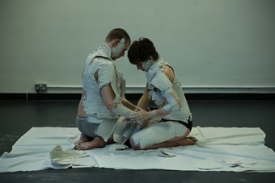
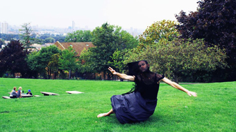

---
# CONFIGURATION
layout: 2014-emergency
rootpath: "../../../"

# ABOUT THE SHOW - GENERIC
artist: "Emergency 2014"
show: "Afternoon: 3pm-5.30pm (Advisory: may not be suitable for under 18s)"
artist_size: 1
show_size: 3
header_image:

# ABOUT THE SHOW - LAYOUT
# artist_size: 1 # optional - size of artist name 1-5. Default is 1. Set longer names to lower values
# show_size: 2 # optional - size of show name 2-5. Default is 2. Set longer names to lower values
# header_image: "header.jpg" # optional custom background image, relative to current page

---
*Presented by* Word of Warning, STUN + Z-arts *during* [Emergency 2014](/current/2014-emergency)    
          
####Order of Appearance (subject to change):      
[Emergency 2014](/current/2014-emergency) runs from 12noon to 10pm and is primarily an adult event; from 3pm onwards we *advise* that work may not be suitable for under 18s.      
          
**Jade Montserrat ¦ *Communion: The Rainbow Tribe***        
A fragment of a larger project inspired by iconic 1930s African-American actress, singer and dancer Josephine Baker, *Communion* looks at ownership, representation and manipulation of the body and persona in a quest for equality and freedom. For more information on the wider *Josephine and the Rainbow Tribe* project, see website.          
[jademontserrat.com](http://jademontserrat.com) ¦ [@jademontserrat](http://twitter.com/jademontserrat)        
            
          
**Art of Disappearing ¦ *The Stand In***          
An audio experience and challenge.      
Taking 2 willing audience members at a time, the work shifts the balance between performer and audience, asking you to become the watched as you take part in this collaborative experience, where you can find out just what type of performer you are and what type of performance you and your fellow *Stand In* will make.              
Art Of Disappearing is artists Rachel Champion + Tristan Shorr.       
Supported through a Dance and the Homemade commission; thanks to Laura, Katherine and the rest of the Chisenhale Dance Space team.  
[www.artofdisappearing.com](http://www.artofdisappearing.com) ¦ [@R_Champion_ ](http://twitter.com/R_Champion_) + [@shorr_tristan](http://twitter.com/shorr_tristan)          
          
**Eik + Orengo ¦ *the air I fill is near to empty // paradise was there, in the silence between our thoughts.***         
A durational piece of body art.         
A collaboration between Eik Elnes + Maria Jam Orengo (Brighton University).     
[eikleknesundelnes.tumblr.com](http://eikleknesundelnes.tumblr.com/post/75807321593/the-air-i-fill-is-near-to-empty-paradise-was
) ¦ <http://slothb00bs.tumblr.com>      
            
          
**Peter Jacobs ¦ *KINDLING***           
An examination of the nature and value of reading and the printed word in an increasingly digital age.        
What is the value of printed books? And how can you control, manipulate and destroy education, ideas and narratives once transferred from page to human consciousness?                         
*KINDLING* explores the relationship between words and ideas, imagination and experience in a durational installation performance that questions why we read, the value of books as artefacts and where they take us individually and as a society.     
<http://peter-jacobs.weebly.com> ¦ [@PeterTJacobs](http://twitter.com/PeterTJacobs)            
          
**Frances-Kay ¦ *"Sorry"***             
What am I sorry for?          
Sorry for not equalling the glossy images of women, images that are simulations of our collective fantasy.              
Sorry for performing the rituals which should keep me in line with an idea of a standard set down by people unknown.    
Previously seen at Liverpool's The1st4, *"Sorry"*  is an exploration of the modern female and expectations of modern society.     
**N.B.** *"Sorry"* contains material of an adult nature, that some may find upsetting.             
<http://franceskayperformanceart.wordpress.com> ¦ [FK facebook](http://www.facebook.com/artists.FrancesKay) ¦ [@_FrancesKay](http://twitter.com/_FrancesKay)              
          
          
**Jonathan Rogerson ¦ *Desert Island Deaths***              
A death scene on repeat; a performance comprised only of deaths, in homage to the tragic diva Dalida, who wished *to die on stage… in a well-orchestrated death.*            
The performance explores how a single image can be caused to mutate, through repetition and duration, in the imagination of the spectator, decaying like an image on a role of celluloid or video tape which deteriorates each time it is replayed.               
Devised + performed by Jonathan Rogerson ¦ Directed by Flora Pitrolo ¦ Costume Design by Mariapia Mineo       
<http://jonathanrogerson.wordpress.com> ¦ [@RogersonJonny](http://twitter.com/RogersonJonny)        
               
          
####Venues + Booking Details            
Date: Saturday 4 October 2014, 12noon-10pm        
[Venue: Z-arts](http://www.z-arts.org/about-us/getting-here), 335 Stretford Road, Manchester, M15 5ZA         
Tickets: FREE no booking required; some ltd capacity shows will have sign-up sheets on the day      
Venue Tel: 0161 232 6089      
          
####Credits         
[Emergency](/hab/emergency) 2014 is produced by [hÅb](/hab); supported using public funding through Arts Council England, funded by Manchester City Council, supported by [STUN](http://stunlive.com) + [Z-arts](http://www.z-arts.org); a greenroom legacy project.
