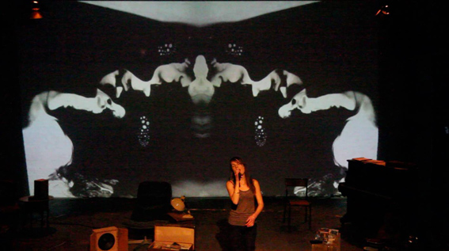

---
# CONFIGURATION
layout: 2014-emergency
rootpath: "../../../"

# ABOUT THE SHOW - GENERIC
artist: "Emergency 2014"
show: "Evening: 5.30pm-10pm"
artist_size: 1
show_size: 3
header_image:

# ABOUT THE SHOW - LAYOUT
# artist_size: 1 # optional - size of artist name 1-5. Default is 1. Set longer names to lower values
# show_size: 2 # optional - size of show name 2-5. Default is 2. Set longer names to lower values
# header_image: "header.jpg" # optional custom background image, relative to current page

---
*Presented by* Word of Warning, STUN + Z-arts *during* [Emergency 2014](/current/2014-emergency)    
          
####Order of Appearance (subject to change):      
[Emergency 2014](/current/2014-emergency) runs from 12noon to 10pm and is primarily an adult event; from 3pm onwards we *advise* that work may not be suitable for under 18s.      
          
**Paul O'Donnell ¦ *One Thing On His Mime***      
Come and be seduced by this mime, come and see him perform in the glass box, drink from the imaginary cup and be pulled by the invisible rope. He's just like all the others, led by the same set of strict rules a mime must follow in order to be. But perhaps, hidden away in there, is a person underneath the face paint waiting to escape that 'glass box' he is trapped inside.             
Can the rules of being a mime really be so black and white?             
<http://podonnell6.wordpress.com> ¦ [@podonnell2](http://twitter.com/podonnell2)          
        
          
**Odd Comic ¦ *My Champion Heartache***           
An investigation of the interactions, language and physicality associated with pet-ownership.       
Spoken word, physical theatre and seemingly unpredictable occurrences take place as two people search for a better understanding of the "pet phenomenon". Surprising dialogue about pets and those who own them. An interpretation of the familiar yet absurd world of pets, pet lovers and pet lover-haters.             
Devised by Odd Comic (Dot Howard + Holly Bodmer) with support from Escalator Live Art + Norwich Arts Centre, supported using public funding by the National Lottery through Arts Council England.            
[www.oddcomic.co.uk](http://www.oddcomic.co.uk) ¦ <http://mychampionheartache.tumblr.com> ¦ [@OddComic](http://twitter.com/OddComic)           
              
          
**FM ¦ *Reunion***            
*I was stirred awake by the tremors of the earth, from my window in a Spanish town the street lights swayed. We would look at the same moon at night. From the moon we would appear side by side. Our clocks read the same time. Our clocks had a different rhythm. The last time I said goodbye was at Christmas outside Wetherspoons in Leeds Station. The next time we would meet we would collide, but not yet. We had a different rhythm.*            
[The FM collaboration facebook](http://www.facebook.com/pages/The-FM-collaboration/661207447246703) ¦ [@benjaminmills](http://twitter.com/benjaminmills)          
       
          
**Lydia Cottrell ¦ *Bolero — Acts I, II, III***             
A re-imagining of the 1960 ballet for Ravel's *Bolero*, where a dancer performs on a tabletop in a Spanish taverna. Here, subverting original choreography towards contemporary culture, female binge drinking and Geordie Shore role models.               
Mentored by David Rosenberg ¦ Music by Michael Donnelly ¦ Commissioned by Drunken Chorus for Drunken Nights II.         
<http://lidyaa-andstuff.com> ¦ [@LidyaaAndstuff](http://twitter.com/LidyaaAndstuff)       
           
          
**Nathan Birkinshaw ¦ *Bored To Death*** *(work in progress)*         
*What do we leave behind when we die in the digital age? Can we manipulate that residue so the future sees us as more than we were?*              
<http://nathanbirkinshaw.wordpress.com> ¦ [@NathBirkinshaw](http://twitter.com/NathBirkinshaw)      
          
**Olivia Preye ¦ *Finding Frank***      
*Frank's still here. Or is he? The old Frank played the guitar on stage. This Frank can't even bring himself to take it out of the case.*       
The story of a relationship forged through music. A relationship between an elderly man with extreme Anxiety Disorder and a young music facilitator. Using the testimonies of people living with mental health issues, this compelling performance explores how music can heal a mind in chaos.     
Performed by Olivia Preye ¦ Devised in collaboration with The Unhidden Collective ¦ Supported by the Barbican, The Yard Theatre + with public funding by the National Lottery through Arts Council England.     
<http://findingfrank.tumblr.com> ¦ <http://theunhiddencollective.wordpress.com>           
           
          
**Matthew Pearce ¦ *Finding Kalen Bushe***        
Matthew Pearce would like to thank Nathan Birkinshaw and Kalen Bushe for their knowing (and unknowing) help during the creation of this piece.      
          
**Neil Callaghan ¦ *A Certain Shaft of Light***             
*You are alone, yet not alone. The others need you, and you need them. Without them, you would not get anywhere and nothing would be true.* Bernard Moitessier — The Long Way           
This new solo began with an interrogation of the difference between loneliness and solitude. Understanding loneliness as something that is always in relation to others, seeking confirmation in the world, and solitude as something which is not necessarily dependent on others but a contentment of how to live in one's own body.       
It has become a solo that touches upon the round-the-world voyage of Bernard Moitessier and how to navigate by the stars. A solo for one body that allows different states to pass through it: the anxiety of being alone, the desire for solitude, the need for others and the need to be with yourself. It presents a body that wants to be of use.       
With huge thanks to Natasha Davis, Bob Karper, Simone Kenyon, Theron Schmidt, Hannah Walker, Holly, Rosie, Emma, Laura + all the Chisenhale Dance team. ¦ Supported through A Dance and the Homemade commission.          
[@neilacallaghan](http://twitter.com/neilacallaghan)        
          
####Venues + Booking Details  
Date: Saturday 4 October 2014, 12noon-10pm        
[Venue: Z-arts](http://www.z-arts.org/about-us/getting-here), 335 Stretford Road, Manchester, M15 5ZA         
Tickets: FREE no booking required; some ltd capacity shows will have sign-up sheets on the day      
Venue Tel: 0161 232 6089      
          
####Credits         
[Emergency](/hab/emergency) 2014 is produced by [hÅb](/hab); supported using public funding through Arts Council England, funded by Manchester City Council, supported by [STUN](http://stunlive.com) + [Z-arts](http://www.z-arts.org); a greenroom legacy project.
