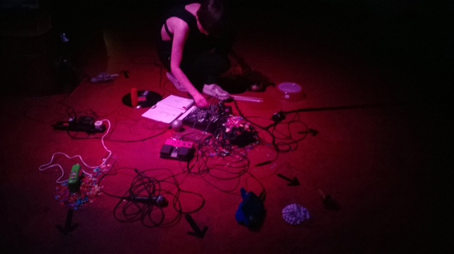

---
# CONFIGURATION
layout: 2014-emergency
rootpath: "../../../"

# ABOUT THE SHOW - GENERIC
artist: "Emergency 2014"
show: "Lunchtime: 12noon-3pm"
artist_size: 1
show_size: 3
header_image:

# ABOUT THE SHOW - LAYOUT
# artist_size: 1 # optional - size of artist name 1-5. Default is 1. Set longer names to lower values
# show_size: 2 # optional - size of show name 2-5. Default is 2. Set longer names to lower values
# header_image: "header.jpg" # optional custom background image, relative to current page

---
*Presented by* Word of Warning, STUN + Z-arts *during* [Emergency 2014](/current/2014-emergency)    
          
####Order of Appearance (subject to change):            
[Emergency 2014](/current/2014-emergency) runs from 12noon to 10pm and is primarily an adult event; from 3pm onwards we *advise* that work may not be suitable for under 18s.      
          
**Anton Mirto ¦ *earning innocence /3***          
Can looking for who you are, be who you are?      
In a world where we are consuming ourselves in the form of images, where our sense of identity is replicated and sold back to us, how do we remember who we are and who we have been?     
A work in development that explores finding and hiding the self and our need for memorialisation. Using silver foil a woman mass-produces versions of herself through moulding her face live.     
Concept + Direction: Anton Mirto ¦ Performer: Eleftheria Tzamtzi ¦ Sound Design: Konstantinis Tsitsas ¦ A first iteration of *earning innocence* was supported + presented at The Yard Theatre, London, March 2014.              
[a2company.org](http://www.A2company.org)         

          
**Art of Disappearing ¦ *The Stand In***          
An audio experience and challenge.      
Taking 2 willing audience members at a time, the work shifts the balance between performer and audience, asking you to become the watched as you take part in this collaborative experience, where you can find out just what type of performer you are and what type of performance you and your fellow *Stand In* will make.              
Art Of Disappearing is artists Rachel Champion + Tristan Shorr.       
Supported through a Dance and the Homemade commission; thanks to Laura, Katherine and the rest of the Chisenhale Dance Space team.               
[www.artofdisappearing.com](http://www.artofdisappearing.com) ¦ [@R_Champion_ ](http://twitter.com/R_Champion_) + [@shorr_tristan](http://twitter.com/shorr_tristan)          
          
**Peter Jacobs ¦ *KINDLING***           
An examination of the nature and value of reading and the printed word in an increasingly digital age.        
What is the value of printed books? And how can you control, manipulate and destroy education, ideas and narratives once transferred from page to human consciousness?               
*KINDLING* explores the relationship between words and ideas, imagination and experience in a durational installation performance that questions why we read, the value of books as artefacts and where they take us individually and as a society.     
<http://peter-jacobs.weebly.com> ¦ [@PeterTJacobs](http://twitter.com/PeterTJacobs)            
          
**Ana Mendes ¦ *Map Series***           
A performance installation on colonialism, in which Ana Mendes stitches the maps of the British Empire using a sewing machine. From Canada to Nigeria, India to Asia, see the rise and fail of an empire. Part experiment, part musical composition, *Map Series* makes you think: what is an empire today?           
[www.anamendes.com](http://www.anamendes.com) ¦ [@anamendesana](http://twitter.com/anamendesana)              
        
          
**Rosanne Robertson ¦ *Touched***       
A performance installation exploring contact between body, object, performance structures and heightened emotional states via sound. Making sound by touching in a simple and ritualistic performance, the artist interacts instinctively according to the unique situation, architecture and acoustic design of Z-arts' Rear Atrium, creating a temporary sound monument to the moment.   
Rosanne Robertson is an artist based in the North of England working with vibrations, objects and the body.             
*For me Rosanne's very much a 'doodlebug', that is to say, a provocateur who tirelessly works across all  platforms, creating work by any medium necessary and who works beneath the skin* — Dazed and Confused.       
[rosannerobertson.com](http://www.rosannerobertson.com) ¦ [@R0sanneR](http://twitter.com/R0sanneR)            
              
          
**Debbie Sharp ¦ *A Requiem For The Darkness (fragment)***   
A fragment of a larger requiem, this piece looks into the space between life and death: the place of waiting, the mechanics of the mind, memories and the frailness of the body.           
Here comes darkness — watching, creeping, stalking.         
Here comes darkness, holding fear within — gripping, burning, tricking.         
[debbie-sharp.com](http://debbie-sharp.com) ¦ [@iAMdebbiesharp](http://twitter.com/iAMdebbiesharp)            
           
          
**Jamil Keating ¦ *Sandcastles***       
During a not-so-perfect family holiday in southern Spain, a boy sits on a beach sipping sangria and building sandcastles, desperately trying to have fun.         
A short performance piece about the countless awkward, absurd and atrocious moments we have on the cusp of being young and naive enough to think you can save the world, but old and cynical enough to start doubting if it's even worth bothering.      
Jamil Keating is an emerging theatre-maker, writer and performer currently undertaking a residency at the Whitworth Art Gallery. *Sandcastles* is his live art debut, the first step in an artistic journey of trying to find the balance between being overwhelmed by perverse enthusiasm for the craziness of life, and trying to say something of substance about it… simply.          
          
####Venues + Booking Details  
Date: Saturday 4 October 2014, 12noon-10pm        
[Venue: Z-arts](http://www.z-arts.org/about-us/getting-here), 335 Stretford Road, Manchester, M15 5ZA         
Tickets: FREE no booking required; some ltd capacity shows will have sign-up sheets on the day      
Venue Tel: 0161 232 6089      
          
####Credits         
[Emergency](/hab/emergency) 2014 is produced by [hÅb](/hab); supported using public funding through Arts Council England, funded by Manchester City Council, supported by [STUN](http://stunlive.com) + [Z-arts](http://www.z-arts.org); a greenroom legacy project.
