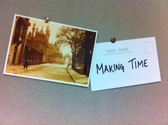

---
# CONFIGURATION
layout: 2014-emergency
rootpath: "../../../"

# ABOUT THE SHOW - GENERIC
artist: "Emergency 2014"
show: "One-to-Ones: 12noon-5.30pm (Limited capacity: sign-up on the day)"
artist_size: 1
show_size: 3
header_image:

# ABOUT THE SHOW - LAYOUT
# artist_size: 1 # optional - size of artist name 1-5. Default is 1. Set longer names to lower values
# show_size: 2 # optional - size of show name 2-5. Default is 2. Set longer names to lower values
# header_image: "header.jpg" # optional custom background image, relative to current page

---
*Presented by* Word of Warning, STUN + Z-arts *during* [Emergency 2014](/current/2014-emergency)              
          
####Order of Appearance (subject to change):      
[Emergency 2014](/current/2014-emergency) runs from 12noon to 10pm and is primarily an adult event; from 3pm onwards we *advise* that work may not be suitable for under 18s.      
          
**Alice Bunker-Whitney ¦ *It's Never Too Late To Have A Happy Childhood.***     
A sensory experience for adults and their inner child.      
Created + performed by Alice Bunker-Whitney ¦ Original score created by her parents, The Surf Messengers ¦ First developed as part of Hope Street Limited's On The Verge festival, with guidance from Elinor Randle (Tmesis Theatre).       
[@Bunkerwhitney](http://twitter.com/Bunkerwhitney)          
              
          
**Boland-Burrell + Byrne ¦ *Hero — Episode 1: Gunslinger***           
Have you ever wanted to be a hero? Fight the bad guys and save the day?         
Well here's your chance!      
This immersive audio experience puts you in the driving seat of a wild-west adventure. It's your time to put on your hat, take-up your shooting iron and be the hero you were always meant to be.    
Voices: Narration — Liam Byrne ¦ Old Man/Additional — Joshua Boland-Burrell ¦ Bartender/Santos/Additional — Luke Richards         
              
          
**Hidden Track ¦ *Told in Confidence***           
I am going to tell you a story that I never tell anyone. But it's okay to tell you, because I don't know who you are.             
An intimate performance for one (or two people) at a time, *Told in Confidence* is a gentle reflection on the taboos and stigma surrounding mental health. Through traditional storytelling and playful use of darkness and light, a space is created where secrets can be shared. Some things can only really be said to a stranger.       
[www.hiddentracktheatre.co.uk](http://www.hiddentracktheatre.co.uk) ¦ [Hidden Track facebook](http://www.facebook.com/HiddenTrackTheatre) ¦ [@HiddenTrackTC](http://twitter.com/HiddenTrackTC)          
             
          
**J. Fergus Evans ¦ *She Sang Me To Sleep With It*** *(work in progress)*      
We all remember at least one song from our childhood — a lullaby our mother sang us, the theme song from our favourite tv show, the song we sang on road trips, the pop song our older sister taught us…        
Poet and performer J. Fergus Evans is asking you to teach him a song from your childhood over a cup of tea, and he might just give you something in return. And don't worry — he isn't a very good singer either.       
*She Sang Me To Sleep With It* was originally conceived at CAMPSITE 2014 with support from the Jerwood Charitable Foundation.     
[jfergusevans.com](http://www.jfergusevans.com) ¦ [@Fergus_Evans](http://twitter.com/Fergus_Evans)            
          
**Krissi Musiol ¦ *Making Time***    
Make something happen in one year or ten. I will deliver to your dedication. I will do my best to ensure it reaches you on time.   
A 6 minute one-to-one piece — about living, about doing, about not putting off tomorrow, about *Making Time* for all the things we want to do.      
Krissi Musiol is a North West based solo contemporary performance maker, writer and performer. Since 2004, she has been developing her own unique performance style, incorporating culture and identity, fusing together poetry and found materials, autobiographical experiences as well as themes of gambling, dancing and cake!             
[krissimusiol.co.uk](http://krissimusiol.co.uk) ¦ [@KrissiMusiol](http://twitter.com/KrissiMusiol)            
           
          
####Venues + Booking Details  
Date: Saturday 4 October 2014, 12noon-10pm        
[Venue: Z-arts](http://www.z-arts.org/about-us/getting-here), 335 Stretford Road, Manchester, M15 5ZA         
Tickets: FREE no booking required; some ltd capacity shows will have sign-up sheets on the day      
Venue Tel: 0161 232 6089      
          
####Credits         
[Emergency](/hab/emergency) 2014 is produced by [hÅb](/hab); supported using public funding through Arts Council England, funded by Manchester City Council, supported by [STUN](http://stunlive.com) + [Z-arts](http://www.z-arts.org); a greenroom legacy project.
