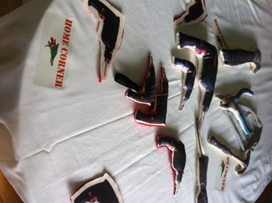

---
# CONFIGURATION
layout: 2014-emergency
rootpath: "../../../"

# ABOUT THE SHOW - GENERIC
artist: "Emergency 2014"
show: "Ongoing/Durational: 12noon-5.30pm"
artist_size: 1
show_size: 3
header_image:

# ABOUT THE SHOW - LAYOUT
# artist_size: 1 # optional - size of artist name 1-5. Default is 1. Set longer names to lower values
# show_size: 2 # optional - size of show name 2-5. Default is 2. Set longer names to lower values
# header_image: "header.jpg" # optional custom background image, relative to current page

---
*Presented by* Word of Warning, STUN + Z-arts *during* [Emergency 2014](/current/2014-emergency)              
          
####Order of Appearance (subject to change):      
[Emergency 2014](/current/2014-emergency) runs from 12noon to 10pm and is primarily an adult event; from 3pm onwards we *advise* that work may not be suitable for under 18s.      
          
**Barbara Dean ¦ *home corner***        
Welcome to the *home corner*, a crafty DIY emergency arts table.      
Need to settle a few scores at the dinner table, or having problems whiling away the hours with another 'boring' day at home? Come and join artist Barbara Dean in creating your very own stuffed toy hand drill… see you at the *home corner*.       
[www.barbaradean.org](http://www.barbaradean.org) ¦ [@Barbara_Dean1](http://twitter.com/Barbara_Dean1)        
              
          
**Hamish MacPherson ¦ *How Many Chairs to Build The Future?***        
A cross between a game, a choreography and a philosophical playground.          
Come and find out what you really mean when you think about the future, freedom and 100 other fundamental ideas.        
<http://hamishmacpherson.co.uk> ¦ [@HamishMacP](http://twitter.com/HamishMacP)            
        
          
**Hooligans Present ¦ *SMALL TALK***    
Tickle your chatter glands with an intimate textual journey for two.            
Text Message 07474360606      
No topic too big, or focus too small. A speciality EMERGENCY nugget for playful brain exchange. Must end by FIVE.       
[@isthissmalltalk](http://twitter.com/isthissmalltalk)      
          
**Martin Hamblen ¦ *A device for digging***       
Martin Hamblen performs phrases. He does the saying.        
At Emergency 2014 he will call a spade, a spade.       
[@uistkunstist](http://twitter.com/uistkunstist)            

**VIA Collective ¦ *THE ORBIT***        
Five people going on a journey together.          
Starting point: here and now. Final destination: yet to be announced.           
*THE ORBIT* is a durational piece where different worlds are reached through the repetition of the simple act of moving. Multinational theatre company VIA Collective invites you to go on a venture that transcends the perimeters of our dimension.      
VIA Collective is Shanna May Breen, Vjera Orbanic, Yoli Seker, Zlil-hen Saks + Rakel Dimar.          
[@via_collective](http://twitter.com/via_collective)        
             
          
####Venues + Booking Details  
Date: Saturday 4 October 2014, 12noon-10pm        
[Venue: Z-arts](http://www.z-arts.org/about-us/getting-here), 335 Stretford Road, Manchester, M15 5ZA         
Tickets: FREE no booking required; some ltd capacity shows will have sign-up sheets on the day      
Venue Tel: 0161 232 6089      
          
####Credits         
[Emergency](/hab/emergency) 2014 is produced by [hÅb](/hab); supported using public funding through Arts Council England, funded by Manchester City Council, supported by [STUN](http://stunlive.com) + [Z-arts](http://www.z-arts.org); a greenroom legacy project.
