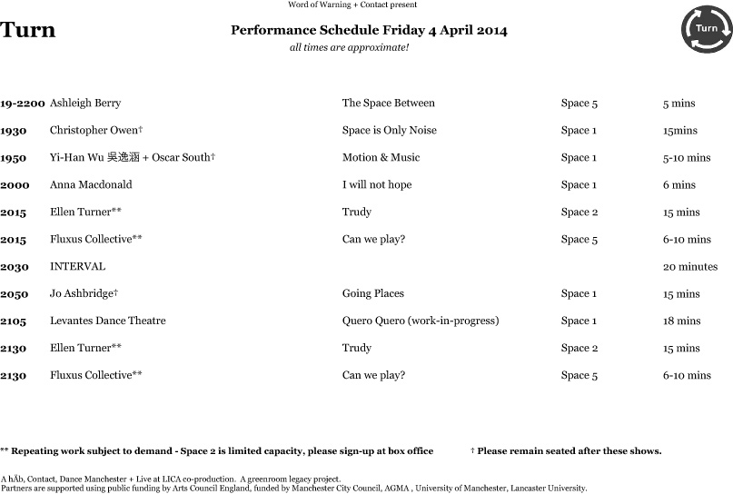

---

# CONFIGURATION
layout: 2014-turn
rootpath: "../../"
is_index: true

# ABOUT THE SHOW - GENERIC
artist: "Turn 2014" # the name of the artist or company
show: "Micro-festival of new dance." # the name of the show
show_size: 3

# ABOUT THE SHOW - LAYOUT
# artist_size: 1 # optional - size of artist name 1-5. Default is 1. Set longer names to lower values
# show_size: 2 # optional - size of show name 2-5. Default is 2. Set longer names to lower values
# header_image: "header.jpg" # optional custom background image, relative to current page

---
*Presented by* Word of Warning + Contact    
         
###Friday 4 + Saturday 5 April 2014, 7.30pm
Explosive, intimate, graceful and challenging — a two night micro-festival of emerging danceworks. Sinuous physicality and flying acrobatic exuberance; tender personal moments and giant shadows bending sound — Turn 2014 invites you to join the dance…          
         
####Venue + Booking Details
Dates: Friday 4 + Saturday 5 April 2014, 7.30pm    
[Venue: Contact](http://contactmcr.com/visit/getting-here/), Oxford Road, Manchester, M15 6JA    
[Tickets: £9/5 (two night pass £11/6)](https://contactmcr.com/whats-on/13070-turn-2014/booking/) | Special offer: buy ten tickets, get one free    
Box Office Tel: 0161 274 0600   
      
####More      
Turn 2014 is our sixth annual platform for dancers + dance-makers, featuring seventeen new works (participating artists subject to change):

Ane Iselin Brogeland | Anna Macdonald | Anoikis | Ashleigh Berry | Christopher Owen | Debbie Freedman | Ellen Turner | Fluxus Collective | Gracefool Collective | Hannah Buckley | Jane Munro + the visitors |  Jo Ashbridge | Joshua Hubbard F\*\#¿\!D | Levantes Dance Theatre | Peter Grist + Company | Tom Bowes Dance | Yi-Han Wu 吳逸涵 + Oscar South        
To get a feel for Turn see 2013's [image gallery](/galleries/2013-turn).      
               
####Schedule (*timings are approximate and subject to change*)          
To download, right click and save image.    
    
      
               
####What people have said about Turn
>★★★★*One of the key events in Manchester’s dance calendar.* The Public Reviews (2013)          
>*Great to see creative innovative new local work. Really good vibe.* *…a new experience. Too many highlights to mention. Thank you WoW!* *Weird and wonderful — as always.* *Fantastic platform for artists.* Audience Feedback (2013)        
A 4 review of Turn 2013's first night by [the public reviews](http://www.thepublicreviews.com/turn-2013-contact-manchester).     
A documentary film about Tom Bowes Dance performing [*Brute* in Turn 2013](http://vimeo.com/66465915).       
A preview of Turn 2014 by [Manchester Wire](http://manchesterwire.co.uk/#!/turn-danceworks-micro-fest-at-contact)       
        
####Credits         
Co-produced by hÅb, Contact, Dance Manchester + Live at LICA. A greenroom legacy project.
