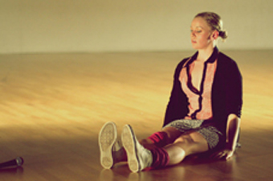

---

# CONFIGURATION
layout: 2014-turn
rootpath: "../../../"

# ABOUT THE SHOW - GENERIC
artist: "Turn 2014"
show: "Second Night: Saturday 5 April"
show_size: 4

# ABOUT THE SHOW - LAYOUT
header_image: "header_turn.jpg"

---
*Part of* Turn 2014, *presented by* Word of Warning + Contact       
                
####Venue + Booking Details, for Turn        
Dates: Friday 4 + Saturday 5 April 2014, 7.30pm    
[Venue: Contact](http://contactmcr.com/visit/getting-here/), Oxford Road, Manchester, M15 6JA    
[Tickets: £9/5 (two night pass £11/6)](https://contactmcr.com/whats-on/13070-turn-2014/booking/) | Special offer: buy ten tickets, get one free    
Box Office Tel: 0161 274 0600    
               
####Order of Appearance (subject to change)      
**Ashleigh Berry | The Space Between**          
A first-stage short film exploration created and directed by Ashleigh Berry, toying with the intersecting ideas of personal and public space. Examining space as a commodity in an ever-changing, ever-moving environment, the film questions when to 'hold space' as an individual, making a mark, and when to succumb to the bustle and become part of the background noise.      
          
Concept + creation: Ashleigh Berry | Collaborators: Nicole Ward, Emma Fishwick | Project Mentor: Laura Boynes | Supported by Healthway, promoting the Drug Aware message, and Propel Youth Arts Western Australia.        
          
**Gracefool Collective | WE (spelt you & i)**         
In this surreal party we see the ways in which alliances are made and relationships form and break over a night; we watch social patterns twist and change as the party plays out, witnessing the transformation and deviation of each character in turn. The result is an unrequited love letter gone wrong, a gender swapping tango, a synthesised party track and a battle of the sexes all rolled into one rather strange event. *WE…* is about relationships, friendships and hardships; about communication and miscommunication, hellos and goodbyes, towing the line, drawing the line and stepping over the line.        
                
Choreographer: Kate Cox | Performers: Sarah Maria Cook, Sofia Edstrand, Rachel Fullegar, Rebecca Holmberg, Kyle Lawson, Davide Trioani + Jack Wignall      
            
[@gracefoolC](http://twitter.com/gracefoolC)          
         
**Hannah Buckley | Woman With Eggs**                    
A solo about women's ability to be many things.              
                     
Choreographer + performer: Hannah Buckley | Music: Alex Drewchin (Babooshka), Grimes (Oblivion) | Costume + styling: Lauren Reyhani                 
Text: *Kakuarshuk* (Inuit folk story taken from Angela Carter's Book of Fairtytales); extracts from interviews with Bo Tillmanns + Elsie Brown; *The Terrorism of Children* (extracts from a Sheila Heti interview with Sophie Calle)               
               
[@buckleyhello](http://twitter.com/buckleyhello)               
 
              
**Ane Iselin Brogeland | Microphono**        
Exploring thoughts of identity and language after being a foreigner in the UK for 2 years, Ane Iselin is curious about the ways in which spoken language and thought reach into each other, and might be inseparable from movement.               
                 
[Website](http://aneiselin.wordpress.com)           

          
**Debbie Freedman | Yugen**          
*What happens when you find the missing piece to solve an ongoing curiosity? Do you take it? Reject it because it is too much to handle? Or do something extraordinary…*             
                   
An emotive performance where Debbie takes you on a magical journey.          
                
Debbie is a professional dancer, choreographer and dance teacher working in the North West. Her choreography for performances and festivals are based on a variety of different styles ranging from Indian and African to Contemporary and hip-hop.           
            
[@dabrhythm](http://twitter.com/dabrhythm)          
          
**Jane Munro + the visitors | Invitation**                      
Examining how a performer deals with the negotiation of participation, we look at how the performer approaches an audience member. We look at the tricks he has to perform to get someone else to join; she seeks wallflowers and exhibitionists. *Invitation* leads audience members from the fearful, to the thrill of dancing an impromptu duet. Or maybe there are no dances and merely a series of refusals.        
              
Performers: Rebecca Bogue + Jaime Lee-Rodney | Choreography: Jane Munro, Rebecca Bogue + Robert Cook | Music: Andrew Lawrence + Nico Muhly
       
[Website](http://www.janemunro.co.uk)       
               
**Anoikis | Black Plastic Bag**           
The dramaturgic texture of this piece has its roots in 20th century protest art, as it involves a complete and devastating negation of economically regulated spectacle (the denouncement of 'beauty' as a class-ified commodity or in any way objectively definable in favour of a more 'everyday' subjectivity) — yet at the same time it is a joyous affirmation of spectacle, albeit one dependent on mass participation and not exclusion, the utopian ideal of communion.           
         
Dancer + choreographer: Melissa Pasut | Direction: Andrew Leslie Hooker
           

**Peter Grist + Company | Tiny Little Flashlights**                   
A new work choreographed by Peter Grist about the consequences of small actions, and the fragility of relationships through tough times. The piece layers moments in time to convey journeys through relationships, love, the environment, and parenthood.         
         
[Website](http://www.petergrist.co.uk)       
         
**Tom Bowes Dance | Imbue**          
Combining projection and choreographed live movement, *Imbue* follows a female dancer as she enters a metaphorical room; we watch as she explores the room's contents, and familiarises herself with past happenings.      
          
Choreography: Tom Bowes | Projection: Ethan Duffy | Performance: Jenny Reeves | Sound: *Enter The Host I* by William Fowler Collins, *Passport Control* by The Black Dog, *We Insist* by Zoë Keating, *Not a Number* by Apparat        
            
[Website](http://www.tombowesdance.com) | [@tombowesdance](http://twitter.com/tombowesdance) | [Facebook Page](http://www.facebook.com/tombowesdance)        
    
          
**Joshua Hubbard F\*\#¿\!D | Dummies**           
A coolly crashing piece of work.     
          
Choreographer: Joshua Hubbard | Dancers: Joshua Hubbard, Anton Hincliffe, Eve Stainton, Aimee Papworth            
           
[Facebook Page](http://www.facebook.com/joshua.hubbard.dance)       
