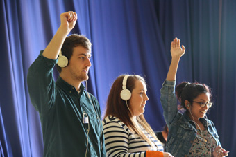

---

# CONFIGURATION
layout: 2014-woah
rootpath: "../../../"

# ABOUT THE SHOW - GENERIC
artist: "SheepKnuckle"
show: "Echo"
artist_size: 1
show_size: 1
header_image: "header_sheepknuckle.jpg"

# ABOUT THE SHOW - LAYOUT
# artist_size: 1 # optional - size of artist name 1-5. Default is 1. Set longer names to lower values
# show_size: 2 # optional - size of show name 2-5. Default is 2. Set longer names to lower values
# header_image: "header.jpg" # optional custom background image, relative to current page

---
*Part of* Works Ahead 2014, *presented by* Word of Warning + Contact      
         
####In Brief                      
SheepKnuckle are two young men going to extraordinary lengths to avoid being on a stage… so what exactly are they doing here?     
     
####Venue + Booking Details, for Works Ahead
Dates: Thursday 8 + Friday 9 May 2014, 7.30pm    
[Venue: Contact](http://contactmcr.com/visit/getting-here/), Oxford Road, Manchester, M15 6JA    
[Tickets: £6/3](http://contactmcr.com/whats-on/13071-works-ahead-2014/booking) | Special offer: buy ten tickets, get one free       
Box Office Tel: 0161 274 0600        
*The same programme is presented each evening, there is no two night pass.*        
       
####Access Information      
Part of a triple-bill of new performance, the three shows take place in different auditoria within Contact; audience members will be guided from show to show. Show duration approx 30mins; triple-bill duration (including intervals) approx 2hrs. Age advisory: 14+    
       
####More       
SheepKnuckle are two young men going to extraordinary lengths to avoid being on a stage… so what exactly are they doing here?    

In this celebration of collective performance anxiety, they cede centre stage to an audience-turned-performer, to become remote whispering guides through an intimate conversation and a performance of the everyday.    
 
*Echo* is a love story you have already heard but are yet to take part in...    
    
####Who are they?    
SheepKnuckle are James Monaghan + Padraig Confrey, who make work that manifests itself often as an experiment; who are interested in using interactive media and ‘the self’ to challenge and de-construct traditional dramaturgy. They met at Salford University in their first year and have been in love ever since.     
        
####Credits         
Commissioned by hÅb, co-produced by Contact, a greenroom legacy project.        
        
####Websites
<http://sheepknuckle.tumblr.com> | [@SheepKnuckle](http://twitter.com/SheepKnuckle)
