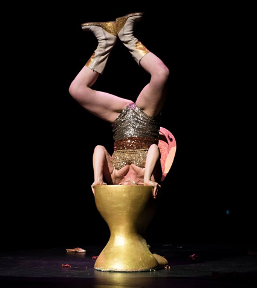
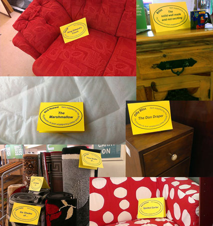
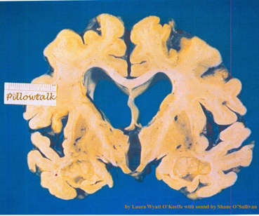
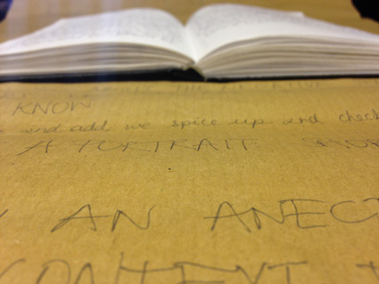
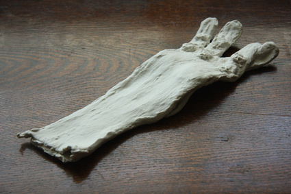

---
# CONFIGURATION
layout: 2015-domestic
rootpath: "../../../"

# ABOUT THE SHOW - GENERIC
artist: "Domestic II"
show: "Saturday Daytime 12noon-5pm"
artist_size: 1
show_size: 3
header_image:

# ABOUT THE SHOW - LAYOUT
# artist_size: 1 # optional - size of artist name 1-5. Default is 1. Set longer names to lower values
# show_size: 2 # optional - size of show name 2-5. Default is 2. Set longer names to lower values
# header_image: "header.jpg" # optional custom background image, relative to current page

---
*Presented by* Word of Warning, The Guinness Partnership *during* [Domestic II](/current/2015-domestic)    
          
####Saturday Daytime:      
[Domestic II daytime](/current/2015-domestic) runs from 12noon to 5pm and is primarily an adult event.      
          
**Threshold ¦ *1989 called...***      
A sonic silhouette, an artist's self-portrait created from the substance of absence.    
*1989 Called...* shapes a sonic silhouette, an artist's portrait in their absence created from the substance left behind that might define them. In this case, the portrait is created from genuine answer phone messages left by friends, recorded in 1989. We listen in on someone else's life as disembodied voices from the past hint at relationships, events, both real and imagined, and imply a character to this absent recipient for whom the messages were once intended.    

A professional filmmaker for 30 years, with more than 200 film credits as artist, producer, director or writer, including rock videos for major UK and US record labels, artists’ shorts video installations, commercial promotional films and award-winning community access workshops productions  Barry’s work has had numerous international screenings and exhibitions, from Las Vegas to Latvia, from the ICA to the belly of a Stockholm ship  He is the Co-Founder and Creative Director of Threshold Studios and Festival Co-Director of Frequency Festival of Digital Culture.    
Supported using public funding by the National Lottery through Arts Council England.                
<http://www.thresholdstudios.tv>     
        
[**Tin Can People ¦ *Audio Caff***](/current/2015-domestic/audiocaff)           
A traditional English café amplified, reverberated and delayed whilst enjoying a pot of tea and a homemade slice of Victoria Sponge. Audio Caff is a performance hub where anyone can meet, relax, enjoy a brew and have a slice of homemade cake, while being immersed in a sound installation.    
 Charlotte Berry is a theatre maker, performance artist and musician based in the NorthWest. Charlotte is a member of Tin Can People, a theatre company that platform devised group performances and solo projects.        
**Doris La Trine ¦ *Flushed***            
Doris La Trine and her beloved toilet Len get Flushed.    
Doris and Len have been together for what seems like forever and the time has come for Doris to open the bathroom door and go alone. This visual and physical performance juxtaposes comedy and tragedy as one piece.    

Doris La Trine is performed by Liselle Terret. As Doris La Trine, she creates and  has performed feminist low art at venues including BAC, Duckie, Assembly Rooms, and Soho Review Ba. She has also performed with Annie Sprinkle (The Chelsea Theatre 2008) as Annie’s dutiful nurse. A lecturer of many years standing, between 2008 to 2010 she co-curated a series of low art queer feminist events in partnership with the Roundhouse, London, and has published articles in a variety of publications.    
    

**Clare Charnley ¦ *Flat Pack***            
Charnley turns things inside out as she makes furniture from its packaging. 
A contemplation on obsolescence in dialogue with the public, Clare is making repro just-out-of-date furniture for this new space. What on earth does she think she’s doing? And why?  Construction and dialogue.    
<http://www.clarecharnley.com>    
     
  
**Mackenzie & Reed ¦ *Natura Naturans***             
Natura Naturans redefines ‘life’ to ask, is a space ever really uninhabited?    
Acting as enablers, Mackenzie and Reed explore the flaws in our current definition of the word ‘life’ by allowing the activity of living matter within the room to become performer.  Using a combination of live microscopy, projection and sound recording within the seemingly uninhabited domestic space, the artists will reveal that the room is alive and coax it into a collaborative performance, encouraging reflection on what constitutes ‘life’ and of our co-existence with this unassuming other.    

Louise Mackenzie (UK) is a mixed-media artist creating installation, sculpture, performance, sound and film worksWith a focus on living material
Mark Reed is a freelance sound recordist, artist and would-be hermit philosopher if he wasn’t so busy workingA graduate of Popular and Contemporary Music at Newcastle University, Mark has expertise in sound design, composition and recording, managing sound production.    
Supported by Northumbria University.    
<http://www.viralexperiments.co/>    
 
**Laura Wyatt O'Keeffe ¦ *Pillow Talk***    	
The sound of forgotten intimacy, an installation for one person at a time.    
Laura and Shane are cousins. They have a Grandmother. She is forgetting herself.    
There is a bed. Not different to hers.     There is a pillow.     A pillow. A something we all own. Holds heads, dreams, thoughts, prayers. Intimate and ours.     
Hers.     This intimate sound installation explores the landscape of the dying mind. Its gentle and surprising.     
Laura Wyatt O’ Keeffe is an actor, writer, theatre maker and the artistic director of the theatre and film company justmakeit Productions.     
Shane O' Sullivan is a composer, sound designer and broadcast engineer from Cork, Ireland and has been designing for theatre, short film and radio since 2009.            
    

**Jamil E-R Keating ¦ *Asteroid RK1***      
How close is too close for something so far?	    
An installation-story about asteroids and alcoholism, meteorites and human rights, comets in the night-sky and care in the city. Rotations, revolutions and realisations...    
An interdisciplinary artist interested in theatre and live art, Jamil has developed an auto-biographical coming of age solo-show for hÅb’s Works Ahead and pieces for Hazard and Emergency.  He was Assistant Director on Contact Young Company’s 'The Shrine of Everyday Things' and produces performance nights as part of the collective, Gnarled Tongues.     
          
**Leo Burtin ¦ *Between Us***        
A brief encounter with a stranger about the bits of life you'd like to never forget.  A conversation for one person at a time.    

It’s a short story, a snapshot of the everyday.  You are invited to celebrate the things that matter to you, to commemorate the small things, the bits of life which you’d like to remember.    

What is your 4th July? Whose birthday would you never forget? When did you take your first steps?     
     
*Between Us* is a performance for one person at a time devised by Leo Burtin as part of the Homemade series. Homemade is a series of artworks which seek to provoke complex conversations by gently disrupting familiar and domestic contexts and concepts.     
  
Leo Burtin is an artist, creative producer and writer based in London. Leo describes himself as a socially engaged practitioner, and his work often takes place at the crossroads where genres and disciplines meet, blend and blur. In the recent past, he has worked with imitating the dog, Raisin & Willow, Rajni Shah Projects and Blast Theory.     
     

**Charlotte CHW ¦ *Body-Wake***             
A repeating performance for small groups.    
An intimate durational live art installation using the body and movement, film and ceramic sculpture to explore the physical and mental impact of life in a degenerating body.    
                        
This highly personal work uses the bodily presence, film, overlapping abstract soundscapes and ceramics to explore the physical and mental impact of living in a degenerating body, mirrored in an intimate semi-derelict environment.    
	
Charlotte CHW is a multidisciplinary artist based in Hastings primarily working in the realms of live art, sculpture, sound and installation and where the boundaries of these mediums do or don’t lie. Primary interests in her work lie in the societal anxiety surrounding physical and mental health and the presentation of this. She attempts to translate emotional honesty to physicality and portray the ebbs and flows of the human body.    
    
           
**Afreena Islam ¦ *Daughters of the Curry Revolution***         
Not very authentic "Authentic Indian Cuisine".  A repeating performance for small groups.    
When I was little, I used to hang out at my dad's restaurant every weekend, back when they used to stay open until 5am. After a hard days toil running round like I owned the place for a bit, I would fall asleep to the CCTV; my body on the chest freezer, and my head resting on a pile of tablecloths.    

*The Daughters of the Curry Revolution* is a reflection on my dad's life; from his journey to this country, to his journey to this day.    
	
Last seen trading secrets in a Liverpool shed for ‘Poolside Emergency, Afreena normally makes work as one half of Manchester-based interactive theatre company, PGB. She calls herself an artist only when she’s got something to say, the rest of the time she manages Divergency, sits on Contact’s board, and is an Associate for London-based interactive theatre-makers, Coney. This is her first solo work.    

**Ana Mendes ¦ *Backspace***             
An audio experience for one person at a time.     
An audio play about anorexia in which audiences interact with a distorted mirror. Funny, witty, but also truthful, try it if you dare to be on the other side of the mirror.    

Portuguese-born Ana Mendes is a writer and artist working and living in London and Berlin. She has studied animation film,  photography and an MA in Writing for Performance. She started to work as a writer, but turned gradually into visual arts. Her performance career started accidentally when she wrote Self-portrait, a play on her identity, in 2010. Since then, she has been developing projects that play on the intersection of photography and performance.    
    

####Venues + Booking Details  
Date: Saturday 26 September 2015, 12noon-5pm        
[Venue: Matthias Court ](https://www.google.com/maps/d/viewer?mid=zUP9hOfLluWs.kxF_FyzLKBI8&usp=sharing), M3 6JD.       
Tickets: FREE no booking required; some ltd capacity shows will have sign-up sheets on the day      
Enquires: 07581 299 439    

####Access Information        
As a sited event, Domestic II presents a number of access challenges and whilst we will make every effort to help, wheelchair access may not be possible, please contact us for details.        
Age advisory: Domestic II is primarily aimed at adults and deals with autobiographical and social issues with some sensitive content.  Works suitable for younger people on Saturday daytime will be clearly signposted on the day.   
For specific age and access information please email info@habarts.org or call 07581 299 439.     
 
####Credits         
[Domestic II](/current/2015-domestic) is produced by [hÅb](/hab) with support from the Guinness Partnership and Guinness Property; supported using using public funding by the National Lottery through Arts Council England.    

