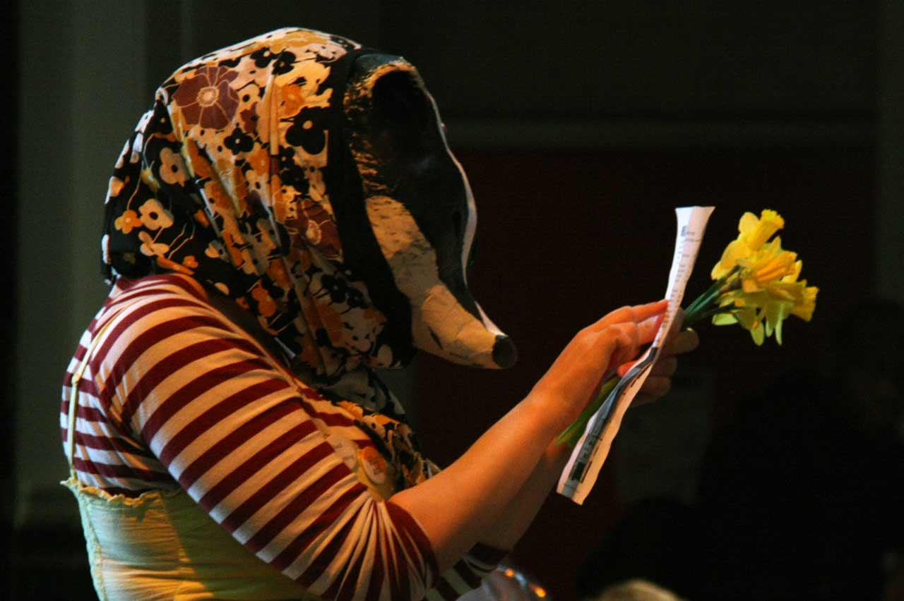
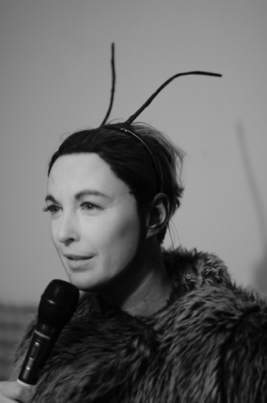

---
# CONFIGURATION
layout: 2015-haphazard
rootpath: "../../../"

# ABOUT THE SHOW - GENERIC
artist: "Haphazard 2015"
show: "Ongoing Activity from 12noon to 4pm"
artist_size: 1
show_size: 4
header_image:

# ABOUT THE SHOW - LAYOUT
# artist_size: 1 # optional - size of artist name 1-5. Default is 1. Set longer names to lower values
# show_size: 2 # optional - size of show name 2-5. Default is 2. Set longer names to lower values
# header_image: "header.jpg" # optional custom background image, relative to current page

---
*A free event for the curious of all ages, presented by* Word of Warning *+* Z-arts* Turn up at Z-arts any time from 12noon to 4pm, come and go as you please…*		

####Venue + Booking Details, for Haphazard
Date: Saturday 28 February 2015, 12noon-4pm    
[Venue: Z-arts](http://www.z-arts.org/about-us/getting-here), 335 Stretford Road, Manchester, M15 5ZA        
Tickets: FREE no booking required († *limited capacity, sign-up on the day*)        
Venue Tel: 0161 232 6089

####Ongoing Activity   
**Lani Irving | *Wildlife***        
Haphazard welcomes its very own bovine micro-herd... Last seen during [2013](/archive/2013-spring/haphazard), Lani Irving returns with a friendly bunch of cows to herd you around the building – and if you need any help they might moo back!        
<http://laniirving.wix.com/thebusybadgeruk> | [The Busy Badger facebook](http://www.facebook.com/thebusybadger) | [@thebusybadger](http://twitter.com/thebusybadger)          
  
     
**Anonymous  | *Narcissus***       
Everyone loves badges, don’t they? What slogan will *you* choose and what does it say about you?    
Ask a white-coated volunteer for your favourite badge and become part of this mobile and moving self-portrait of an unknown artist, painted in words on tin.    
          
**Leo Burtin | *Homemade: Le Bistroquet***      
You are invited to Leo's Bistro - join us in this pop-up café where the menu needs **you**!    
While you sip on a soupçon or taste a tit-bit, why not offer your own recipe for our chef to consider?    
 *Le Bistroquet* is a pop-up intervention by Leo Burtin [last seen at Hazard 2014](/archive/2014-hazard/ongoing),  and produced by Talk with LEAP as part of the Homemade series. Leo Burtin is an artist and creative producer... he wouldn't normally let you know that he is French and used to work for Jamie Oliver!         
**N.B.** Food and drink served may contain allergens.            
[www.talkwithleap.com](http://www.talkwithleap.com) | [@olamerino](http://twitter.com/olamerino)        
        
**Peter Jacobs**    
Little by little, as the hours while away, curious creatures appear in the café. Shaping and growing, from little more than a roll of tape, these brightly coloured mummies emerge, stumbling and waddling in a slow-mo game of follow-my-leader.     
<http://peter-jacobs.weebly.com> | [Peter Jacobs facebook](http://www.facebook.com/mrpeterjacobs) | [@PeterTJacobs](http://twitter.com/PeterTJacobs)        

**Natasha Patel | *Shoes***   
If your shoes could talk, what stories could they tell?  What journeys have they been on and what has led you down the path you have walked?   
A trail of shoes, big and small, plain and fancy, each with its own story...    

**Josh Coates | *The White Room***       
*Is there something you want to get off your chest? Has something been bugging you for a while? That song lyric, that memory, that conversation?  Or is a little part of you just itching to make your mark?*   
The White Room offers you the chance to do just that… a store-room turned memory-book - walls, floors, chairs papered in an invitation to leave a message, a story or a picture for your fellow visitor.  Artist Josh Coates will be there to help and inspire you (and maybe to discourage the less creative contribution!)    
[@J_JCoates](http://twitter.com/J_JCoates)
    
        
**Julieann O’Malley | *HIVE***          
Welcome to the *HIVE* - or the plight of the bumble bee.     
Enter inside and meet Queen Bee, a friendly creature who needs your help.    
Her workers are struggling and without them we'll lose our fruit and veg.    
Can your ideas help the Queen save her bees?     
*A five minute experience for one or two.*    
[@JulieannOMalley](http://twitter.com/JulieannOMalley)      
    

**Special guests: Hunt & Darton**       
Popping-up at Haphazard just before their [café pops-up on Piccadilly Approach](/current/2015-spring/h&d) during SICK! Festival throughout March…          
<http://huntanddartoncafe.com> | [Hunt & Darton facebook](http://www.facebook.com/hunt.darton) | [@HuntDarton](http://twitter.com/HuntDarton)      
  
               
####[Timed Activity between 12noon & 4pm](/current/2015-haphazard/timed):		
Rachel Ramchurn | Ultra Violets | Robert Foster | Levantes Dance Theatre | Liz Clarke    

