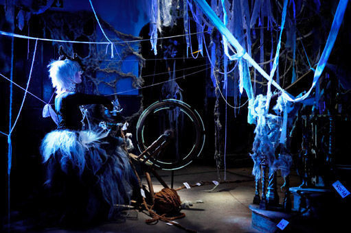
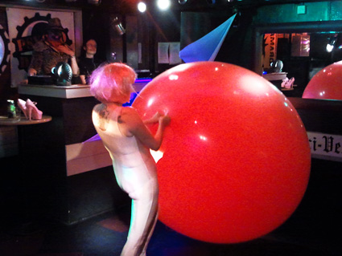

---
# CONFIGURATION
layout: 2015-haphazard
rootpath: "../../../"

# ABOUT THE SHOW - GENERIC
artist: "Haphazard 2015"
show: "Timed Activity between 12noon & 4pm"
artist_size: 1
show_size: 4
header_image:

# ABOUT THE SHOW - LAYOUT
# artist_size: 1 # optional - size of artist name 1-5. Default is 1. Set longer names to lower values
# show_size: 2 # optional - size of show name 2-5. Default is 2. Set longer names to lower values
# header_image: "header.jpg" # optional custom background image, relative to current page

---
*A free event for the curious of all ages, presented by* Word of Warning *+* Z-arts* Turn up at Z-arts any time from 12noon to 4pm, come and go as you please…*        
        
####Venue + Booking Details, for Haphazard        
Date: Saturday 28 February 2015, 12noon-4pm    
[Venue: Z-arts](http://www.z-arts.org/about-us/getting-here), 335 Stretford Road, Manchester, M15 5ZA        
Tickets: FREE no booking required († *limited capacity, sign-up on the day*)        
Venue Tel: 0161 232 6089        
        
####12noon-12.20pm | 1-1.20pm | 2-2.20pm | 3-3.20pm		
**Rachel Ramchurn | *Crochet: LIVE***        
What happens when crochet comes alive?
Find out and meet the bizarrely whimsical character 'Crochet' in this spontaneously woolly performance.		
		
Created by Rachel Ramchurn + performed by Amanda Debrowski.        
<http://rachelramchurn.blogspot.co.uk> | [@rararamchurn](http://twitter.com/rararamchurn)       
    
 
####12noon-12.30pm | 1-1.30pm | 2-4pm	
**Ultra Violets | *Labolis Goes Wild***        
Welcome to the jungle… pick up a pirate map from Captain Jack and embark on a perilous quest for buried treasure.  Fish in the lagoon and unravel the spiderweb riddle in search of the elusive clues.    

In [Haphzard 2013](/archive/2013-spring/haphazard/index.html), the Ultra Violets brought mayhem in the minotaur’s maze.  Now be enticed to explore but remember - it’s a jungle out there!    

[www.ultraviolets.org.uk](http://www.ultraviolets.org.uk) | [Ultra Violets facebook](http://www.facebook.com/pages/Ultra-Violet-Violence/182526948443905)		
	    

####12noon-1pm | 3-4pm		
**Robert Foster | *Fool's Game***        
Roll up, roll up and join in the hoopla!  
Pick your challenge level and put your skill to the test by tossing a ring over a bucket-headed fool in this surreal makeover for the old fashioned game of quoits.   
<http://robertjohnfoster.wordpress.com> | [@robert_j_foster](http://twitter.com/robert_j_foster)	
	
####12.30-1pm | 1.30-2pm		
**Levantes Dance Theatre | *The Western Frontier (work-in-progress)***        
A playful exploration of love in a western landscape or an adventure in love, loss and banjos...    
A return to Manchester for eccentrically engaging and offbeatly odd Word of Warning favourites, Levantes Dance Theatre.    
A work in development commissioned by hÅb for Haphazard.           
[www.levantesdancetheatre.org](http://www.levantesdancetheatre.org) | [Levantes facebook](http://www.facebook.com/pages/Levantes-Dance-Theatre/104271426281626) | [@LevantesDance](http://twitter.com/LevantesDance)		
    	 
	
####1-3pm (durational) + 3-3.10pm performance		
**Liz Clarke | *My Inflatable One***        
A cross between a rubbery, exploding 'sewing bee' and an odd cabaret. 
Part mundane, part spectacle, part wonderment, this encounter charts the quest for *Bigger! Better! More!* through the medium of balloons and silly soundtracks.   
	
Liz Clarke is a performance maker who the boundaries between reality and dreamscape. Shows include *I Tattooed My Baby* (she didn't) and *Cannonballista*, a dark human cannonball show (she did).    
[www.lizclarke.org](http://www.lizclarke.org) | [@LizGClarke](http://twitter.com/LizGClarke)        

<small>Image Credit: Toaster in the Bath</small>  		
		
####[Ongoing Activity from 12noon to 4pm](/current/2015-haphazard/ongoing):		
Anonymous | Leo Burtin | Josh Coates | Hunt & Darton | Lani Irving | Peter Jacobs | Julieann O'Malley† | Natasha Patel
