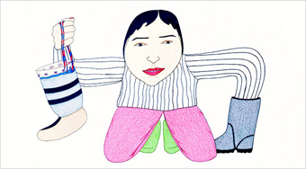
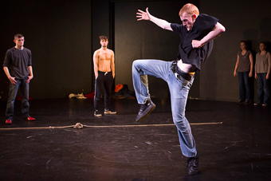

---

# CONFIGURATION
layout: 2015-turn
rootpath: "../../../"

# ABOUT THE SHOW - GENERIC
artist: "Turn 2015"
show: "Second Night: Saturday 28 March"
show_size: 4

# ABOUT THE SHOW - LAYOUT
header_image:

---
*A micro-festival of new dance, presented by* Word of Warning*,* Contact *+* Dance Manchester       
     
####Venue + Booking Details, for Turn        
Dates: Friday 27 + Saturday 28 March 2015, 7.30pm    
[Venue: Contact](http://contactmcr.com/visit/getting-here), Oxford Road, Manchester, M15 6JA    
[Tickets: £9/5 per night (two night pass £11/6)](https://contactmcr.com/whats-on/30697-turn-2015/booking)        
Special offer: buy nine tickets + get your tenth free    
Box Office Tel: 0161 274 0600    
        
####Order of Appearance (subject to change)        
**™ Dance Company | *Today***        
When we meet someone we meet all that they are and all that they will be. Desire and influences are the past and futures within someone. However, we meet them as they are today and yet we can relate to all these things which exist within the individual. Through story-telling, Capoeira, Hip-hop and Contemporary, *Today* delivers solid physicality and intricate duet work; exploring the performers' journey from adolescence into manhood and beyond, it focuses on significant factors like: the father figure, spirituality and culture.        
[@MalachiSimmons](http://twitter.com/MalachiSimmons) | [@theofapo](http://twitter.com/theofapo)        
        
        
**Tangled Dance Company | *Spilled Ink***        
Words scrawled, pages flicked, ink smudged, love lost, hearts wrenched, lives torn… United they stood, side by side, hope in hand and fear on face. Women stood firm, backbone of the nation, still anxious for one more embrace.        
        
Choreography: Amy Eccleston + Georgie Abbott | Composition: Craig Frangleton | Performers: Amy Eccleston, Georgie Abbott + Craig Frangleton        
<http://tangleddancecompany.wix.com/tdc1> | [Tangled Dance Facebook](http://www.facebook.com/TangledDanceCompany) | [@Tangled_Dance](http://twitter.com/Tangled_Dance)        
        
        
**Joseph Mannion | *Brotherly Love***        
This piece wouldn't have been possible without the creative input and dedication of the original member Bryn Gallimore.        
Thank you to: Lisa Cullen, Sarie Slee + Joseph Lau from the University of Salford        
<http://josephmannionchoreography.weebly.com>) | [@JosephMannion\_](http://twitter.com/JosephMannion_)        
        
**Rebekka Platt | *The Snow People* (a work-in-progress)**        
Devised by: Rebekka Platt + Louise Mellor        
<http://rebekkaplatt.wix.com/home> | [@BekkePlatt](http://twitter.com/BekkePlatt)        
        
        
**Phoebe Ophelia Douthwaite | *The Land of the Blue Mist***         
I set off for the Appalachian mountains of North Carolina last summer with the intention of researching and developing my current skills in Appalachian step dance — at the end of this 3 month-long trip my aim was to bring all the inspiration and skills I had picked up from dance teachers, friends, musicians and the mountains to create a solo piece which fused both traditional step dance and contemporary movement. Performed from feelings, thoughts and a life changing experience, the feel of the movement changes every time — not just because Appalachian step dancing is a freestyle form, but that new experiences and feelings are provoked every time I put myself back into *The Land of the Blue Mist*; this isn't a performance, it's a true confession and expression of how I found mindfulness.        
        
Choreography: Phoebe Ophelia | Composer: John Duncan | Credits: John Duncan, Northern School of Contemporary Dance, Sue Coe, Pete Coe, Ira Bernstein, Matt Gordon, Trevor + Travis Stuart.        
<http://phoebeopheliaaa.tumblr.com>        
        
         
**EdgeFWD Dance Theatre | *REVOLT***       
Taking inspiration from the 1984 British miners' strike, EdgeFWD presents a powerful, dynamic, splintering explosion of Northern, working class grit. Driven by a sound score mixing thumping 90's rave and Grimethorpe Colliery Brass Band classics, *Revolt* takes a hard hitting look at what it takes to stand up and be heard, in a demonstration of unity and survival.        
        
Music: *Born Slippy* by Underworld; Grimethorpe Colliery Band | Choreography: Gary Clarke | Performers: EdgeFWD | Artistic Direction: Debbie Milner | Rehearsal Direction: Julia Griffin + Joe Reay-Ried | Thanks to: Edge Hill University        
[www.edgefwd.org](http://www.edgefwd.org) | [EdgeFWD Facebook](http://www.facebook.com/pages/Edge-FWD/121091001259090) | [@EdgeFWD](http://twitter.com/EdgeFWD)        
        
        
**Victoria Sheldon | *Who Are You Fighting Against?***        
A practical exploration into the collaboration of martial arts and dance.        
         
Directed, choreographed + performed by: Victoria Sheldon | Music: *A Boxer's Soundscape: The Battle During and Between Rounds* by Desiree D'Alessandro, *Vordhosbn* by Aphex Twin        
<http://www.vickyvickstah.webs.com> | [Vicky Vickstah Facebook](http://www.facebook.com/VickyDancerVickstah) | [@VickyVickstah](http://twitter.com/VickyVickstah)        
        
        
**Dan Watson | *Jacket Dance***        
We think there must be something seriously meaningful and interesting in the idea of ridiculous dancing. This performance is part-game, part-choreographed work.        
       
    
Danced by: Dan Watson + Matthew Winston | Created by: Dan Watson with Rachael Mossom + Matthew Winston | Music: *Neither One Of Us (Wants To Be The First To Say Goodbye)* by Ruby Winters        
Made possible by a Dance and the Homemade Commission from Chisenhale Dance Space, special thanks to participants of the workshop *Play, Confusion and Ridiculous Dancing* at Chisenhale on 13 April 2013.        
<http://danwatsonperforms.blogspot.co.uk> | [Dan Watson Facebook](http://www.facebook.com/pages/Dan-Watson-Performs/133892962511) | [@DanGWatson](http://twitter.com/DanGWatson)        
        
####[Appearing on the First Night: Friday 27 March](/current/2015-turn/fri)         
Adam Russell | Ebony-Rose + Lorienne Aimée | Joshua Hubbard | Lo-Giudice Dance | Maelstrom Theatre | Peter Grist + Company | Rachel Sweeney | Sophie Unwin
