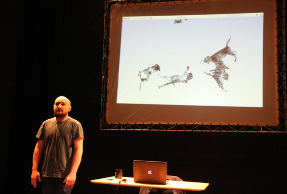

---

# CONFIGURATION
layout: 2015-woah
rootpath: "../../../"

# ABOUT THE SHOW - GENERIC
artist: " Nathan Birkinshaw"
show: "How I Lost The Will To Live (& Why You Should Too)"
artist_size: 1
show_size: 3
header_image: "header_birkinshaw.jpg"

# ABOUT THE SHOW - LAYOUT
# artist_size: 1 # optional - size of artist name 1-5. Default is 1. Set longer names to lower values
# show_size: 2 # optional - size of show name 2-5. Default is 2. Set longer names to lower values
# header_image: "header.jpg" # optional custom background image, relative to current page

---
*Part of* Works Ahead 2015, *presented by* Word of Warning + Contact      
         
####In Brief                      
A coming of age story for a hyper-connected world.   
A world convinced it's dying.   
A world that's no longer good enough.    
A world where it's not the length that matters, but what you do with it.   
(Allergen information: may contain nuts, gluten, ketchup and cats.)     
       
####Venue + Booking Details, for Works Ahead
Dates: Friday 24 + Saturday 25 April 2015, 8pm (Double Bill)        
[Venue: Contact (space 2)](http://contactmcr.com/visit/getting-here), Oxford Road, Manchester, M15 6JA            
[Tickets: £6/3](http://contactmcr.com/whats-on/35092-works-ahead-2015/booking) | Special offer: buy nine tickets + get your tenth free            
Box Office Tel: 0161 274 0600        
        
####Access Information      
Age advisory: 16+ Part of a double bill of new performance in development, the evening will last approximately 1½ hours — each show lasts approximately 30 minutes, with a 30 minute interval between during which our audience will be asked to return to the bar/foyer. Mainly spoken English. For specific age and access information please email info@habarts.org or call 0161 232 6086.                     
 
####Who is he?    
Nathan Birkinshaw is a performer and theatre-maker from Wakefield, creating work that's honest and funny, with a mixed-media approach. He aims to pick out the absurdity in the notion of humanity and the crazy time we're living in.    
                                             
>*Smartly-silly* — [Donald Hutera](http://twitter.com/donaldhutera/status/576193697022373888)      
>*A mistake* — Mr + Mrs Birkinshaw         
        
        
####Credits         
Commissioned by hÅb, co-produced with Contact. Project Mentor: Peader Kirk

####Website
[nathanbirkinshaw.wordpress.com](http://nathanbirkinshaw.wordpress.com) | [@NathBirkinshaw](http://twitter.com/NathBirkinshaw)
