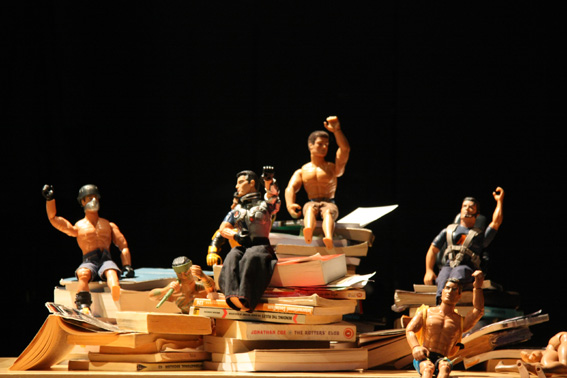

---

# CONFIGURATION
layout: 2015-woah
rootpath: "../../../"

# ABOUT THE SHOW - GENERIC
artist: "Jamil Keating"
show: "Affected"
artist_size: 1
show_size: 1
header_image: "header_keating.jpg"

# ABOUT THE SHOW - LAYOUT
# artist_size: 1 # optional - size of artist name 1-5. Default is 1. Set longer names to lower values
# show_size: 2 # optional - size of show name 2-5. Default is 2. Set longer names to lower values
# header_image: "header.jpg" # optional custom background image, relative to current page

---
*Part of* Works Ahead 2015, *presented by* Word of Warning + Contact      
         
####In Brief                      
The confessions of a Marxist poseur.  From achingly earnest teen-activist to wannabe Olivier, the scuffles and skirmishes of a young man seeking his place in the world.    
         
####Venue + Booking Details, for Works Ahead
Dates: Friday 24 + Saturday 25 April 2015, 8pm (Double Bill)        
[Venue: Contact (space 2)](http://contactmcr.com/visit/getting-here), Oxford Road, Manchester, M15 6JA            
[Tickets: £6/3](http://contactmcr.com/whats-on/35092-works-ahead-2015/booking) | Special offer: buy nine tickets + get your tenth free            
Box Office Tel: 0161 274 0600      
       
####Access Information      
Part of a double-bill of new performance in development both shown in Contact Space 2.  Mainly spoken English.     
Each piece lasts approx 30 mins with a 30 min interval during which the audience will be asked to return to the bar. how duration  Age advisory: 16+.        
          
       
      
####Who is he?        
Jamil Keating is an emerging theatre-maker, writer and performer.  *Affected* is his first full solo work, the first step in an artistic journey of trying to find the balance between being overwhelmed by perverse enthusiasm for the absurdity of life, and trying to say something of substance about it… simply.    
To date he has made small pieces for [Hazard](/archive/2014-hazard/ongoing/index.html) (as Tracey Lumpkin) and [Emergency](archive/2014-emergency/lunchtime/) and has been an emerging artist in residence at the Whitworth Art Gallery.       
         
####Credits         
Commissioned by hÅb, co-produced by Contact.  Project Mentor: Peader Kirk.        

        
