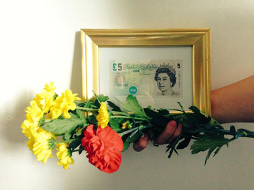
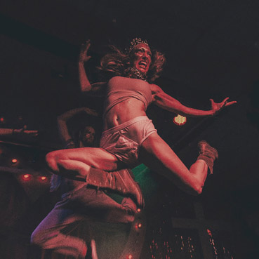

---
# CONFIGURATION
layout: 2015-emergency
rootpath: "../../../"

# ABOUT THE SHOW - GENERIC
artist: "Emergency 2015"
show: "EVENING: 4pm-10pm"
artist_size: 1
show_size: 3
header_image:

# ABOUT THE SHOW - LAYOUT
# artist_size: 1 # optional - size of artist name 1-5. Default is 1. Set longer names to lower values
# show_size: 2 # optional - size of show name 2-5. Default is 2. Set longer names to lower values
# header_image: "header.jpg" # optional custom background image, relative to current page

---
*Presented by* Word of Warning, STUN *+* Z-arts *during* [Emergency 2015](/archive/2015-emergency)         
        
#### Artists in Alphabetical Order (*subject to change*)         
**Please note this is primarily an adult event, see Access Info below.**        
        
**Ali Matthews + Leo Burtin** | ***The Best of Both Worlds***        
*Stealthily scrounging your tax pennies, your guilty scratch card spendings, Matthews & Burtin are funded escapees. She from the cutthroat, self-made, individualist American dream. He from lukewarm, protectionist, socialist France. By air and by sea, and both to the best of both worlds: the UK.*        
Using 1930s French street songs, sales pitches, autobiography and live audience experiments, Burtin & Matthews take stock of what the UK values now and how we go about valuing it.        
        
Supported using public funding by the National Lottery through Arts Council England, with additional support from ARC Stockton, East Street Arts + the University of Salford. Produced by Becci Sharrock.        
[www.bitchuationistinternational.com](http://www.bitchuationistinternational.com) | [@bitchuationist](http://twitter.com/bitchuationist) + [www.leoburtin.co.uk](http://www.leoburtin.co.uk) | [Leo Burtin Facebook](http://www.facebook.com/leoburtin) | [@olamerino](http://twitter.com/olamerino)        
         
        
**Ali Wilson** | ***Sh\*t Happens***        
How many cucumbers can you slice in minute?        
How many nappies can you change before the kettle boils?        
And what do you do when you find you've become a completely different person without even realising?        
A new adventure can be liberating, but what if it starts to turn a sour?        
Expect the unexpected is perhaps the vital lesson here.        
Make yourself at home, but please don't wear your shoes around the apartment.        
[@aliwil267](http://twitter.com/aliwil267)        
        
**Chris Jenkins** | ***‘Comedy’ with Top Joe***        
We never actually see ourselves with our own eyes. We only ever see our reflections. *Comedy* is an autobiographical performance in which Chris Jenkins explores life, depression and desire through his comedy alter-ego Top Joe.         
        
Chris performs and creates work across a number of mediums including live art, theatre, video, clown and alternative comedy. He has performed/had work shown at Latitude, Hazard, SLAP, Beacons Festival, Live Art Bistro, FACT, Cornerhouse, Under the Owls, CALM + Food for Thought.        
<http://toptopjoe.tumblr.com> | [@toptopjoe](http://twitter.com/toptopjoe)      
        
        
**Dr Mango** | ***The Third Island***        
Two men, two islands.        
Matt and Greg have lost each other and are stuck on their own self-imposed islands; Matt is obsessed with taking unnecessary risks and leaving his life to chance, whilst Greg is stuck in a world of self-improvement and narcissism. They both need to escape but are unable to do it alone. If they could re-establish contact, if they could find each other again, then would they be able to pull each other out of their own problems?        
[@gregsaxton](http://twitter.com/gregsaxton)       
        
**Gareth Cutter** | ***I Was A Teenage Volcano***         
*Water boils at 100 degrees celsius. So does blood. Rubber melts at 180 degrees. Bitumen: 500. Steel: 1370. Without additives, quartz sand becomes glass at just 2300. The average human body temperature is 37 degrees celsius.*          
*I was a teenage volcano. I didn't wipe out an entire city. I never even erupted, really. But for five years, I grew a chest shaped like a mountain range.*         
         
Inspired by the journey to a surgical operation at the age of 18, *I Was A Teenage Volcano* is a part-fictionalised reminiscence of a time of sexual turbulence and emotional upheaval that makes the ground shake and brings the walls down.       
Supported by an OPEN Bursary from Live at LICA.        
<http://garethcutter.com> | [@garethcutter](http://twitter.com/garethcutter)       
         
             
**Howl Yuan** | ***The Invisible Guest** (performance)*          
He changed his English name several times…         
A new production about crossing culture, lost identity, nationalism and mobility. Through physical movement, language barriers and military figures, identity is questioned within cultures, nations and persons. We walk, run or march through moving images, memory and scenery like a changing mirror, which lights up our homecoming — an impossible homecoming.        
         
Thanks to Ben Francombe, Pete Phillips + Helena Hunter and all at University of Chichester without whose help, I couldn't have made this work.        
      

**James O'Donoghue** | ***Zero Point***        
*A heroic little struggle using stand-up and Starbucks.*        
Globalisation has meant the presence of huge corporations in Aberystwyth that do not fit the town, nor do they respect its local businesses or residences. And yet, they still maintain customers. *Zero Point* is the trajectory of a comedian — from the opening joke, to the cheap divisive gag, to the failure of comedy, to its eventual return. It is despair and hope.        
        
Tony Benn once said that progress is made by two flames: anger and hope.         
*Zero Point* adds another flame: the flame of silliness.          
[@JAODonoghue](http://twitter.com/JAODonoghue)        
       
        
**Jon M Coleman** | ***How to be a Man***        
*Men are in crisis. They don’t know how to be men anymore and they are trying to find the answers. What are the core values that a man should hold dear? Is manhood a choice? How does a man hug?*        
In this solo performance, one man (and two mannequins) attempt to navigate the various and often contradictory opinions on being a man.        
       
Written + devised by Jon Coleman, directed by Josh Coates, set design by Simone Romaniuk.        
Supported by Ovalhouse, Live at LICA + using public funding by the National Lottery through Arts Council England.        
[Facebook](http://www.facebook.com/jonmcoleman) | [@JonathanColem](http://twitter.com/JonathanColem)        
       
        
**Lucy McCormick** | ***Ascension Piece***        
Lucy McCormick presents a f*ckstep-dubpunk morality play for the new age. Casting herself as Jesus Christ, the artist attempts to 're-connect to her own moral conscience' by re-enacting old biblical stories via power ballads and performance art, with the additional help of two professional backing dancers.           
With trademark absurdism and enthusiasm, Lucy puts her best foot forward in the face of existential deadlock.        
[@lucy_muck](http://twitter.com/lucy_muck)      
      
 
**Stephen Donnelly** | ***Sibling Audition*** *(no longer appears)*        
A participatory theatre game show where the performer auditions the audience in a search for a new sibling. Inspired by the Yorgos Lanthimos film, *The Alps*.           
        
Part of an ongoing project exploring the rituals we create to deal with loss, dealing with grief and the ways we help each other pick up the pieces.        
[@stdonnelly](http://twitter.com/stdonnelly)        
          
**Tin Can People** | ***Remember Me***         
The smell is stained within the denim and thick within the smoke. The music is loud, the drums, even louder! Rock & Roll will never die and we will be remembered. *Welcome to our little soirée. Tonight, we will go down in history!*           
             
Charlotte Berry + Rob Gregson created Tin Can People, a NW-based theatre company platforming devised group performances and their solo projects.        
<http://tincanpeople.com> | [Facebook](http://www.facebook.com/tincanpeople) | [@TinCanPeople](http://twitter.com/TinCanPeople)        
        
         
#### Venue + Booking Details
Date: Saturday 3 October 2015, 4pm-10pm (event starts at 12noon)    
[Venue: Z-arts](http://www.z-arts.org/about-us/getting-here), 335 Stretford Road, Manchester, M15 5ZA        
Tickets: FREE no booking required, come + go as you please.        
*N.B. Some limited capacity shows have sign-up sheets on the day, others operate on a first come, first served basis.*          
Venue Tel: 0161 232 6089             
          
#### Access Information       
Emergency 2015 is primarily an adult-focussed event, some works will not be suitable for younger viewers (i.e. under 18s). From 12noon experience durational and limited capacity work; from 4pm onwards see a short series of short performances. It takes place in a number of different spaces and formats — some seated, some standing, some spoken word, some visual, some limited capacity, some participatory. We apologise but some of the work is not wheelchair accessible. For specific age and access information please email <mailto:info@habarts.org> or call 0161 232 6086.     
            
#### Credits         
[Emergency](/hab/emergency) 2015 is produced by [hÅb](/hab); supported using public funding by Arts Council England, funded by Manchester City Council, supported by [STUN](http://stunlive.com) + [Z-arts](http://www.z-arts.org); a greenroom legacy project.        
        
#### Websites
<http://emergencymcr.org> | [Facebook event](http://www.facebook.com/events/1479136439056940) |[#EmergencyMcr](http://twitter.com/hashtag/EmergencyMcr)
