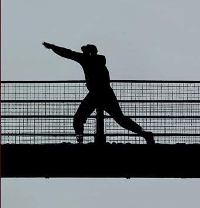
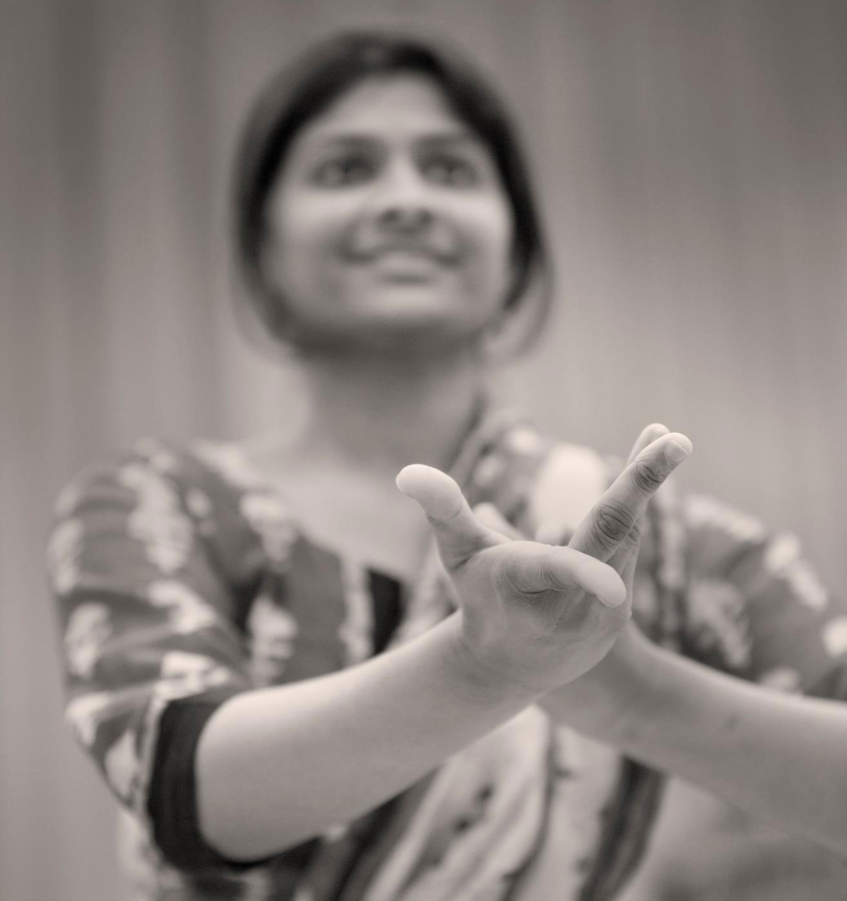
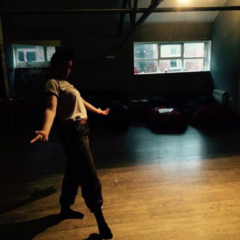
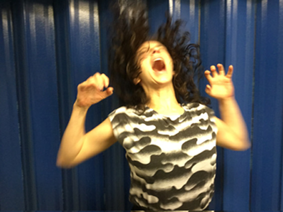
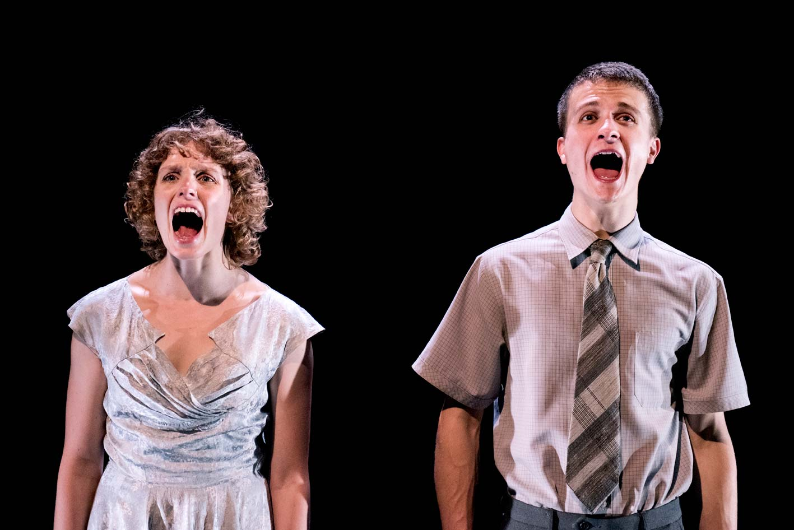
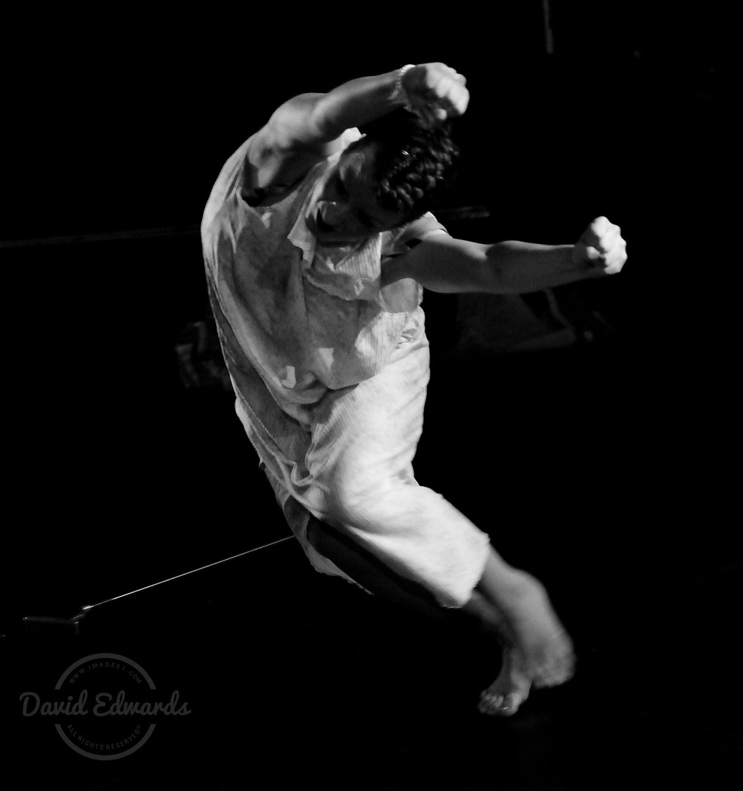
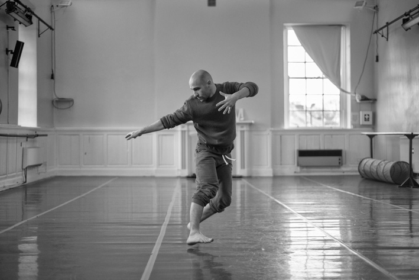
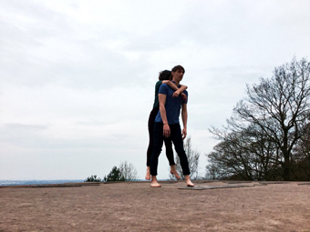

---

# CONFIGURATION
layout: 2016-turn
rootpath: "../../../"

# ABOUT THE SHOW - GENERIC
artist: "Turn 2016"
show: "FIRST NIGHT: Fri 22 Apr"
show_size: 4

# ABOUT THE SHOW - LAYOUT
header_image:

---
*A micro-festival of new northern dance, presented by* Word of Warning*,* Contact *+* Dance Manchester
        
#### Venue + Booking Details, for Turn 2016              
Dates: Friday 22 + Saturday 23 April 2016, 7.30pm       
<a href="http://contactmcr.com/visit/getting-here" target="_blank">Venue: Contact</a>, Oxford Road, Manchester, M15 6JA         
<a href="http://contactmcr.com/whats-on/47093-turn-2016/booking" target="_blank">Tickets: £9/5 per night</a> (two night pass £11/6)        
*<a href="http://www.contactmcr.com/ticketoffers" target="_blank">Group offer</a>: buy 10 (full or concession) tickets + get your 11th free.*        
Box Office Tel: 0161 274 0600                
                  
#### Order of Appearance (subject to change)     
Ongoing from 6pm:    
**Stream Project | *A Searching Mind…***    
Shot on a bridge in the beautiful Peak District in Derbyshire, the film explores the internal working of the body, with a view to make the internal external. This work evolved from an investigation into dancing with sound produced by measuring brainwaves, heart rate and breath.    
[streamproject.wordpress.com](http://streamproject.wordpress.com)    
    
 
**Stream Project | *Wired 2***   
An interactive installation that allows the viewer's heart rate to dictate what they see on the screen in front of them. *Wired 2* takes advantage of new technology where the viewer can construct their experience by altering their heart rate and ultimately view a dance film that is both empowering and intimate.
[streamproject.wordpress.com](http://streamproject.wordpress.com)    

From 7.30pm:    
**Jo Ashbridge | *Going Places***                      
Inspired by the idea of 'mental time travel' or mind wandering, the piece is a whimsical take on the activities of the mind when disconnected from the present moment, when it has ceased to engage with the here and now and has drifted off to past or future events, scenarios, regrets, plans or aspirations.     
A work-in-development, supported by Dance Manchester, hÅb and Contact through Turn Prize 2014.    
[joashbridgedance.wordpress.com](http:/joashbridgedance.wordpress.com)    

**Gayathri Ganapathy | *Mirror N You're On!***                     
Body. Mind. Synergy.    
      
            
**Holly Rush | *Yes Sir Act***      
An exploration of movement with literature, creating a surreal perspective into parenthood, adulthood and childhood. This piece morphs movement, memories and metaphors to explore the *Yes Sir Act* that creates the absurd look into obeying and disobedience.       
[Video](http://www.youtube.com/channel/UC3OVEE66Ebd22OmwVTCsl0A)      
        
         
**Bridget Fiske + Co. | *Inner Terra***    
*Terra: earth, land (latin).*        
A new dance duet for public spaces, *Inner Terra* documents, embodies and reflects upon conversations with people affected by crisis, migration and being at the fringes. A documentary inscribed through the body, *Inner Terra* explores freedom, restriction and chaos.          
A work-in-progress performed by Bridget Fiske with Joseph Lau.      
[www.bridgetfiske.com](http://www.bridgetfiske.com)     
     

**Lizzie J Klotz | *To Suit***    
A dance-theatre exploration of the relationship between man and woman. Developed through an investigation into human communication, the work draws comparisons to animal courtship rituals, specifically exploring the behaviour of birds. Commenting on the social formalities of human interaction, *To Suit* explores the use of body, voice and sound as a means of conversation.          
Lizzie J Klotz is a Newcastle based dance artist, working with companies such as Rosie Kay Dance Company, State of Grace and Not So Silent: Dance Theatre. Lizzie's choreography is marked by an interest in human behaviour, exploring actions, reactions and interactions of the everyday to create sensitive, humorous and thought-provoking work.        
[www.lizziejklotz.co.uk](http://www.lizziejklotz.co.uk)       
      
       
**Lauren Tucker | *This is what we left behind***    
An extract of an autobiographical solo work in progress that responds to film footage of Lauren's great grandmother in 1964.       
Starting with the question: *'What can we learn from the woman in our past?'* Lauren has explored her family heritage and drawn upon significant moments of her great grandmother's life to create a physical and theatrical response. This is an exploration of an ordinary woman from Liverpool, who had two daughters and a son, two husbands, two silver wedding anniversaries, and a collection of memories from all over the world.        
[Website](http://letucker6.wix.com/laurentuckerdance#!about/c2414)       
      
         
**Giorgio de Carolis | *Blind Certainty***    
*"…a close-mindedness that amounts to an imprisonment so total that the prisoner doesn't even know he is locked up."*    
[giorgiodecarolis.com](http://giorgiodecarolis.com)       
       
          
**Tom Bowes Dance | *Long and Short of It***    
*You may be able to see us in the blackout. We're ready to begin.*      
[www.tombowesdance.com](http://www.tombowesdance.com)      
       
              
#### Access Information      
Turn 2016 takes place in a number of different spaces and formats around Contact's building — some seated, some standing, some limited capacity, some participatory. With intervals, each evening will last about 3 hours. Age advisory: 14+ (parental/guardian discretion). For specific age and access information please email <mailto:info@habarts.org> or call 0161 232 6086.            
       
#### Credits         
[Turn](/hab/turn) 2016 is co-produced by [hÅb](/hab), <a href="http://contactmcr.com" target="_blank">Contact</a> + <a href="http://www.digm.org" target="_blank">Dance Manchester</a>; supported using public funding by Arts Council England + funded by Manchester City Council. | Image: Jo Ashbridge, Turn Prize 2014 by Jerome Whittingham          
<a href="http://turnmcr.org" target="_blank">turnmcr.org</a> | <a href="http://twitter.com/hashtag/TurnMcr" target="_blank">#TurnMcr</a>          
         
#### Appearing on the [SECOND NIGHT: Sat 23 Apr](/current/2016-turn/sat)          
Brink Dance Company | Ina Colizza + Antonello Apicella | Ekpei, McKie + Withycombe-Wharton | Louise Gibbons | Gracefool Collective | Manoli Moriaty + Frances Kay | Now | Shelley Owen | Joseph Reay-Reid | Adam John Roberts | Sap Dance
